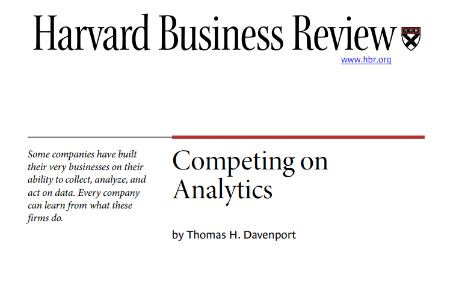

In this session, we split into two groups.
You have approx. 30 mins for each part.

## Group 1: Read _Competing on Analytics_

Read the _Competing on Analytics_ paper by @Davenport2006.

Davenport, T. Competing on Analytics, HBR. [link](https://cs.brown.edu/courses/cs295-11/competing.pdf)

{width=50% fig-align="center"}

Prepare to discuss the following questions:

1. **What does it mean for a company to “compete on analytics”?**  
   How is this different from simply using data or reports in decision making?

2. **What organizational capabilities are required to compete on analytics?**  
   Consider aspects such as leadership, culture, people, and technology.

3. **Which companies or industries today seem to compete on analytics?**  
   Give examples and explain how analytics creates their competitive advantage.

## Group 2: Create an analytical notebook in Jupyter

::: {.learning-objectives}
Explore the Python and Jupyter analytics ecosystem:

- Start Jupyter in a VM (GitHub Codespace)
- Write a first notebook
:::

::: {.callout-note title="TODO"}
See https://www.codecademy.com/article/how-to-use-jupyter-notebooks
https://www.codecademy.com/article/getting-started-with-jupyter
-> variable? + tab-completion, shift-tab for function arguments

- test workflow (github/local jupyter notebook - do not save as qmd / or convert?!)
- understand the elements of a jupyter notebook

- shortcuts: run individual lines with shift+ENTER ??, press a, b, x, ...

- extend slide-deck?

:::

## Preface

The purpose of this document is to give an introduction to data analytics with Python.

+ jupyter notebooks and libraries

## Example case

1. Select a case (business problem and dataset)

Kaggle: [Retail and shopping](https://www.kaggle.com/datasets?topic=retailAndShoppingDataset), [financial](https://www.kaggle.com/datasets?search=financial) or [trending](https://www.kaggle.com/datasets?topic=trendingDataset).

2. Draft an analytical notebook

- writing a notebook: following the CRISP-DM structure: business question, how the data is loaded, prepared, analyzed, what our interpretation is.
-> Create a new notebook: create a skeleton (following CRISP-DM). explain the business problem, import a dataset from kaggle, explain what you would do in the different steps, include code cells and add notes on how you would analyze the data, which parts would be  (if you are not sure about a particular part, you can leave it as TODO, say probably XY, or list two or three options that coudl be tried)

3. Refine the notebook

- Go over the notebook and annotate: which parts would be descriptive, predictive, prescriptive?

4. Start implementing 

See how far you get:

- import the CSV, create a descriptive overview of the data, select a model to make predictions

Consult the documentation of Python libraries such as pandas or scikit-learn.

- Get a dataset (nice datasource)
- Import and prepare
- Produce a notebook

::: {.callout-note title="TODO"}
**TODO: add a setup explanation + tests for available python version and packages**
:::

## Exam prep

TODO : include specific questions/tasks that could be included in the exam.

- "Simple question" (e.g., Amazon is successful because we all order online. Explain why you (dis)agree with the statement. -> explain how it exemplifies the rise of modern analytics, referring to the four "pillars")
- table with questions and choices (primary analytical purpose): descriptive, predictive, prescriptive
- TBD: questions related to the jupyter ecosystem?

## Survey

# References