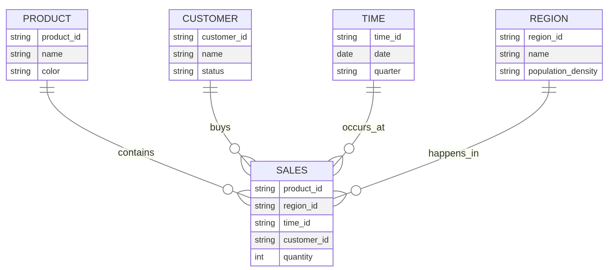
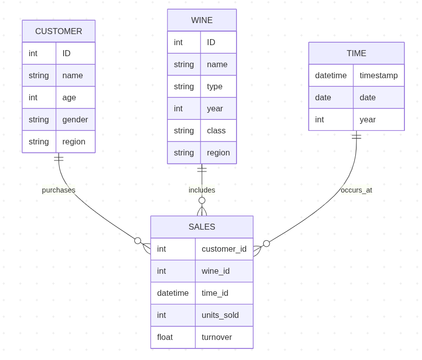
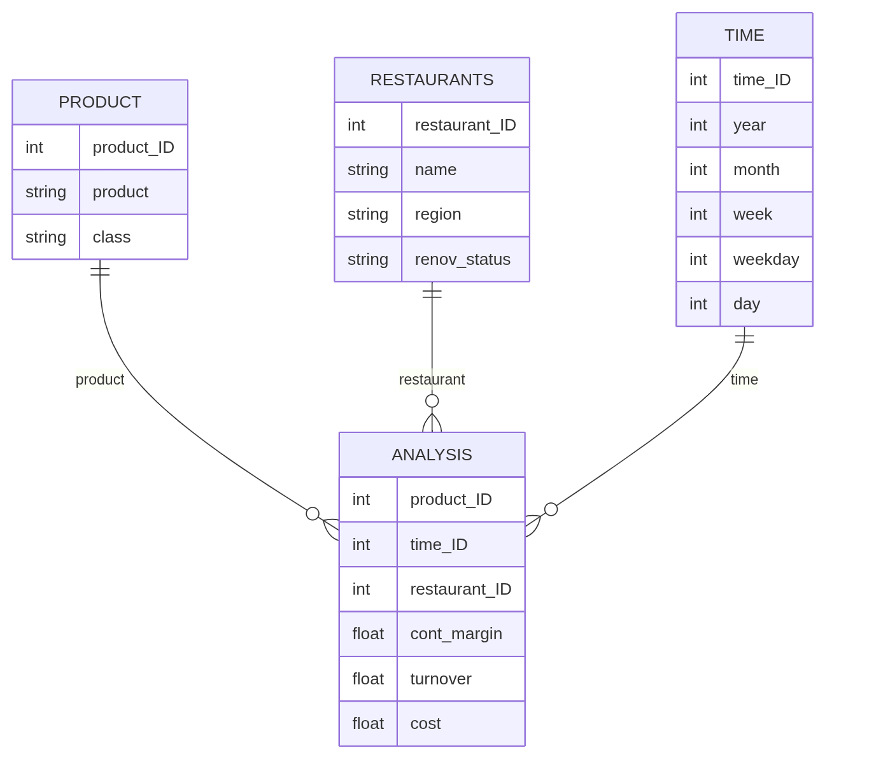
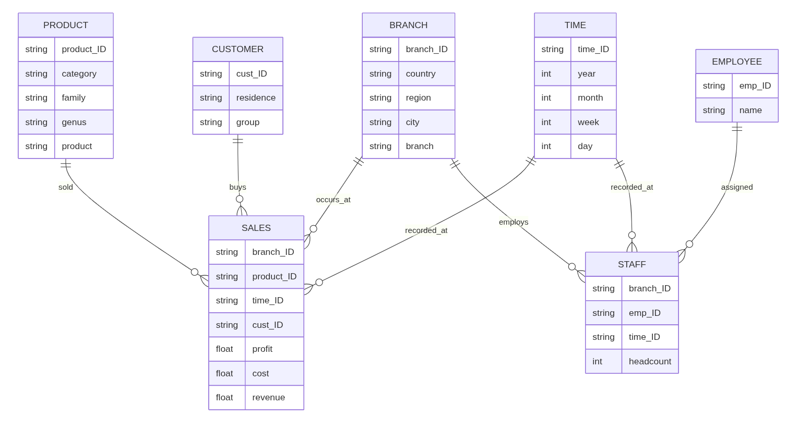

::: {.direction}

In this exercise, we cover:

| Exercise part                                       | Time (min) |
| --------------------------------------------------- | ---------- |
| [Star schema: Facts and dimensions](#part-1)        | 15         |
| [Star schema (wine retailer)](#part-2)              | 10         |
| [Star schema (restaurant chain)](#part-3)           | 15         |
| [Star schema (Flowers GmbH)](#part-4)               | 15         |
| [OLAP operations](#olap)                            | 10         |
| [Question set](#questions)                          | 20         |
| [Wrap-up](#wrap-up)                                 | 5          |
| **Overall**                                         | **90**     |

::: {.callout-note title="How to work on this exercise"}
This notebook does not involve coding.
You can solve all tasks in the PDF document.
:::

:::



## Part 1: Star schema: Facts and dimensions <a id="part_1"></a>

::: {.direction}

You are working as a data analytics consultant for a bank. The bank plans to build a data warehouse to support management reporting and analytical queries.
A common starting point in data warehouse design is to consider the analytical questions that decision-makers want to answer.
These questions help determine:

- **the facts** that should be stored in the warehouse (typically derived from transaction data, e.g., transaction amounts or volumes), and
- **the dimensions** that provide perspectives for analyzing these facts (typically derived from master data or attributes of master data, such as customer characteristics or product categories).

Below is a selection of analytical questions that bank managers might ask.

- What is the ratio of individual customers to business clients in the bank’s portfolio?
- Does this customer distribution correspond to the share of total transaction volume generated by each group?
- Do customer attributes (e.g., profession, household status, education level, income group) influence the volume or value of financial transactions?
- Which customers generate the highest transaction volumes?
- How does transaction volume evolve over time? Are there noticeable shifts when analyzed by customer segments?
- Can new customer segments be identified by combining multiple attributes (e.g., income level, profession, and household structure)?
- Are there geographic patterns in customer behavior or transaction activity across different regions?
- Are certain financial products or service categories particularly prominent in specific regions?
- Are there relationships between customer profiles and the financial products they use?
- Which financial products or services generate the highest transaction volumes? Which products are rarely used?
- Are there seasonal patterns in transaction activity depending on the type of financial product or customer segment?

Your task

- Read the questions and highlight the elements referring to facts.
  Highlight the elements referring to dimensions.
- Based on these observations, derive a possible star schema, identifying the fact table and the relevant dimension tables.

<br><br><br><br><br><br><br><br><br><br><br><br>
:::


:::{.sol}

### Solution

Facts are highlighted in **<span style="color:#d62728;">red</span>**.
Dimensions are highlighted in **<span style="color:#2ca02c;">green</span>**.

- What is the ratio of **<span style="color:#2ca02c;">individual customers</span>** to **<span style="color:#2ca02c;">business clients</span>** in the bank’s portfolio?
- Does this **<span style="color:#2ca02c;">customer distribution</span>** correspond to the share of total **<span style="color:#d62728;">transaction volume</span>** generated by each group?
- Do **<span style="color:#2ca02c;">customer attributes</span>** such as **<span style="color:#2ca02c;">profession</span>**, **<span style="color:#2ca02c;">household status</span>**, **<span style="color:#2ca02c;">education level</span>**, or **<span style="color:#2ca02c;">income group</span>** influence **<span style="color:#d62728;">transaction volume</span>**?
- Which **<span style="color:#2ca02c;">customers</span>** generate the highest **<span style="color:#d62728;">transaction volumes</span>**?
- How does **<span style="color:#d62728;">transaction volume</span>** develop over **<span style="color:#2ca02c;">time</span>**? Are there shifts when analyzing different **<span style="color:#2ca02c;">customer segments</span>**?
- Can additional **<span style="color:#2ca02c;">customer segments</span>** be identified when combining multiple **<span style="color:#2ca02c;">customer attributes</span>**?
- Are there **<span style="color:#2ca02c;">regional patterns</span>** in **<span style="color:#2ca02c;">customer activity</span>** or **<span style="color:#d62728;">transaction volumes</span>**?
- Are certain **<span style="color:#2ca02c;">financial products</span>** or **<span style="color:#2ca02c;">service categories</span>** particularly prominent in specific **<span style="color:#2ca02c;">regions</span>**?
- Are there relationships between **<span style="color:#2ca02c;">customer profiles</span>** and **<span style="color:#2ca02c;">financial products</span>** used?
- Which **<span style="color:#2ca02c;">financial products</span>** or **<span style="color:#2ca02c;">service categories</span>** generate the highest or lowest **<span style="color:#d62728;">transaction volumes</span>**?
- Are there **<span style="color:#2ca02c;">seasonal patterns</span>** in **<span style="color:#d62728;">transaction activity</span>** depending on the **<span style="color:#2ca02c;">financial product</span>** or **<span style="color:#2ca02c;">customer segment</span>**?

Star schema (SALES is the fact table, the others are dimension tables):



:::



## Part 2: Star schema (wine retailer) <a id="part_2"></a>

An online wine retailer plans to design a data warehouse to collect key figures regarding its wine sales.
The relevant part of the operational database consists of the following tables:

**CUSTOMER** (ID, name, address, telephone, birthday, gender)  
**WINE** (ID, name, type, year, bottle_price, class_ID)  
**CLASS** (ID, name, region)  
**ORDER** (customer_ID, wine_ID, timestamp, nr_bottles)  

Create the star schema for the data warehouse.

:::{.direction}
<br><br><br><br><br><br><br><br><br><br><br><br>
:::

:::{.sol}

## Solution



:::



## Part 3: Star schema (restaurant chain) <a id="part_3"></a>

A restaurant chain wants to build a management information system.
The application system architecture is to be aligned with the data warehouse concept.
An OLAP system is chosen for report generation.
The company maintains various restaurants, which can be differentiated by region and by renovation status.
The Leonardo-Campus restaurant belongs to the North region and is New from the renovation status.
The restaurant Nordblick is also located in the North region, but its renovation status is Old.
The Spätzleburg restaurant, on the other hand, is in the South region and has a New renovation status.
The menu items of the restaurants are divided into the classes "Starters", "Main courses", "Desserts", "Beverages" and "Other".
Time-based analyses are to enable evaluations by days of the week, weeks, months and years.
Simple contribution margin calculations for restaurants, services and days are to be supported.
The contribution margin is mathematically calculated from sales minus costs.

Create the logical data warehouse schema!

:::{.direction}
<br><br><br><br><br><br><br><br><br><br><br><br>
:::


:::{.sol}
## Solution


:::



## Part 4: Star schema (Flowers GmbH) <a id="part_4"></a>

As an employee of the Controlling department, you will be given the task of setting up a data warehouse for sales and headcount analyses.
Flowers GmbH has two branches in Hesse, one in Rhineland-Palatinate and three in France.
Product categories include cut flowers, garden flowers and bridal jewelry.
Within garden flowers, the rose family includes the genera roses and wild roses.
Products in the rose genus include thornless roses and roses with thorns.
The company distinguishes between corporate and private customers.
Data about the place of residence of the customers is available.
The DWH should be able to generate daily and weekly analyses as well as monthly, quarterly and annual reports.
The key figure required for the sales analyses is the profit, which is calculated from the difference between revenues and costs.
Employees have been working in the different branches of the company for different periods of time.
The DWH should also enable headcount analyses.
The key figure required for this is the headcount.

Create the logical data warehouse schema!

:::{.direction}
<br><br><br><br><br><br><br><br><br><br><br><br>
:::


:::{.sol}
# Solution


:::



## Part 5: OLAP operations <a id="part_5"></a>

Next, we will translate common OLAP operations into SQL queries using a simple dataset.

We work with the `sales_data` table:

| order_id | date       | region | product_category | sales_amount |
| -------- | ---------- | ------ | ---------------- | ------------ |
| 1        | 2024-01-15 | Europe | Electronics      | 200          |
| 2        | 2024-01-20 | Europe | Furniture        | 150          |
| 3        | 2024-02-10 | Asia   | Electronics      | 300          |
| 4        | 2024-02-12 | Europe | Electronics      | 250          |
| 5        | 2024-03-05 | Asia   | Furniture        | 100          |


:::{.direction}

:::{.callout-note title="Working with dates: `DATE_TRUNC`"}
To aggregate data by time periods (e.g., months), we use:

```sql
DATE_TRUNC('month', date)
```

This function rounds a date down to the beginning of the specified time unit. Example:

  * `2024-01-15 → 2024-01-01`
  * `2024-02-12 → 2024-02-01`

This allows grouping data at the month level instead of day level.
:::
:::

# Task 1: Roll-up

Roll-up means aggregating data to a higher level of granularity.

In this case:

* From day → month
* Grouped by region and month

:::{.direction}
Write an SQL query that calculates total sales:

* grouped by `region`
* aggregated at the monthly level (not daily)

Use `DATE_TRUNC('month', date)`.

Also:

* include `total_sales` as a column
* sort the result by region and month

Finally, sketch the expected structure of the resulting table.



:::


::: {.sol}

```sql
SELECT
    region,
    DATE_TRUNC('month', date) AS month,
    SUM(sales_amount) AS total_sales
FROM sales_data
GROUP BY region, DATE_TRUNC('month', date)
ORDER BY region, month;
```

Expected structure:

| region | month      | total_sales |
| ------ | ---------- | ----------- |
| Asia   | 2024-02-01 | ...         |
| Asia   | 2024-03-01 | ...         |
| Europe | 2024-01-01 | ...         |
| Europe | 2024-02-01 | ...         |

Fewer rows than original data because values are aggregated.

:::


# Task 2: Drill-down

Drill-down means moving to a more detailed level.

In this case:

* From month → day
* Keep both month and exact date

---

:::{.direction}
Write an SQL query that shows total sales:

* by `region`
* by `month`
* and by exact date

Use `DATE_TRUNC('month', date)`.

Also:

* include `total_sales`
* sort by region, month, and date

Finally, sketch the structure of the result.


:::


::: {.sol}

```sql
SELECT
    region,
    DATE_TRUNC('month', date) AS month,
    date,
    SUM(sales_amount) AS total_sales
FROM sales_data
GROUP BY region, DATE_TRUNC('month', date), date
ORDER BY region, month, date;
```

Expected structure:

| region | month      | date       | total_sales |
| ------ | ---------- | ---------- | ----------- |
| Europe | 2024-01-01 | 2024-01-15 | ...         |
| Europe | 2024-01-01 | 2024-01-20 | ...         |
| Europe | 2024-02-01 | 2024-02-12 | ...         |
| Asia   | 2024-02-01 | 2024-02-10 | ...         |

More rows because we move to a finer level of detail.
:::


# Task 3: Slice

Slice means fixing one dimension to a single value.

In this case:

* Only look at Europe

:::{.direction}
Write an SQL query that calculates total sales:

* only for `region = 'Europe'`
* grouped by month

Use `DATE_TRUNC('month', date)`.

Also:

* include `total_sales`
* sort by month

Sketch the resulting table structure.


:::

::: {.sol}
```sql
SELECT
    DATE_TRUNC('month', date) AS month,
    SUM(sales_amount) AS total_sales
FROM sales_data
WHERE region = 'Europe'
GROUP BY DATE_TRUNC('month', date)
ORDER BY month;
```

Expected structure:

| month      | total_sales |
| ---------- | ----------- |
| 2024-01-01 | ...         |
| 2024-02-01 | ...         |

Only one region remains; aggregation happens over time.
:::

# Part 6: Question sets <a id="questions"></a>

:::{.direction}

::: .callout-note
Work on these questions as far as you get during the session.
There is no expectation to complete everything — you can continue with the rest after the session.
:::

:::

## Question 1
**Explain the role of exploratory data analysis in business decision-making.**

:::{.direction}
Address the following points:

- Why analysts do not jump directly to modeling
- How data preparation and EDA are connected
- Which kinds of insights EDA can provide before formal modeling


:::

:::{.sol}
**Answer:**  
Exploratory data analysis helps analysts understand the structure, quality, and patterns of data before building models or making decisions. It helps reveal distributions, unusual values, missing data, relationships between variables, and possible groupings. In business decision-making, this is important because decisions based on poorly understood or low-quality data can be misleading. EDA is closely connected to data preparation because restructuring, cleansing, and transforming data are often necessary before meaningful exploration is possible.
:::


## Question 2
**Measurement scales determine which analyses are meaningful. Why?**

:::{.direction}
For each of the following variables, identify the scale (`nominal`, `ordinal`, `interval`, `ratio`) and name one appropriate descriptive statistic or visualization:

- customer_id
- customer satisfaction (low / medium / high)
- date_of_birth
- income
- country

Then explain why the mean is appropriate for some variables but not for others.

<br><br><br><br><br><br><br><br>
:::

:::{.sol}
**Answer:**  
Different scales allow different kinds of comparisons and calculations.

- `customer_id`: **nominal**; appropriate summary: frequency count
- `customer satisfaction (low / medium / high)`: **ordinal**; appropriate summary: mode or ordered bar chart
- `date_of_birth`: **interval**; appropriate summary: histogram or median date
- `income`: **ratio**; appropriate summary: mean, median, histogram, boxplot
- `country`: **nominal**; appropriate summary: frequency table or bar chart

The mean is only appropriate when numerical differences are meaningful. That is the case for variables like income. It is not meaningful for nominal variables such as country or customer_id. For ordinal variables, order matters, but distances between categories are not clearly defined, so the mean is usually not appropriate.
:::

## Question 3
**A histogram is useful for some variables, but not for all. Explain why.**

:::{.direction}
Use the examples below:

- customer names
- age
- date_of_birth
- country


:::

:::{.sol}
**Answer:**  
A histogram is suitable for quantitative variables where values can be grouped into intervals. It shows how often observations fall into numeric ranges.

- **Customer names:** not suitable, because names are nominal categories and cannot be meaningfully grouped into numeric intervals.
- **Age:** suitable, because age is quantitative and grouping into intervals such as 20–29 or 30–39 is meaningful.
- **Date of birth:** can be suitable if treated as a time variable and grouped into intervals such as years or decades.
- **Country:** not suitable, because country is a nominal variable. A bar chart or frequency table is better.

So the key issue is whether the variable has a numeric or interval-like structure that supports binning into ranges.
:::


## Question 4
**Why is the following dataset not tidy?**

:::{.direction}
A table contains the columns: `Region | Year | Sales_Q1 | Sales_Q2 | Sales_Q3 | Sales_Q4`

Answer the following:

1. Identify values, variables, observations, and the unit of observation.
2. Explain why the structure is problematic for analytics tools.
3. Propose the tidy target structure.
4. Describe the transformation needed.

<br><br><br><br><br><br><br><br><br><br><br><br>
:::

:::{.sol}
**Answer:**  
This dataset is not tidy because quarters are stored in separate columns instead of in a single variable.

- **Values:** Germany, France, 2020, 2021, Q1, Q2, and sales numbers such as 120, 150, or 210
- **Variables:** Region, Year, Quarter, Sales
- **Observations:** one sales measurement for a specific region, year, and quarter
- **Unit of observation:** a region–year–quarter combination

The structure is problematic because one variable, quarter, is spread across multiple columns. Many analytics tools work better when each variable has its own column and each observation has its own row.

A tidy structure would look like this:

| Region | Year | Quarter | Sales |
|--------|------|---------|-------|
| EU     | 2024 | Q1      | 120   |
| EU     | 2024 | Q2      | 150   |

The transformation needed is a **wide-to-long reshape**, for example by melting the quarter columns into one `Quarter` column and one `Sales` column.
:::

## Question 5
**Different data quality issues require different cleansing actions.**

:::{.direction}
Match each issue with a suitable cleansing action and justify your choice:

- missing values: 

- outdated values: 

- outliers / implausible values: 

- inconsistent date formats: 

- inconsistent units: 

- duplicate records: 

- data entry errors: 


:::

:::{.sol}
**Answer:**  

- **Missing values:** impute them where appropriate, or remove affected rows if necessary.
- **Outdated values:** update them if a correct value is available, or flag/remove them if they are no longer valid.
- **Outliers / implausible values:** inspect them, then correct, cap, or remove depending on whether they are errors or valid extreme cases.
- **Inconsistent date formats:** standardize all values into one consistent date format.
- **Inconsistent units:** convert values into one common unit before analysis.
- **Duplicate records:** identify duplicates and remove or merge them.
- **Data entry errors:** correct obvious mistakes where possible, otherwise flag them as invalid or missing.

Different actions are needed because not all quality problems have the same cause or impact. Some require standardization, others correction, removal, or imputation.
:::

## Question 6
**Why can data transformation change which analyses are possible?**

:::{.direction}
Use the example of timestamps stored as strings.

Discuss:

- which operations are possible before transformation
- which analyses become possible after transforming timestamps
- examples such as hour of day, day of week, or numeric timestamps

<br><br><br><br><br><br><br><br><br><br><br><br>
:::

:::{.sol}
**Answer:**  
Data transformation changes the format or type of a variable so that it becomes analytically usable.

If timestamps are stored as strings, only limited operations are possible. They can be displayed or counted as text, but time-based operations are difficult or unreliable.

After transforming them into a datetime format, analysts can:

- sort observations chronologically
- calculate time differences
- extract hour, weekday, month, or year
- aggregate by day, week, or month
- create time series visualizations

So transformation expands what can be computed and analyzed. A variable stored in the wrong format may contain useful information, but that information is not fully accessible until the variable is transformed.
:::

## Question 7
**Classify the following EDA methods.**

:::{.direction}
For each method, classify it as:

- univariate or multivariate
- graphical or non-graphical

Methods:

- histogram: 
- boxplot: 
- frequency table: 
- correlation: 
- scatterplot: 
- clustering: 


:::

:::{.sol}
**Answer:**

- **Histogram:** univariate, graphical
- **Boxplot:** usually univariate, graphical
- **Frequency table:** univariate, non-graphical
- **Correlation:** multivariate, non-graphical
- **Scatterplot:** multivariate, graphical
- **Clustering:** multivariate, usually non-graphical as a method itself, though results are often shown graphically

These methods differ in whether they focus on one variable or multiple variables and whether they summarize results numerically or visually.
:::

## Question 8
**Explain the logic of the k-means algorithm in your own words.**

:::{.direction}
Your answer should include:

- the role of `k`
- initialization
- centroids
- stopping criterion

<br><br><br><br><br><br><br><br><br><br><br><br>
:::

:::{.sol}
**Answer:**  
K-means groups observations into `k` clusters.

First, the number of clusters `k` is chosen in advance.
Then the algorithm starts with initial cluster centers, called centroids, which are placed at random.
Each observation is assigned to the nearest centroid.
After that, new centroids are computed based on the observations currently assigned to each cluster.
The observations are then reassigned to the nearest updated centroid.
This process repeats until the assignments no longer change much or the centroids become stable.
:::

## Question 9
**Why is scaling important before k-means clustering?**

:::{.direction}
Discuss:

- what happens if one variable has a much larger scale than another
- why k-means is sensitive to scaling
- what standardization is intended to achieve


:::

:::{.sol}
**Answer:**  
Scaling is important because k-means relies on distances between observations.
If one variable has a much larger numerical scale than another, it will dominate the distance calculation.

For example, if one variable ranges from 0 to 1 and another from 0 to 10,000, the larger-scale variable will have much more influence on the clusters, even if both variables are conceptually equally important.

Standardization puts variables on a comparable scale, often with mean 0 and standard deviation 1.
This helps ensure that each variable contributes more equally to the clustering result.
:::


## Question 10

**How can a dendrogram support the choice of the number of clusters?**

:::{.direction}
In your answer, explain:

* what a dendrogram shows
* how large vertical gaps can help suggest a reasonable number of clusters
* how this supports deciding where to “cut” the tree

<br><br><br><br><br><br><br><br><br><br>
:::

:::{.sol}
**Answer:**
A dendrogram is a tree-like diagram produced by hierarchical clustering. It shows how individual observations are progressively grouped together into clusters and at which level of dissimilarity these merges occur.

Large vertical gaps in the dendrogram indicate that clusters being merged at that stage are quite dissimilar. This suggests that a reasonable number of clusters can be obtained by cutting the dendrogram just before such a large jump.

By selecting a horizontal cut across the dendrogram, the data can be partitioned into a chosen number of clusters. The position of this cut determines how many clusters are formed and how similar the observations within each cluster are.

Unlike other clustering approaches, the dendrogram itself already represents the full clustering structure at all levels of granularity. It does not require a predefined number of clusters but instead allows this decision to be made based on the structure of the data.
:::


## Question 11

**Why are star schemata preferred over highly normalized schemata in data warehouses?**

:::{.direction}
Discuss:

* differences between OLTP and OLAP requirements
* query performance and join complexity
* usability for analysts
* how the structure relates to tidy data principles


:::

:::{.sol}
**Answer:**
Star schemata are preferred because they are optimized for analytical queries rather than transactional consistency. Compared to highly normalized schemata, they reduce the number of joins required, which improves query performance.

They are also easier for analysts to understand because the structure clearly separates facts and dimensions. This makes it simpler to formulate queries and interpret results.

In addition, star schemata align well with tidy data principles: each row represents one observation (e.g., a transaction), each column represents a variable (e.g., time, product, region), and each table has a clear role. This structure supports efficient aggregation and analysis.

In contrast, normalized schemata are designed to avoid redundancy and support transactional updates, which is less important in analytical contexts.
:::

## Question 12

**Explain the difference between a fact table and a dimension table.**

:::{.direction}
In your answer, include:

* the type of data stored in each
* examples of attributes
* how they are used together in analysis
* how this relates to tidy data structure

<br><br><br><br><br><br><br><br><br>
:::

:::{.sol}
**Answer:**
A fact table contains quantitative measures such as sales, revenue, or transaction counts. These are the values that are analyzed.

A dimension table contains descriptive attributes that provide context for the facts, such as customer, product, region, or time.

Fact tables are typically large and contain foreign keys referencing dimension tables. Dimension tables are used to filter, group, and aggregate the facts during analysis.

This structure corresponds to tidy data principles: each row in the fact table represents one observation at a defined level of detail, while dimensions provide well-structured variables that can be joined for analysis. Together, they create a clean and analyzable dataset.
:::

## Question 13

**What is the role of the time dimension in a data warehouse?**

:::{.direction}
Discuss:

* why time is almost always included as a dimension
* typical hierarchies (e.g., day → month → year)
* how it supports analysis


:::

:::{.sol}
**Answer:**
The time dimension is essential because most business analyses involve changes over time. It enables tracking trends, seasonality, and performance over different periods.

Typical hierarchies include day, week, month, quarter, and year. These allow aggregation at different levels of granularity.

Without a proper time dimension, it would be difficult to perform comparisons, detect trends, or analyze temporal patterns.
:::

## Question 14

**Explain the difference between roll-up and drill-down in OLAP.**

:::{.direction}
Use examples to illustrate:

* change in level of detail
* impact on number of rows
* typical use cases
* illustrate both operations using SQL (based on the examples in Part 5)

<br><br><br><br><br><br><br><br><br><br><br><br>
:::

:::{.sol}
**Answer:**
Roll-up means aggregating data to a higher level of granularity, for example from daily sales to monthly sales. This reduces the number of rows and provides a more summarized view.

Example (roll-up):

```sql
SELECT
    region,
    DATE_TRUNC('month', date) AS month,
    SUM(sales_amount) AS total_sales
FROM sales_data
GROUP BY region, DATE_TRUNC('month', date);
```

Drill-down is the opposite: it moves to a more detailed level, such as from monthly data to daily data. This increases the number of rows and reveals more detailed patterns.

Example (drill-down):

```sql
SELECT
    region,
    DATE_TRUNC('month', date) AS month,
    date,
    SUM(sales_amount) AS total_sales
FROM sales_data
GROUP BY region, DATE_TRUNC('month', date);
```

Roll-up is useful for overview and reporting, while drill-down helps investigate specific patterns or anomalies.
:::


:::{.direction}



## Wrap-up <a id="wrap-up"></a>

🎉🎈 You have completed the notebook - good work! 🎈🎉

In this notebook, we have learned to

- Translate business questions into **analytical requirements**
- Distinguish clearly between **facts (measures)** and **dimensions (perspectives)**
- Derive **star schemata** from both conceptual questions and operational data sources
- Structure data for **multidimensional analysis (OLAP)**

::: {.callout-tip title="Session 3 survey"}
Before you wrap up, please complete the Session 3 survey here: [](){target="_blank"}. Thank you 🙏
:::

:::
