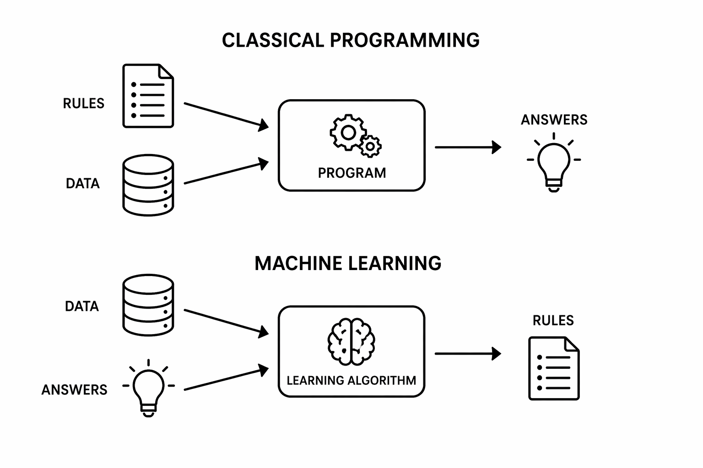

2026-04-20: 95 min (skipped regression trees and support vector regression)

| Time (min) | Duration | Topic | Additional materials |
|------------|----------|-------|----------------------|
| 0–90       |       90 |  TODO |                      |

::: callout-note

Lectures
https://harvard-iacs.github.io/2019-CS109A/lectures/lecture15/presentation/Lecture15_Decision_Trees.pdf

:::

## Supervised ML

{width=600px fig-align=center}

- Start by sketching the two process boxes
- Illustrate what "classical programming" means: manually codifying all conditions and special cases to make the prediction
- Ask students what the input/output is
- Highlight for machine learning: at training time, to make predictions, we will use the rules in the sense of classical programming

## Decision trees

https://medium.com/data-science/entropy-how-decision-trees-make-decisions-2946b9c18c8

TODO: check statement and plot!!

<!--
Information gain rewards purity—even if it comes from splitting into many small groups. Gain ratio corrects this by penalizing overly fragmented splits.

```{python}
#| label: fig-gain-ratio-fragmentation
#| fig-cap: "Information Gain vs Gain Ratio under increasing fragmentation"
import numpy as np
import matplotlib.pyplot as plt


def entropy(probs):
    return -np.sum([p * np.log2(p) for p in probs if p > 0])


groups = range(2, 11)

info_gain = []
split_info = []
gain_ratio = []

parent_entropy = 1.0  # fixed for illustration

for m in groups:
    # assume equal-sized groups
    probs = [1 / m] * m
    si = entropy(probs)  # split information

    # assume groups become purer as m increases (toy assumption)
    child_entropy = 1 / m  # smaller with more splits

    ig = parent_entropy - child_entropy

    info_gain.append(ig)
    split_info.append(si)
    gain_ratio.append(ig / si)

plt.figure(figsize=(7, 4))
plt.plot(groups, info_gain, marker="o", label="Information Gain")
plt.plot(groups, gain_ratio, marker="o", label="Gain Ratio")

plt.xlabel("Number of groups (fragmentation)")
plt.ylabel("Value")
plt.title("Gain Ratio penalizes overly fragmented splits")
plt.legend()
plt.grid()
plt.show()
```
-->

### ID3 algorithm (entropy)

#### 1) Intuition and Definition

Entropy is a measure of **how mixed or impure the labels** in a dataset are.

* If all observations belong to the same class → **low entropy (0)** → perfectly pure
* If observations are evenly distributed across classes → **high entropy** → maximum uncertainty

Formally, for a dataset with (K) classes and class probabilities (p_1, \dots, p_K):

$$H = - \sum_{i=1}^{K} p_i \log_2 p_i$$

This captures the **expected amount of information (uncertainty)** in the labels.


#### 2) Key Teaching Insight: What Is the Maximum Entropy?

A common misconception is that entropy is always between 0 and 1 — this is only true for **binary classification**.
In general, entropy depends on the **number of classes (K)**.

Entropy is maximized when all classes are **equally likely**:

$$p_1 = p_2 = \dots = p_K = \frac{1}{K}$$

Substituting into the entropy formula:

$$H = - \sum_{i=1}^{K} \frac{1}{K} \log_2 \left(\frac{1}{K}\right)$$

Now simplify:

$$H = - K \cdot \frac{1}{K} \cdot \log_2 \left(\frac{1}{K}\right)$$

$$H = - \log_2 \left(\frac{1}{K}\right)$$

Using the log rule:

$$\log_2 \left(\frac{1}{K}\right) = -\log_2 K$$

So:

$$H = \log_2 K$$

**Important takeaway:**

- Maximum entropy is **not fixed**
- It grows with the number of classes
- For example:

  - $K = 2 \Rightarrow H = 1$
  - $K = 4 \Rightarrow H = 2$
  - $K = 8 \Rightarrow H = 3$


#### 4) Python Illustration (Entropy vs. Number of Classes)

```{python}
#| fig-align: center
#| echo: false
import numpy as np
import matplotlib.pyplot as plt

# Number of classes
K_values = np.arange(1, 11)

# Maximum entropy H = log2(K)
entropy_values = np.log2(K_values)

plt.figure()
plt.plot(K_values, entropy_values, marker="o")
plt.xlabel("Number of classes (K)")
plt.ylabel("Maximum entropy H = log2(K)")
plt.title("Maximum Entropy as a Function of Number of Classes")
plt.grid()

plt.show()
```

Entropy is best understood as:

> “A measure of how uncertain we are about the class label.”

- **Low entropy** → clear, predictable classification
- **High entropy** → mixed, uncertain data
- **Maximum entropy = $\log_2(K)$** → depends on how many classes exist

This is exactly why decision trees aim to **reduce entropy** through splits (information gain).


## SVM

<!--
https://www.youtube.com/watch?v=efR1C6CvhmE

See also: https://www.mathstat.dal.ca/~aarms2014/StatLearn/docs/09%20_annotated.pdf
-->

## Maximal margin classifier

Small M&A teams are **successful**, large teams **unsuccessful**.

A simple baseline would place the threshold halfway between the **class means**.
The maximal margin classifier instead places the threshold halfway between the **closest opposing cases** and maximizes the distance to both classes.

```{python}
#| label: fig-maximal-margin-1d
#| fig-cap: "A naive midpoint between class means versus the maximal-margin threshold"
#| echo: false
import matplotlib.pyplot as plt
import numpy as np

successful = np.array([2, 3, 4, 5])
unsuccessful = np.array([8, 9, 10, 11])

mean_threshold = (successful.mean() + unsuccessful.mean()) / 2
sv_left = successful.max()
sv_right = unsuccessful.min()
margin_threshold = (sv_left + sv_right) / 2

fig, ax = plt.subplots(figsize=(8, 2.2))

# points on a line
ax.scatter(successful, np.zeros_like(successful), marker="o", s=90, label="Successful")
ax.scatter(unsuccessful, np.zeros_like(unsuccessful), marker="x", s=90, label="Unsuccessful")

# support vectors
ax.scatter([sv_left, sv_right], [0, 0], s=220, facecolors="none", edgecolors="black", linewidths=1.8)

# thresholds
ax.axvline(mean_threshold, linestyle="--", label="Midpoint between means")
ax.axvline(margin_threshold, linestyle="-", label="Max-margin threshold")

# margin illustration
ax.annotate(
    "", xy=(sv_left, 0.12), xytext=(margin_threshold, 0.12),
    arrowprops=dict(arrowstyle="<->", lw=1.2)
)
ax.annotate(
    "", xy=(margin_threshold, 0.12), xytext=(sv_right, 0.12),
    arrowprops=dict(arrowstyle="<->", lw=1.2)
)
ax.text(margin_threshold, 0.18, "margin", ha="center", va="bottom")

ax.set_yticks([])
ax.set_ylim(-0.15, 0.28)
ax.set_xlabel("M&A team size")
ax.legend(loc="upper center", ncol=2, frameon=False)
plt.show()
```

**Teaching point:**
The midpoint between means uses the class centers.
The maximal margin classifier uses the **edge cases** that define the safest separating threshold. This matches the standard SVM intuition that only the nearest points determine the margin. 

## Support vector classifier (soft margin)

Now allow slight overlap:

* one relatively small team is unsuccessful
* one relatively large team is successful

The support vector classifier keeps a central boundary, but also allows some points to lie **inside the margin** or even on the **wrong side of the boundary**.

```{python}
#| label: fig-soft-margin-1d
#| fig-cap: "Soft-margin classifier: margin bands, an in-margin point, and a misclassified point"
#| echo: false
import matplotlib.pyplot as plt
import numpy as np

successful = np.array([2, 3, 4, 9])
unsuccessful = np.array([5, 8, 10, 11])

boundary = 6.5
margin_left = 5.2
margin_right = 7.8

fig, ax = plt.subplots(figsize=(8, 2.2))

# points on a line
ax.scatter(successful, np.zeros_like(successful), marker="o", s=90, label="Successful")
ax.scatter(unsuccessful, np.zeros_like(unsuccessful), marker="x", s=90, label="Unsuccessful")

# decision boundary and margins
ax.axvline(boundary, linestyle="-", label="Decision boundary")
ax.axvline(margin_left, linestyle="--")
ax.axvline(margin_right, linestyle="--")

# shade soft margin region
ax.axvspan(margin_left, margin_right, alpha=0.12)

# highlight example points
inside_margin = 5   # unsuccessful, but inside the margin on the correct side
misclassified = 9   # successful, but on the wrong side of the boundary

ax.scatter([inside_margin], [0], s=220, facecolors="none", edgecolors="black", linewidths=1.8)
ax.scatter([misclassified], [0], s=220, facecolors="none", edgecolors="black", linewidths=1.8)

ax.text(inside_margin, 0.14, "inside margin", ha="center", fontsize=9)
ax.text(misclassified, -0.14, "misclassified", ha="center", fontsize=9)

ax.text(boundary, 0.18, "soft margin", ha="center", va="bottom")

ax.set_yticks([])
ax.set_ylim(-0.22, 0.25)
ax.set_xlabel("M&A team size")
ax.legend(loc="upper center", ncol=2, frameon=False)
plt.show()
```

**Teaching point:**
This is the most important soft-margin visual: one point can be **inside the margin but still correctly classified**, while another can be **across the boundary and misclassified**. That is exactly the role of slack variables in the standard support vector classifier formulation. 

## Support Vector Machines (Kernel trick for nonlinear patterns)

Change the M&A example. Assume:

- small → unsuccessful
- mid-sized → successful ("sweet spot")
- large → unsuccessful

```{python}
#| label: fig-nonlinear-1d
#| fig-cap: "Nonlinear pattern: only mid-sized M&A teams are successful"
#| echo: false
import matplotlib.pyplot as plt
import numpy as np

x_unsuccessful = np.array([2, 3, 4, 11, 12, 13])
x_successful = np.array([6, 7, 8, 9])

fig, ax = plt.subplots(figsize=(8, 2))

ax.scatter(x_unsuccessful, np.zeros_like(x_unsuccessful),
           marker="x", s=100, label="Unsuccessful (low & high)")
ax.scatter(x_successful, np.zeros_like(x_successful),
           marker="o", s=100, label="Successful (mid-sized)")

ax.set_yticks([])
ax.set_xlabel("M&A team size")
ax.legend()

plt.show()
```

Note: linear separation no longer possible.

Transformation (Quadratic transformation)

```{python}
#| label: fig-kernel-2d
#| fig-cap: "Quadratic transformation enables linear separation"
#| echo: false
import matplotlib.pyplot as plt
import numpy as np

x_unsuccessful = np.array([2, 3, 4, 11, 12, 13])
x_successful = np.array([6, 7, 8, 9])

z_unsuccessful = (x_unsuccessful - 7.5)**2
z_successful = (x_successful - 7.5)**2

fig, ax = plt.subplots(figsize=(6, 5))

ax.scatter(x_unsuccessful, z_unsuccessful, marker="x", s=100, label="Unsuccessful")
ax.scatter(x_successful, z_successful, marker="o", s=100, label="Successful")

threshold = (z_successful.max() + z_unsuccessful.min()) / 2
x_line = np.linspace(1, 14, 100)
ax.plot(x_line, np.ones_like(x_line)*threshold, linestyle="-", label="Linear separator")

ax.set_xlabel("Team size (x)")
ax.set_ylabel("$(x - 7.5)^2$")
ax.legend()
plt.show()
```

**Teaching point:**
The kernel trick makes nonlinear patterns **linearly separable in a transformed space**.

## Short wrap-up

- **Maximal margin classifier** → perfect separation
- **Support vector classifier** → allows some errors
- **Support vector machine** → handles nonlinear patterns


# Exercises

2026-04-20: 80 min (`Data Analytics with Python.pdf` : Ridge Regression (p.57), Decision Trees and Random Forests (p.28), and Support Vector Regression (p.20))

TODO: add to exercise:
If a model is trained on scaled data, it will only work with scaled data. Note, that the scaling
must be exactly the same as for the training data. Thus, it is necessary, to keep the scaler.