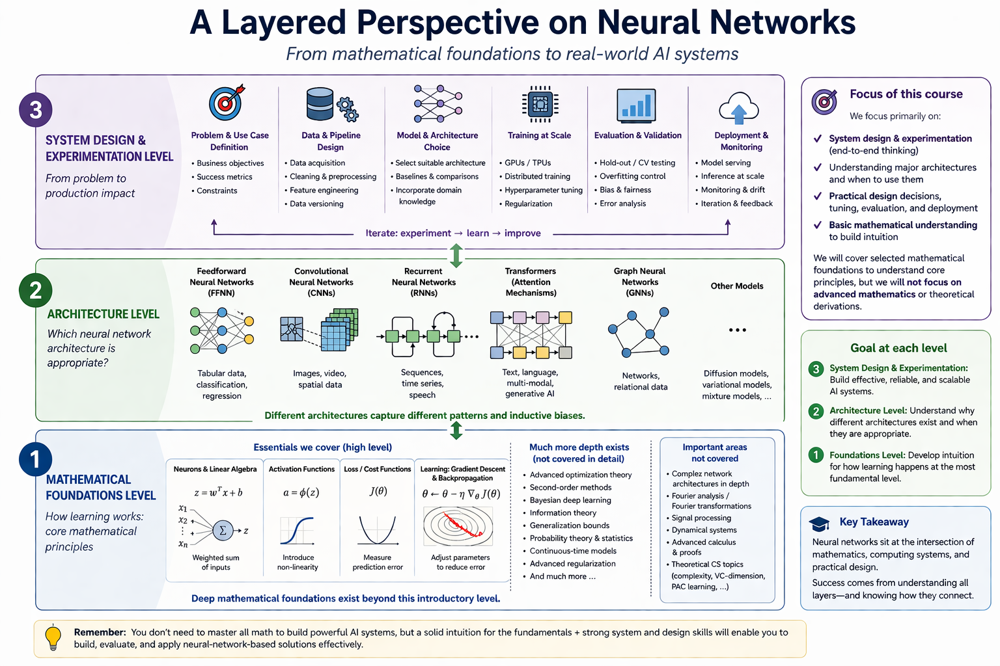

| Time (min) | Duration | Topic | Additional materials |
|------------|----------|-------|----------------------|
| 0–90       | 90       | TODO  |                      |

::: callout-note
TODO

Neural Networks:
https://www.youtube.com/watch?v=aircAruvnKk
https://www.youtube.com/watch?v=IHZwWFHWa-w
https://www.youtube.com/watch?v=Ilg3gGewQ5U

Good MIT intro:
https://introtodeeplearning.com/slides/6S191_MIT_DeepLearning_L1.pdf

https://aaubs.github.io/ds23/en/m3/01_intro-to-traditional-dl/

Maybe: https://github.com/microsoft/ai-for-beginners

Check: https://playground.tensorflow.org/

TODO: p. 29: binary logistic regression as a 1-layer network: https://web.stanford.edu/~jurafsky/slp3/slides/nn25aug.pdf

Calculate backpropagation:
- Berkeley https://inst.eecs.berkeley.edu/~cs188/archive/fa24/assets/discussions/disc11-examprep-sols.pdf
- Stanford https://cs230.stanford.edu/winter2020/section3_exercises.pdf
- https://mattmazur.com/2015/03/17/a-step-by-step-backpropagation-example/

https://www.ismll.uni-hildesheim.de/lehre/ml-19w/exercises/tutorial07.pdf

TODO: The "simple calculation example" in the ABD slides (PR) is useful to show the actual math. The neural networks videos (https://www.youtube.com/watch?v=aircAruvnKk) explain the effect more clearly (of gradient vector and "cost nudges").
Ideally, students should have a solid intuition, seen the math, and know when (not) to use neural networks.

Comprehensive resource (formal specification and implementation): https://d2l.ai/index.html

Interactiv js visualization of NNs: https://github.com/hmkcode/netflow.js

TBD/whether and where to cover:
Acquire and preprocess large-scale or unstructured data using APIs and appropriate tools in Python.
Apply large language models or other scalable methods to extract, classify, or summarize unstructured data.
TBD: API Keys?!
:::

## Introductory comments

NN : very inspiring class of models and algorithms, which model how nature solves particular problems. NN: brain, but also: genetic algorithms, or ant algorithms for search problems.

Maybe start with something like:
https://web.stanford.edu/~jurafsky/slp3/slides/nn25aug.pdf

## Survey

TODO: ask for areas where additional practice material would be helpful; questions for the exam (prepare for next session)