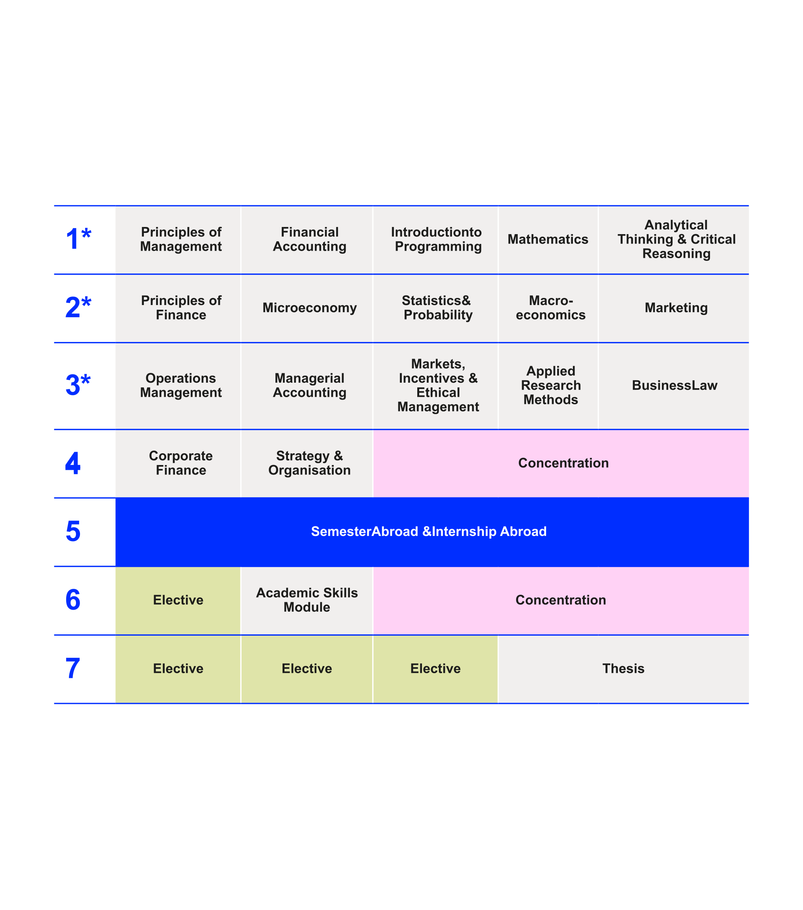
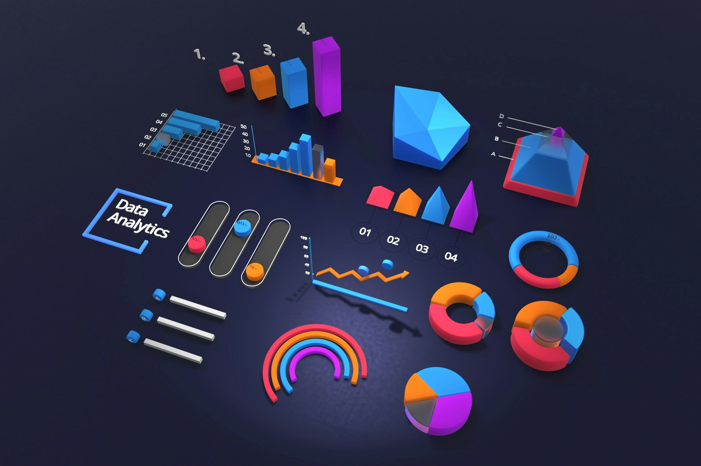
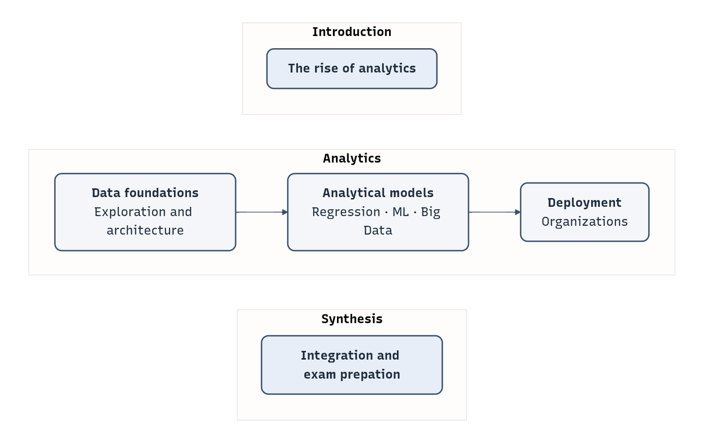

# Welcome {data-stack-name="Welcome"}

## Prof. Dr. Gerit Wagner

::: {.columns}
::: {.column width="70%"}

Academic background

- Universität Regensburg: Doctorate
- HEC Montréal: Postdoctoral Fellowship
- Otto-Friedrich-Universität Bamberg: Assistant Professor
- Frankfurt School of Finance & Management: Full Professor

Research interests

- Open, agentic, and boundary-spanning work
- AI-supported knowledge synthesis

Teaching interests

- Analytics and big data
- Programming and software engineering
- IT security
- Digital knowledge-intensive and platform-based work
- Literature review methods

:::

::: {.column width="30%"}

:::
:::


## About you


Please answer the three questions.
Then choose **one** optional area where you would like to share a bit more.


### 1. Have you worked in an industry role or completed an internship with an analytics focus?

Optional:

- What was something that felt **very useful** in your analytics work?
- Or where would you have liked to be **better prepared** for a data-related task?

### 2. Which analytics tools or programming languages have you used?

Optional:

- What was a particularly interesting analytics **challenge** you encountered?
- Or a tool you found especially powerful or **surprising**?

### 3. What are your expectations for the course?

<!--
- What do you want to be able to do by the end of this course?
- What would make this course “worth it” for you?
-->


# Analytics & Big Data {data-stack-name="Analytics & Big Data"}


## Analytics & Big Data in the curriculum

<div style="text-align:center">
  {width=40%}
</div>


<!--

Prerequisite: Completed the "Introduction to Programming" module.
-->

## What exactly is "analytics"?

:::: {.columns}

::: {.column width="50%"}
<br><br>
{width=90% fig-align="center"}
:::

::: {.column width="50%"}
<br><br><br><br><br><br>

Business analytics refers to the computer-supported examination of data using mathematical models to drive decisions and actions within business situations (based on Davenport & Harris 2007).
:::

::::

<!--
TODO (ideally referring to a textbook?)

Analytics is the systematic use of data, statistical methods, and digital tools to generate insights that support better business decisions.

If you want it slightly more detailed (but still accessible):

Analytics refers to the process of collecting, processing, and analyzing data to identify patterns, explain outcomes, predict future developments, and improve decision-making in organizations.

You can break it down into four core elements:

Data – Raw facts (e.g., sales numbers, customer clicks, costs).

Methods – Statistical models, algorithms, and visualizations.

Technology – Software tools like spreadsheets, databases, BI systems.

Decision-making – Turning insights into business action.
-->


## Why Analytics (and This Course) Matter

** Finance — Quantitative Arbitrage at Princeton-Newport Partners**

- Early pioneer of applying the Black-Scholes option pricing model in real markets
- Systematic identification of mispriced options through mathematical arbitrage
- Demonstrated how financial models and data could generate consistent trading profits

. . .

** Entertainment — Personalization at Scale at Netflix**

- Recommendation systems shape what millions watch
- Continuous A/B testing and model refinement
- Data directly drives engagement and revenue

. . .

** Sports — The Moneyball Revolution at Oakland Athletics**

- Advanced metrics replaced traditional scouting intuition
- Data-driven player selection with limited budget
- Competitive advantage through better measurement


## Course Architecture

<div style="text-align:center">

{width=60%}

<!--
```{mermaid}
%%{init: {
  "theme": "base",
  "themeVariables": {
    "primaryColor": "#E8EEF7",
    "primaryTextColor": "#1F2D3D",
    "primaryBorderColor": "#3A506B",
    "lineColor": "#3A506B",
    "secondaryColor": "#F4F6FA",
    "fontSize": "18px",
    "fontFamily": "Helvetica, Arial, sans-serif"
  }
}}%%

flowchart LR

  classDef foundation fill:#E8EEF7,stroke:#3A506B,stroke-width:2px,rx:10,ry:10,text-align:center;
  classDef stack fill:#F4F6FA,stroke:#3A506B,stroke-width:2px,rx:10,ry:10,text-align:center;
  classDef synthesis fill:#E8EEF7,stroke:#3A506B,stroke-width:2px,rx:10,ry:10,text-align:center;

  subgraph Right["<b>Synthesis</b>"]
    direction TB
    S["<div align='center'><b>Integration and exam prepation</b></div>"]
  end

  subgraph Stack["<b>Analytics</b>"]
    direction LR
    D["<div align='center'><b>Data foundations</b><br/>Exploration and architecture</div>"]
    M["<div align='center'><b>Analytical modeling</b><br/>Regression · ML · Big Data</div>"]
    O["<div align='center'><b>Deployment</b><br/>Organizations</div>"]
    D --> M --> O
  end

  subgraph Left["<b>Introduction</b>"]
    direction TB
    F2["<div align='center'><b>The rise of analytics</b></div>"]
  end

  class F2 foundation;
  class D,M,O stack;
  class S synthesis;
```
-->

</div>

## Learning objectives

**Knowledge**

- **Differentiate** between descriptive, predictive, and prescriptive analytics approaches.
- **Describe** architectures for data warehousing and big data processing, with reference to the underlying data modeling concepts.
- **Explain** fundamental concepts of data analytics, and its role in data-driven organizations.

**Skills**

- **Select** appropriate analytical methods for transactional or non-transactional data, and for descriptive, predictive, and prescriptive analysis tasks.
- **Apply** analytical methods to real-world datasets, including structuring, transforming, and visualizing data. This also involves training models, evaluating performance, and interpreting analytical results for decision-making.
- **Implement** analytical procedures in Python, using standard data science libraries (`pandas`, `scikit-learn`, `matplotlib`).

**Competence**

- **Design** analytics solutions aligned with business goals and governance principles.
- **Integrate** analytical technologies into organizational decision-making processes
- **Assess** the operational and strategic implications of data analytics in organizations.


## What This Course Does *Not* Cover


- **Engineering of production-grade analytical systems**

  - Software engineering
  - Database design
  - DevOps/MLOps pipelines
  - Scalable application development

- **Statistical theory**

  - Inferential statistics
  - Proofs/derivations

- **Mathematical optimization and simulation models**

  - Scheduling, logistics, queueing

- **Autonomous or agentic decision systems**
 
  - Robots/agents acting on decisions
  - Reinforcement learning

 We will *touch* these areas where needed, but our focus is on **analytical reasoning** and **notebook-based implementations**.


# Course logistics  {data-stack-name="Logistics"}

## Course logistics

Workload: 150h total (44h in class, remaining: self-study and group project)

Assessment

- Exam: 60 minutes, 60 points
- Group project: written paper (40 pages), 60 points (end of module)

Sessions:

- See overview in Canvas

Contact:

- EMail: [g.wagner@fs.de](mailto:g.wagner@fs.de)
- Office hours: [booking page](https://outlook.office.com/bookwithme/user/42312b4f18fd4acbb4255b5ce301f5d0%40fs.de?anonymous&ismsaljsauthenabled)

Individual circumstances

If you have family responsibilities, religious holidays, health-related matters, or other individual circumstances that may affect your participation or performance, please reach out early.
We will work together to find a fair and workable solution.

<!--
      - Format
      - Expectations
      - Workload
      - Assessments and deliverables
      - resources and administration

      TODO: group sizes, how groups will form, ...

      Sessions: Monday, 8.15-11.45, April 28 - July 21
      Location: WE5/04.003

      Consultation hours: [by appointment](https://calendly.com/gerit-wagner/30min) (individually or in small groups)
      Web: https://www.uni-bamberg.de/digital-work

      Materials: available via VC: https://vc.uni-bamberg.de/course/view.php?id=71961 (password: IdW2526#stud)

      - Exam: 90 points (minimum required: 45 points)
      - Summaries for the exams
        - You can submit summaries at lectures 4, 7, and 10.
        - Each summary can be one page (A5).
        - Contents have to be summarized.
        - The summaries will be available during the exams.

      If contents are not summarized, we may return them (with one opportunity to revise)

      - Assignments: 12 points (in 3 parts)

      bis zu 12 Punkte können vorher als Studienleistung eingebracht werden
      über die 90 Punkte der Klausur hinaus
      nach 45 Punkten in der Klausur werden die Bonuspunkte zugerechnet (cut bei 90 Punkten)
      ggf. 6 Bonuspunkte (zB. auf Kurzvortrag zu Paper - Kurzvortrag skaliert nicht bei größeren Kursen)
      Ggf. Übungsaufgaben mit Quiz


      TODO: `group-projects/Guidelines for the GroupProjects.pdf`


      ## We value your feedback and suggestions

      We encourage you to share your feedback and suggestions on our teaching materials. You can find the following links in the footer of each slide:

      <br>

      <a href="https://github.com/fs-ise/literature-review-seminar/issues/new" target="_blank"> ♻️ </a> Provide feedback by submitting an issue
      <a href="https://github.com/fs-ise/literature-review-seminar/edit/main/slides/00-orga.md" target="_blank"> 🛠️ </a> Suggest specific changes by directly modifying the content

      <br>

      Your feedback plays a crucial role in helping us align with our core goals of **impact in research, teaching, and practice**. By contributing your suggestions, you help us further our commitment to **rigor**, **openness** and **participation**. Together, we can continuously enhance our work by contributing to **continuous learning** and collaboration across our community.

      Visit this <a href="https://fs-ise.github.io/handbook/docs/10-lab/10_processes/10.01.goals.html" target="_blank">page</a> to learn more about our goals:  🚀 🛠️ ♻️ 🙏 🧑‍🎓️ .
-->


## Materials

Slides and materials

- Presentation slides will be made available for download.
- You are expected to take complementary notes and read the recommended literature.
<!-- - You can contribute directly to the [teaching materials](https://github.com/fs-ise/big-data-analytics) by submitting an issue ♻️ or suggesting edits 🛠️. -->
- Literature and complementary materials will be listed at the end of each lecture.
- Reading of complementary materials depends on your interest and ambition.

<!-- - Materials will be made available whenever possible. -->

Selected literature

- Part 1: @ChenEtAl2012, @MartinezEtAl2019, @ShardaEtAl2018
- Part 2: @Raschka2015, @SchuttONeil2014, @Vaisman2016
- Part 3: @BengfortEtAl2018. @Schmarzo2016
- Part 4: @Davenport2006, @VidgenEtAl2017


## You may also be interested in ... {data-state="hide-menubar"}

:::: {.columns}

::: {.column width="50%"}
Bachelor's theses: See [SuSy](https://susy.frankfurt-school.de/) and additional information on [this page](https://fs-ise.github.io/theses/).


In SuSy, you can find more information on my primary research topics:

- **Open, Agentic, and Boundary-Spanning Work**  
  This area examines how AI agents and open digital infrastructures reshape knowledge work and collaboration across organizational boundaries. It focuses on agentic systems embedded in real work contexts (e.g., Git workflows, handbooks, and repositories) and how they transform coordination, governance, and accountability.
- **AI-Supported Knowledge Synthesis**  
  This area investigates how AI supports knowledge synthesis across academic and professional contexts, focusing on transparency, rigor, and traceability in AI-assisted processes. It includes literature reviews and synthesis in digital gardens, second-brain systems, and other knowledge repositories.

:::

::: {.column width="50%"}
<br><br><br><br>

{width=70% fig-align=center}
:::

::::

<!--
 and [open topics](https://fs-ise.github.io/theses/docs/topics.html)

::: {.callout-note title="TODO"}
TODO: update thesis topics
:::

    
    
    
    

    ## The open-source project (WI-Projekt)

    - Learn to code in Python and contribute to the CoLRev package
    - Practice the use of Git in a small-team setting

    First session: Thursday, 17. April, 12.15-13.45 (WE5 3.004)
-->

# References {data-state="hide-menubar"}