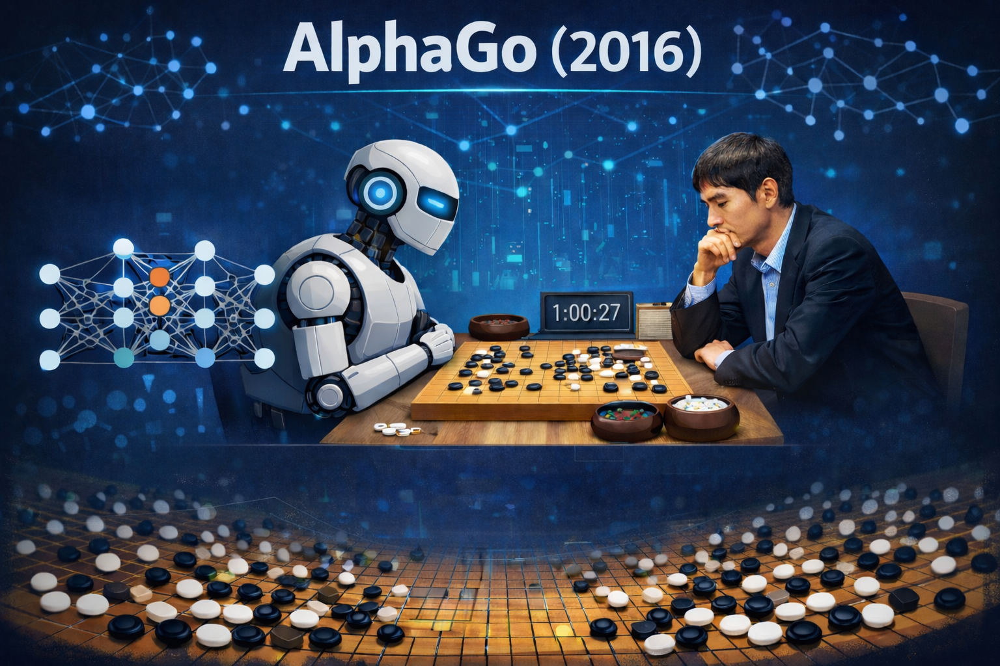
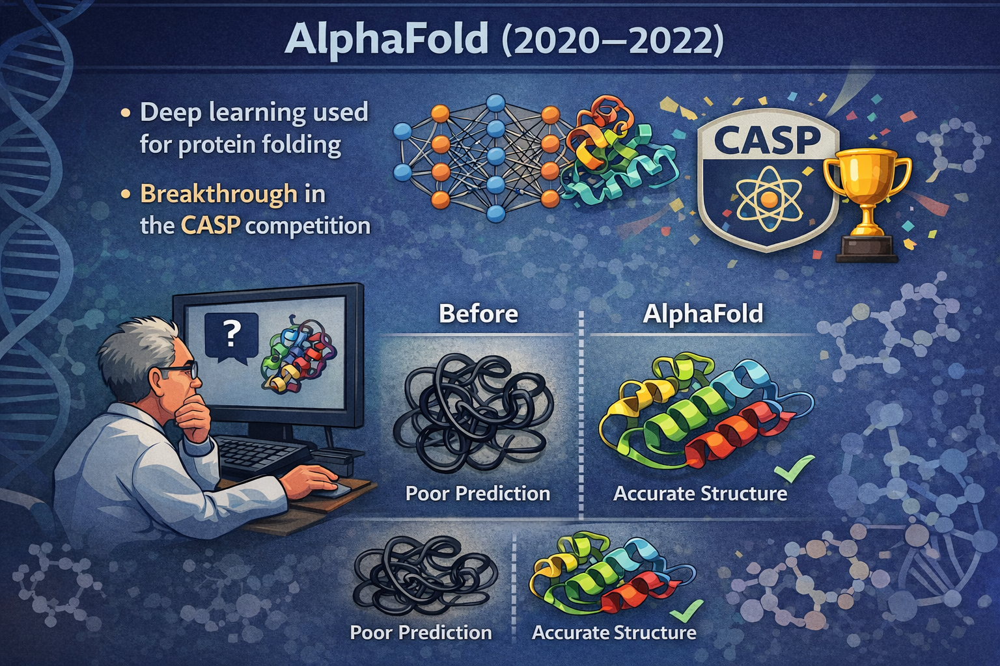
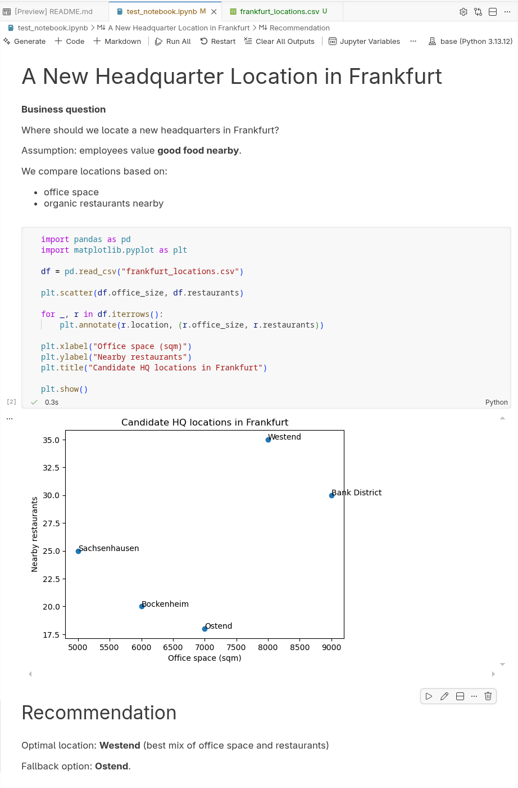
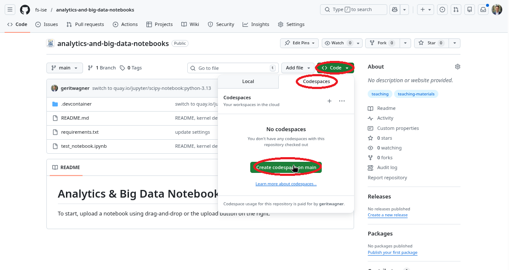
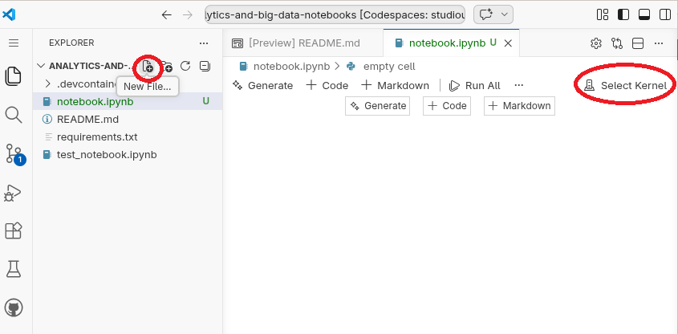

## Why is modern analytics so successful?

1. [More data](#more-data-for-the-analysis)
2. [More computing power](#computing-power)
3. [New algorithms](#new-algorithms)
4. [New analytics processes](#analytics-processes)

# More data for the analysis {data-stack-name="Data"}

## The explosion of data

::: columns

:::  {.column width="50%"}

<br><br>

```{python}
#| echo: false

import matplotlib.pyplot as plt
import numpy as np

# Known datapoints from literature (IDC Global Datasphere summaries)
years_known = np.array([2010, 2012, 2014, 2016, 2018, 2020, 2022, 2024, 2025])

structured_known = np.array([0.6, 1.0, 1.6, 3.8, 7, 12, 18, 26, 32])
unstructured_known = np.array([1.4, 2.5, 4.4, 12.2, 26, 52, 79, 121, 149])

# Sources referenced in literature:
#
# - Global data volume was ~2 ZB in 2010
# - It increased to ~33 ZB by 2018
# - IDC Global Datasphere reports forecast ~175 ZB by 2025
# - Some summaries report ~181 ZB by 2025
#
# These figures illustrate strongly exponential growth.

# Create full yearly range
years = np.arange(2010, 2026)

# Interpolate missing years
structured = np.interp(years, years_known, structured_known)
unstructured = np.interp(years, years_known, unstructured_known)

totals = structured + unstructured

# Identify interpolated years
is_interpolated = ~np.isin(years, years_known)
is_known = np.isin(years, years_known)

# Fit exponential trendline
log_totals = np.log(totals)
coeffs = np.polyfit(years, log_totals, 1)
trend_raw = np.exp(np.poly1d(coeffs)(years))

# Scale trend so it reaches ~190 ZB in 2025
target_2025 = 190
scale_factor = target_2025 / trend_raw[years == 2025]
trend = trend_raw * scale_factor

plt.figure(figsize=(9,4))

# --- Structured data bars ---
plt.bar(
    years[is_known],
    structured[is_known],
    label="Structured data"
)

plt.bar(
    years[is_interpolated],
    structured[is_interpolated],
    color="gray",
    hatch="//"
)

# --- Unstructured data bars ---
plt.bar(
    years[is_known],
    unstructured[is_known],
    bottom=structured[is_known],
    label="Unstructured data"
)

plt.bar(
    years[is_interpolated],
    unstructured[is_interpolated],
    bottom=structured[is_interpolated],
    color="gray",
    hatch="//"
)

# Exponential trendline
plt.plot(years, trend, color="black", linewidth=2, label="Estimated exponential trend")

plt.xlabel("Year")
plt.ylabel("Zettabytes")
plt.title("Growth of Global Data Volume")

plt.xticks(years, rotation=45)
plt.grid(axis="y")

plt.legend()

plt.show()
```

:::

:::  {.column width="50%"}

<br><br>

| Unit | Equivalent | Approximate meaning |
|-----|------------|---------------------|
| Gigabyte (GB) |  | A HD movie file or a few hundred photos |
| Terabyte (TB) | 1,000 GB | Storage of a modern laptop or external drive |
| Petabyte (PB) | 1,000 TB | Data of a large company or several large data centers |
| Exabyte (EB) | 1,000 PB | Roughly the yearly internet traffic of a small country |
| Zettabyte (ZB) | 1,000 EB | ≈ 1 trillion gigabytes; global data creation scale |

:::

:::

## Data production

**Enterprise and transactional data**  
Enterprise systems such as ERP, CRM, and supply chain platforms generate large volumes of structured data through everyday business transactions.

**eCommerce**  
Every search, click, purchase, and review creates behavioral and transactional data used for recommendations and personalized marketing.

**Social media and user-generated content**  
Platforms such as TikTok, YouTube, and Instagram generate enormous data volumes through uploads, interactions, and live streaming.

**IoT and smart devices**  
Connected devices—from wearables to industrial sensors—continuously produce real-time data across interconnected systems.

**Digital transactions**  
Online banking, mobile payments, and blockchain systems generate detailed financial records for transactions and security monitoring.

**AI-generated data**  
Machine learning and generative AI create large datasets during training and operation, further accelerating global data growth.


<!--
## Data storage
Moores law, Cloud computing, ...
-->


# Computing power {data-stack-name="Computing power"}

## Growth of computing power

The rapid acceleration of computing power—driven by advances in hardware, cloud infrastructure, and parallel processing—has enabled modern analytics and machine learning to scale to massive datasets.

<!-- TODO : could include an illustration of a modern AI data center -->

<br>

{fig-align="center" width="70%"}

## Evolution of computing power

The growth of modern analytics is enabled by **changing strategies for increasing computing power**.

<br>

| Era | Main Strategy | Explanation |
|-----|---------------|-------------|
| 1970s–2000s (*) | **Moore’s Law & miniaturization** | Smaller transistors → more components per chip → faster processors |
| 2005–today | **Parallel computing** | Performance increases by using multiple processors simultaneously |
| 2010s–today | **Specialized hardware** | Chips optimized for specific workloads (GPUs, TPUs, AI accelerators) |
| Emerging | **New computing paradigms** | Alternative computing models such as quantum computing |

::: aside
(*) Miniaturization continues today, but progress has slowed as transistors approach physical limits.
Advances such as extreme ultraviolet (EUV) lithography are required to continue scaling.
See how $400 million machines are constructed to build modern chips: [https://www.youtube.com/watch?v=MiUHjLxm3V0](https://www.youtube.com/watch?v=MiUHjLxm3V0).
:::

# New algorithms {data-stack-name="Algorithms"}

## Algorithms

An algorithm is a step-by-step procedure for performing a computation and thereby solving a problem.

Algorithms determine how efficiently computers can process data and solve tasks.


Examples:

- **Linux Scheduling Algorithms** *(1990s–present)* — Efficient process scheduling enabling operating systems to run tasks concurrently
- **RSA Encryption** *(1977)* — Public-key cryptography algorithm enabling secure internet communication
- **PageRank** *(1998)* — Algorithm ranking webpages based on link structure, enabling scalable web search
- **Blockchain** *(2008)* — Distributed consensus algorithm enabling decentralized digital ledgers and cryptocurrencies
- **Deep Learning** *(2010s)* — Improved neural network training enabling major advances in vision, speech, and language AI
- **Gradient Boosting** *(2014)* — High-performance ensemble learning algorithm widely used in predictive analytics and data science
- **GPT / Transformer Models** *(2017–present)* — Transformer architecture enabling large language models and generative AI


## Algorithms enable more powerful analytical models

<br><br>

::: columns
::: {.column width="30%"}
{width="90%"}

Traditional Regression

:::

::: {.column width="30%"}

{width="90%"}

Decision Tree
:::

::: {.column width="30%"}
{width="90%"}

Neural Network
:::

:::


## Algorithmic breakthroughs drive AI progress

Recent breakthroughs in artificial intelligence (AI)^[AI systems are based on algorithms; in the following, we use the broader term AI when referring to such algorithm-based systems.] show how new algorithms can rapidly surpass human performance.
**DeepMind** provides good examples.

::: columns

::: column

AlphaGo (2016)

- Uses **deep neural networks + reinforcement learning**
- Defeated world champion **Lee Sedol** in the game of Go

Go was long considered too complex for computers due to the enormous search space.

{width=50% fig-align="center"}

:::

::: column

AlphaFold (2020–2022)

- Uses deep learning to predict **protein structures**
- Achieved breakthrough performance in the **CASP competition**^[Hassabis and colleagues were awarded the 2024 Nobel Prize in Chemistry, in part for the development of AlphaFold.]

Predicting protein folding had been a major unsolved problem in biology for decades.

{width=50% fig-align="center"}

:::

:::


## Jagged frontier of AI

:::: {.columns}

::: {.column width="40%"}
AI progress often occurs through **algorithmic breakthroughs**, enabling machines to outperform humans in increasingly complex tasks.

Recent studies suggest that AI creates a **“jagged frontier.”** [@DellAcquaEtAl2023], i.e., some tasks are well suited to AI, while others that appear similar remain outside its capabilities. 

- **Within this frontier, AI can strongly enhance knowledge work**, improving productivity and the quality of outputs. 
- **Outside the frontier, AI can reduce performance**, especially when users rely too heavily on its outputs without verification. 

<!--
https://www.agidefinition.ai/
https://www.oneusefulthing.org/p/the-shape-of-ai-jaggedness-bottlenecks
-->

:::

::: {.column width="60%"}

<br><br>

```{python}
#| echo: false

import numpy as np
import matplotlib.pyplot as plt

# Categories (axes)
labels = [
    "Knowledge",
    "Reading & Writing",
    "Math",
    "Reasoning",
    "Working Memory",
    "Memory Storage",
    "Memory Retrieval",
    "Visual",
    "Auditory",
    "Speed"
]

# Example scores (approximate values from the illustration)
gpt4 = [8, 6, 4, 0, 2, 0, 4, 0, 0, 3]
gpt5 = [9, 10, 10, 7, 4, 0, 4, 4, 6, 3]

# Close the polygon
gpt4 = gpt4 + [gpt4[0]]
gpt5 = gpt5 + [gpt5[0]]

# Compute angles
angles = np.linspace(0, 2*np.pi, len(labels), endpoint=False).tolist()
angles += angles[:1]

# Create figure
# fig, ax = plt.subplots(figsize=(6,6), subplot_kw=dict(polar=True))
fig, ax = plt.subplots(figsize=(6,6), subplot_kw=dict(polar=True))

ax.set_theta_offset(np.pi / 2)   # rotate so first label is at top
ax.set_theta_direction(-1)       # make axes go clockwise

# Plot data
ax.plot(angles, gpt5, linewidth=2, label="GPT-5 (2025)")
ax.fill(angles, gpt5, alpha=0.15)

ax.plot(angles, gpt4, linewidth=2, label="GPT-4 (2023)")
ax.fill(angles, gpt4, alpha=0.15)

# Axis labels
ax.set_xticks(angles[:-1])
ax.set_xticklabels(labels)

# Radial limits
ax.set_ylim(0, 10)

# Grid and legend
ax.set_title("AI Capabilities", pad=20)
ax.legend(loc="upper right", bbox_to_anchor=(1.3, 1.1))

plt.show()
```
:::

::::

::: aside
Figure based on the work of @HendrycksEtAl2025 on *Artificial General Intelligence*.
:::


# Analytics processes {data-stack-name="Analytics processes"}

<!--
        ## Structure: TODO

        - start with epistemic goals (describing, predicting, prescribing)
        - introduce CRISP-DM
        - distinguish different analytical models and disciplines (referring to the epistemic goals - example: statistician would not be happy with an ML model because it does not support inference/explanation. ML engineer is not happy with a regression model - it may support inference/explanation better, but its predictions may be less accurate)

        {fig-align="center" width="40%"}

        ## Traditional vs. Modern Analytics Process


        **Traditional Analytics Process:**

        {fig-align="center" width="40%"}


        **Modern Analytics Process:**

        {fig-align="center" width="40%"}


        ## From the Past to the Present

        {fig-align="center" width="60%"}


        ## Evolution of Analytics


        {fig-align="center"  width="70%"}


        ::: aside
        Source: http://juxt.pro/blog/posts/machine-learning-with-clojure.html
        :::
-->

## Maturing analytical capabilities

<br><br>

{width=60% fig-align=center}

<!--
https://medium.com/aimonks/key-types-of-analytics-according-to-gartner-9dd5861debe2

Types of Analytics (I)

{fig-align="center" width="60%"}

::: aside
Source: @Schmarzo2016, p. 88
:::
-->

## Analytical purposes

<br><br>

<div class="smaller">

| What happened? (descriptive )    | What will happen? (predictive analytics) | What should I do? (prescriptive analytics) |
|----------------------------------|------------------------------------------|--------------------------------------------|
| How many widgets did I sell last month? | How many widgets will I sell next month? | Order **5,000** units of Component Z to support widget sales for next month. |
| What were sales by zip code for Christmas last year? | What will be sales by zip code over this Christmas season? | Hire **Y** new sales reps by these zip codes to handle projected Christmas sales. |
| How many of Product X were returned last month? | How many of Product X will be returned next month? | Set aside **$125K** in financial reserve to cover Product X returns. |
| What were company revenues and profits for the past quarter? | What are projected company revenues and profits for next quarter? | Sell the following product mix to achieve quarterly revenue and margin goals. |
| How many employees did I hire last year? | How many employees will I need to hire next year? | Increase hiring pipeline by **35%** to achieve hiring goals. |

</div>

<br><br>

 A particular method, such as regression or machine learning, can serve multiple purposes.

<!--
- What happened in the past?
- Find patterns and relationships in data and use them for prediction.
- Use the predictions to make decisions.
-->

::: aside
Source: @Schmarzo2016, p. 13
:::

## Example: Descriptive analytics

<br>

{fig-align="center" width="45%"}

## Example: Predictive analytics

<br>

{fig-align="center" width="60%"}

## Example: Prescriptive analytics

<!-- TODO: select an example that aligns more with prescriptive analytics (not scenario planning) -->

Based on more than 300 million data records per week, Otto generates over one billion forecasts annually on the expected sales of individual products in the coming days and weeks.
These forecasts are used to optimize inventory decisions, determining how many units of each product should be stocked or reordered across warehouses.
By systematically adjusting inventory levels based on these data-driven recommendations, Otto is able to reduce its overall inventories by up to 30% on average while maintaining product availability.

{fig-align="center" width="60%"}

::: aside
Source: http://www.bvl.de/misc/filePush.php?mimeType=application/pdf&fullPath=/files/441/442/777/1015/DLK12_C3-3_Praesentation_Stueben.pdf
:::

<!-- TODO: include an example from algorithmic management/Uber or automated financial trading -->

<!--
        ## Classical Corporate Planning

        {fig-align="center" width="60%"}

        ## Example Driver-based Planing (I)

        {fig-align="center" width="60%"}

        ## Example Driver-based Planing (II)

        {fig-align="center" width="40%"}

        1. Sales forecasts based on market and social media data
        2. Automated pricing based on market and competitor analyses
        3. Early detection of price changes and adjustment of purchasing behavior
        4. Optimization of inventory management based on customers' current purchasing preferences
-->

## Analytical models

There is a a broad repertoire of models and methods from multiple disciplines, each with its own assumptions, data preparation steps, and modeling processes.
While these fields often focus on methodological development, business analytics emphasizes applying these approaches to support understanding and decision-making in organizational contexts.

<br>

| Discipline          | Model culture           | Typical models            |
| ------------------- | ----------------------- | ------------------------- |
| Statistics          | Probabilistic inference | Regression, GLM, Bayesian |
| Econometrics        | Causal modeling         | IV, panel models          |
| Computer Science    | Algorithmic learning    | Trees, SVM, NN            |
| Operations Research | Optimization            | Linear programming, Non-linear optimization                   |
| Management Science  | Decision modeling       | Stochastic optimization   |
| Complex Systems     | Simulation              | Agent-Based/Discrete Event Simulation                  |

<!--
    Oftentimes, the goal may also be to understand and explain, not to decide (prescribe).

    Statistics vs. Data Analytics

    
-->

## Cross-Industry Standard Process for Data Mining (CRISP-DM)

:::: {.columns}

::: {.column width="45%"}

**CRISP-DM** is a widely used framework that structures data mining and analytics projects [@WirthHipp2000].

- Developed by an **industry consortium** (e.g., DaimlerChrysler, SPSS, NCR) to create a common methodology for data mining projects.
- Designed to be **independent of specific industries and technologies**, making it applicable across many domains.
- Integrates **best practices from real-world projects**, helping teams plan, communicate, and document analytics work.
- Became popular because it provides a **reliable and repeatable standard process** for managing complex data mining projects.

:::

::: {.column width="55%"}

<br>
```{dot}
//| fig-width: 8

digraph CRISPDM {
  layout=neato;
  overlap=false;
  splines=true;
  fontname="Helvetica";

  node [
    shape=box,
    style="rounded,filled",
    fillcolor="#f4f6fb",
    fontname="Helvetica",
    fontsize=20,
    width=2.8,
    height=1
  ];

  edge [
    penwidth=1.6,
    arrowsize=1.1
  ];

  // --- Circular positions ---
  A [label="Business\nUnderstanding", pos="-2,2!"];
  B [label="Data\nUnderstanding", pos="2,2!"];
  C [label="Data\nPreparation", pos="3,0!"];
  D [label="Modeling", pos="2,-2!"];
  E [label="Evaluation", pos="-2,-2!"];
  F [label="Deployment", pos="-4,0!", fillcolor="#e6f4ea"];

  // --- Central Database ---
  X [
    label="Data",
    shape=cylinder,
    fillcolor="#e9f2ff",
    fontsize=22,
    width=1.9,
    height=1.4,
    pos="0,0!"
  ];

  // --- Main Flow ---
  A -> B;
  B -> C;
  C -> D;
  D -> E;
  E -> F;

  // --- True Bidirectional Iterations ---
  B -> A;
  A -> B;

  D -> C;
  C -> D;

  E -> A;
  A -> E;
}
```

:::

::::

::: aside
Besides CRISP-DM, there are other models, such as KDD Process, SEMMA, or TDSP.
:::

## Structure of the course

:::: {.columns}

::: {.column width="45%"}


We structure the course along the **CRISP-DM analytics lifecycle**:

- **Introduction** (Session 0–1)  
  - Overview of analytics and the CRISP-DM workflow.

- **Data Foundations** (Session 2–3)
  - Exploration and analytical data architecture.

- **Analytical Models** (Session 4-9)
  - Regression, machine learning, and big data analytics.

- **Deployment** (Session 10)
  - Analytics in organizations.

- **Synthesis** (Session 11)
  - Integration of the full analytics workflow.

:::

::: {.column width="55%"}

<br>
```{dot}
//| fig-width: 8

digraph CRISPDM {
  layout=neato;
  overlap=false;
  splines=true;
  fontname="Helvetica";

  node [
    shape=box,
    style="rounded,filled",
    fillcolor="#f4f6fb",
    fontname="Helvetica",
    fontsize=20,
    width=2.8,
    height=1
  ];

  edge [
    penwidth=1.6,
    arrowsize=1.1
  ];

  // --- Circular positions ---
  A [label="Business\nUnderstanding", pos="-2,2!"];
  B [label="Data\nUnderstanding", pos="2,2!"];
  C [label="Data\nPreparation", pos="3,0!"];
  D [label="Modeling", pos="2,-2!"];
  E [label="Evaluation", pos="-2,-2!"];
  F [label="Deployment", pos="-4,0!", fillcolor="#e6f4ea"];

  // --- Central Database ---
  X [
    label="Data",
    shape=cylinder,
    fillcolor="#e9f2ff",
    fontsize=22,
    width=1.9,
    height=1.4,
    pos="0,0!"
  ];

  // --- Main Flow ---
  A -> B;
  B -> C;
  C -> D;
  D -> E;
  E -> F;

  // --- True Bidirectional Iterations ---
  B -> A;
  A -> B;

  D -> C;
  C -> D;

  E -> A;
  A -> E;
}
```

:::

::::

> Analytics is not a linear pipeline. We constantly move between business problems, data, modeling, and evaluation.

## Summary {data-state="hide-menubar"}

::: {.learning-objectives}
- **Illustrate** how the rise of data analytics capabilities is enabled by data availability, advances in computing power, new algorithms, and maturing analytics processes.
- **Distinguish** between descriptive, predictive, and prescriptive analytics.
- **Explore** the Python and Jupyter analytics ecosystem (*exercise*).
:::

# Exercise {data-state="hide-menubar"}

## Setup for the practical exercises  {data-state="hide-menubar"}

:::: {.columns}
::: {.column width="40%"}

**Options**

- Microsoft Excel
- RapidMiner
- RStudio
- IBM SPSS Statistics
- **Jupyter Notebooks**
- Tableau
- Microsoft Power BI

:::

::: {.column width="60%" .fragment}

**Why this setup?**

We use **Jupyter Notebooks and Python** because

- it supports **advanced analytics**, including data analysis, visualization, machine learning, and big data analytics
- it is a **more demanding environment to learn**, which helps us build skills that transfer easily to simpler analytics tools and interfaces
- it is **widely used in research and large organizations**, making it a valuable and relevant skillset
- it allows us to combine **context, code, explanations, and results in a single document**

<!-- **GitHub Codespaces** provides a browser-based virtual environment with a common setup for everyone. -->

:::
::::

## A Jupyter notebook  {data-state="hide-menubar"}

:::: {.columns}
::: {.column width="60%"}

Jupyter Notebooks combine **context, code, output, and implications** in one interactive document.

**Cells**

* **Markdown cells** → text, explanations, documentation
* **Code cells** → Python code for analysis

**Output**

Running a code cell produces results directly below it (text, tables, charts, etc.).

**Execution environment**

* **Kernel** → executes the code (Python in this course)
* **Virtual machine (VM)** → the computer where the kernel runs
* In this course: provided through **GitHub Codespaces**

 The analysis runs on a **remote machine with Python and libraries already installed**.
:::

::: {.column width="40%"}

{width=70% .boxed-image fig-align=center}

:::
::::

## Starting GitHub Codespaces  {data-state="hide-menubar"}

- Create a GitHub account and sign in: [https://github.com/signup](https://github.com/signup)
- Open [https://github.com/fs-ise/analytics-and-big-data-notebooks](https://github.com/fs-ise/analytics-and-big-data-notebooks)
- Start a Codespace:

<br>

{width=50% fig-align=center .boxed-image}


::: aside
A local setup may also be possible after this session, depending on your machine. If you run into setup issues or have tips to share, please post them in this repository's issues: [github.com/fs-ise/analytics-and-big-data-notebooks/issues](https://github.com/fs-ise/analytics-and-big-data-notebooks/issues).
:::


::: {.content-hidden when-profile="pdf"}

## Break  {data-state="hide-menubar"}

## Group split  {data-state="hide-menubar"}

Each section is 30 min.
Work in pairs of two.

<br><br><br>

```{dot}
digraph learning_flow {
    rankdir=LR;

    node [shape=box];

    B [label="Split", shape=diamond];

    C [label="Group 1\nJupyter Notebook", width=2.6, height=0.9, fixedsize=true];
    D [label="Group 2\nReading", width=2.6, height=0.9, fixedsize=true];

    E [label="Switch"];

    F [label="Group 1\nReading", width=2.6, height=0.9, fixedsize=true];
    G [label="Group 2\nJupyter Notebook", width=2.6, height=0.9, fixedsize=true];

    H [label="Discussion & Comparison"];

    B -> C;
    B -> D;

    C -> E;
    D -> E;

    E -> F;
    E -> G;

    F -> H;
    G -> H;
}
```

<!--
  - Github advice: https://docs.github.com/en/codespaces/developing-in-a-codespace/getting-started-with-github-codespaces-for-machine-learning
  
  - Working example (setup time seems to be fast!): https://github.com/github/codespaces-jupyter
  - https://github.com/devcontainers-community/templates-jupyter-datascience-notebooks
  - https://jupyter-docker-stacks.readthedocs.io/en/latest/using/selecting.html

    Start codespace, go to https://github.com/codespaces -> open in jupyterlab
    https://github.blog/changelog/2022-11-09-using-codespaces-with-jupyterlab-public-beta/
    can select jupyterlab as default editor in github/settings/codespaces/editor preferences
    BUT: VSCode seems to be the better supported/more popular and reliable version...
    Note: pin the image version (to enable caching and prevent re-loading)

    Note: only microsoft is cached.
    -> TODO: test whether pip-install through devcontainer setup works.
    -> microsoft does not seem to be stashed... -> reverting to jupyter/scipy-notebook
-->

:::

## Group 1: Read _Competing on Analytics_ {data-state="hide-menubar"}

Read the _Competing on Analytics_ paper by @Davenport2006.
Prepare to discuss the following questions:

1. **What does it mean for a company to “compete on analytics”?**  
   How is this different from simply using data or reports in decision making?

2. **What organizational capabilities are required to compete on analytics?**  
   Consider aspects such as leadership, culture, people, and technology.

3. **Which companies or industries today seem to compete on analytics?**  
   Give examples and explain how analytics creates their competitive advantage.


## Group 2: Developing an analytical notebook {data-state="hide-menubar"}

Find a dataset on [https://www.kaggle.com/datasets](https://www.kaggle.com/datasets) and a corresponding business problem you could address with the data.

Create a notebook `report.ipynb` and draft an **analysis structure based on CRISP-DM**:

- Add Markdown sections describing what you would do in each phase
- Add Python code sections for the analyses you intend to run
- Indicate which parts of the analysis are **descriptive**, **predictive**, or **prescriptive**

Then:

- Download a suitable dataset (CSV)
- Import it into your notebook
- Start exploring the data and implement the analyses as far as you get

The goal is **not to complete the analysis**, but to begin working with the data.

. . . 

<br><br>

Meeting link: []()


::: aside
If you have a question, put up the **help-needed** tag and I will come by.
:::


## Jupyter Notebook {data-state="hide-menubar"}

:::: {.columns}
::: {.column width="50%"}

**Modes**

- Edit mode: `Enter`
- Command mode: `Esc`

**Navigating cells**

- Move between cells: `↑` / `↓`
- Create new cell: `a` (above) / `b` (below)

**Cell types**

- Markdown cell: `m`
- Code cell: `y`

**Run cells**

- Run cell: `Ctrl + Enter` or  `Shift + Enter`

:::

::: {.column width="50%"}

{width=100%}


**Steps to get started:**

- Create a new notebook: `notebook.ipynb`
- Kernel selection → choose Python environments / ``/opt/conda/bin/python``.
- Create a Markdown cell explaining that this is a test notebook
- Create a code cell to print "Hello world"
- Run both cells

:::

::::


## GitHub Codespaces: Stop, resume, and download your work {data-state="hide-menubar"}

**Stopping and resuming a Codespace**

- **Stop a Codespace** when you finish working  
  - This **pauses the environment** but keeps your files and setup.
  - You can **resume later** and continue where you left off.

- **Resume a Codespace**
  - Open the repository on GitHub.
  - Navigate to **Code → Codespaces → Resume**.

**Deleting a Codespace**

- **Deleting a Codespace permanently removes the environment and all files stored in the Codespace.**
- **Before deleting**: Download notebooks or files that you want to keep for your own reference.

**Recommendation**

- Prefer **Stop / Resume** if you plan to continue working later.
- If you **delete a Codespace**, make sure you **download important notebooks** or **push your changes to GitHub** first.

::: aside
As a student, you can apply for the [GitHub Student Developer Pack](https://education.github.com/pack), which includes **free or extended GitHub Codespaces usage**.
:::

## Survey: Session 1 {data-state="hide-menubar"}

<br><br>

::: {style="display:flex; justify-content:center;"}



:::

<br><br>

Link: [https://docs.google.com/forms/d/e/1FAIpQLSeE4yOEu7kk1gm2NcEC1p55HprTc4j9peJ2Zun26NeItYoYzQ/viewform?usp=publish-editor](https://docs.google.com/forms/d/e/1FAIpQLSeE4yOEu7kk1gm2NcEC1p55HprTc4j9peJ2Zun26NeItYoYzQ/viewform?usp=publish-editor)

Note: Responses may be analyzed and published in anonymized form.

# References {data-state="hide-menubar"}
