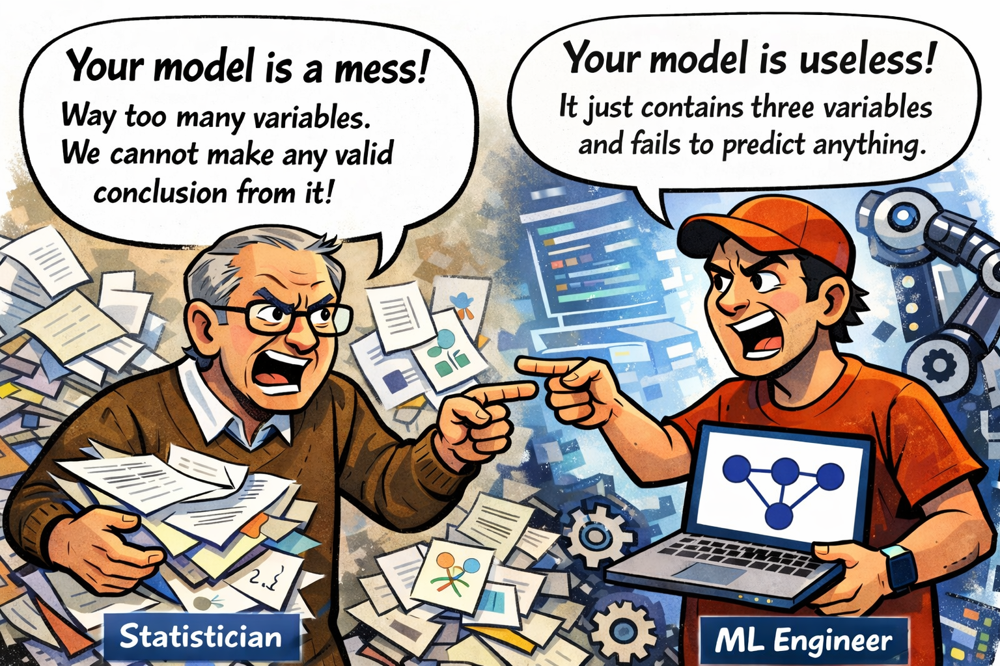
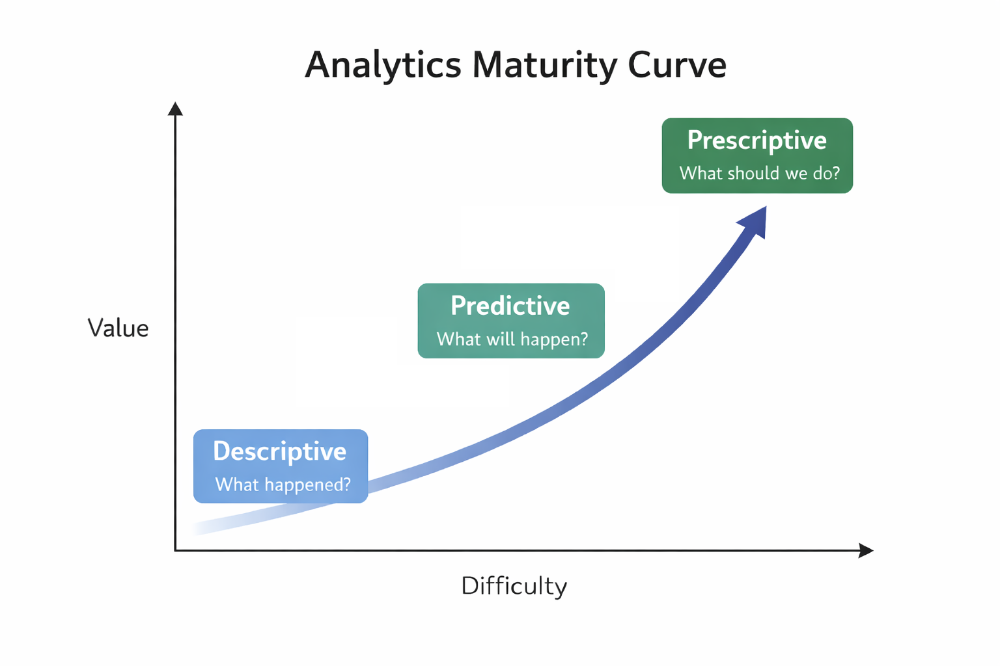
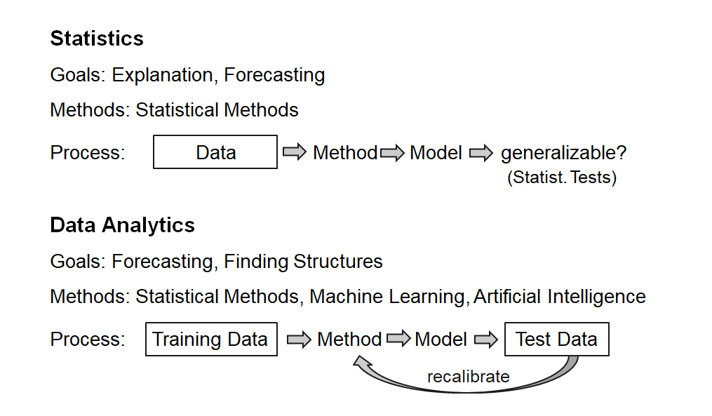

## Why is Modern Analytics so Successful?

1. [More Data](#more-data-for-the-analysis)
2. [More Computing Power](#computing-power)
3. [New Algorithms](#new-algorithms)
4. [New Analytics Processes](#analytics-processes)

# More Data for the Analysis {data-stack-name="Data"}


## The Data Explosion

::: columns

:::  {.column width="50%"}

<br><br>

```{python}
#| echo: false

import matplotlib.pyplot as plt
import numpy as np

# Known datapoints from literature (IDC Global Datasphere summaries)
years_known = np.array([2010, 2012, 2014, 2016, 2018, 2020, 2022, 2024, 2025])

structured_known = np.array([0.6, 1.0, 1.6, 3.8, 7, 12, 18, 26, 32])
unstructured_known = np.array([1.4, 2.5, 4.4, 12.2, 26, 52, 79, 121, 149])

# Sources referenced in literature:
#
# - Global data volume was ~2 ZB in 2010
# - It increased to ~33 ZB by 2018
# - IDC Global Datasphere reports forecast ~175 ZB by 2025
# - Some summaries report ~181 ZB by 2025
#
# These figures illustrate strongly exponential growth.

# Create full yearly range
years = np.arange(2010, 2026)

# Interpolate missing years
structured = np.interp(years, years_known, structured_known)
unstructured = np.interp(years, years_known, unstructured_known)

totals = structured + unstructured

# Identify interpolated years
is_interpolated = ~np.isin(years, years_known)
is_known = np.isin(years, years_known)

# Fit exponential trendline
log_totals = np.log(totals)
coeffs = np.polyfit(years, log_totals, 1)
trend_raw = np.exp(np.poly1d(coeffs)(years))

# Scale trend so it reaches ~190 ZB in 2025
target_2025 = 190
scale_factor = target_2025 / trend_raw[years == 2025]
trend = trend_raw * scale_factor

plt.figure(figsize=(9,4))

# --- Structured data bars ---
plt.bar(
    years[is_known],
    structured[is_known],
    label="Structured data"
)

plt.bar(
    years[is_interpolated],
    structured[is_interpolated],
    color="gray",
    hatch="//"
)

# --- Unstructured data bars ---
plt.bar(
    years[is_known],
    unstructured[is_known],
    bottom=structured[is_known],
    label="Unstructured data"
)

plt.bar(
    years[is_interpolated],
    unstructured[is_interpolated],
    bottom=structured[is_interpolated],
    color="gray",
    hatch="//"
)

# Exponential trendline
plt.plot(years, trend, color="black", linewidth=2, label="Estimated exponential trend")

plt.xlabel("Year")
plt.ylabel("Zettabytes")
plt.title("Growth of Global Data Volume")

plt.xticks(years, rotation=45)
plt.grid(axis="y")

plt.legend()

plt.show()
```

:::


:::  {.column width="50%"}

<br><br>

| Unit | Equivalent | Approximate Meaning |
|-----|------------|---------------------|
| Gigabyte (GB) |  | A HD movie file or a few hundred photos |
| Terabyte (TB) | 1,000 GB | Storage of a modern laptop or external drive |
| Petabyte (PB) | 1,000 TB | Data of a large company or several large data centers |
| Exabyte (EB) | 1,000 PB | Roughly the yearly internet traffic of a small country |
| Zettabyte (ZB) | 1,000 EB | ≈ 1 trillion gigabytes; global data creation scale |

:::

:::

## Data production

**Enterprise and Transactional Data**  
Enterprise systems such as ERP, CRM, and supply chain platforms generate large volumes of structured data through everyday business transactions.

**eCommerce**  
Every search, click, purchase, and review creates behavioral and transactional data used for recommendations and personalized marketing.

**Social Media and User-Generated Content**  
Platforms such as TikTok, YouTube, and Instagram generate enormous data volumes through uploads, interactions, and live streaming.

**IoT and Smart Devices**  
Connected devices—from wearables to industrial sensors—continuously produce real-time data across interconnected systems.

**Digital Transactions**  
Online banking, mobile payments, and blockchain systems generate detailed financial records for transactions and security monitoring.

**AI-Generated Data**  
Machine learning and generative AI create large datasets during training and operation, further accelerating global data growth.


<!--
## Data storage
Moores law, Cloud computing, ...
-->


# Computing Power {data-stack-name="Computing Power"}

## Growth of Computing Power

The rapid acceleration of computing power—driven by advances in hardware, cloud infrastructure, and parallel processing—has enabled modern analytics and machine learning to scale to massive datasets.

<br>

{fig-align="center" width="70%"}

## Evolution of Computing Power

The growth of modern analytics is enabled by **changing strategies for increasing computing power**.

<br>

| Era | Main Strategy | Explanation |
|-----|---------------|-------------|
| 1970s–2000s (*) | **Moore’s Law & miniaturization** | Smaller transistors → more components per chip → faster processors |
| 2005–today | **Parallel computing** | Performance increases by using multiple processors simultaneously |
| 2010s–today | **Specialized hardware** | Chips optimized for specific workloads (GPUs, TPUs, AI accelerators) |
| Emerging | **New computing paradigms** | Alternative computing models such as quantum computing |

::: aside
(*) Miniaturization continues today, but progress has slowed as transistors approach physical limits.
Advances such as extreme ultraviolet (EUV) lithography are required to continue scaling.
See how $400 million machines are constructed to build modern chips: [https://www.youtube.com/watch?v=MiUHjLxm3V0](https://www.youtube.com/watch?v=MiUHjLxm3V0).
:::

# New Algorithms {data-stack-name="Algorithms"}


## Algorithms enable more powerful models

<br><br>

::: columns
::: {.column width="30%"}
{width="90%"}

Traditional Regression

:::

::: {.column width="30%"}

{width="90%"}

Decision Tree
:::

::: {.column width="30%"}
{width="90%"}

Neural Network
:::

:::


## Rapid Advances in Algorithms

Recent breakthroughs in AI show how new algorithms can rapidly surpass human performance in specific domains.

::: columns

::: column

AlphaGo (2016)

- Developed by **DeepMind**
- Uses **deep neural networks + reinforcement learning**
- Defeated world champion **Lee Sedol** in the game of Go

Key insight:

- Go was long considered too complex for computers due to the enormous search space.

**Result**

> AI surpassed human experts in complex strategic reasoning.

:::

::: column

AlphaFold (2020–2022)

- Developed by **DeepMind**
- Uses deep learning to predict **protein structures**
- Achieved breakthrough performance in the **CASP competition**

Key insight:

- Predicting protein folding had been a major unsolved problem in biology for decades.

**Result**

> AI can solve scientific problems that previously required years of human research.

:::

:::

**Key takeaway**

AI progress often occurs through **algorithmic breakthroughs**, enabling machines to outperform humans in increasingly complex domains:

TODO:
- add illustrations
- 
- nobel prize + biotech. ?

<!--
        ## ImageNet

        ImageNet is a large-scale image recognition competition where models compete to classify millions of images across thousands of categories.
        Breakthrough models have historically demonstrated major advances in deep learning.
-->

```{python}
#| echo: false
import matplotlib.pyplot as plt

# Same data
years = ["2010", "2011", "2012", "2013", "2014", "2016", "2017"]
models = ["NEC-UIUC", "XRCE", "AlexNet/\nSupervision",
          "ZFNet", "GoogLeNet", "T-S", "SEN"]
error_rates = [28.2, 25.8, 16.34, 11.7, 6.7, 3.0, 2.25]
human_error = 5.1

fig, ax = plt.subplots(figsize=(8, 4))
x = range(len(years))
ax.bar(x, error_rates)

ax.axhline(human_error, linestyle="--")
ax.text(len(years)-0.5, human_error + 0.3,
        f"Human error rate ({human_error}%)",
        ha="right", va="bottom")

ax.set_xticks(x)
ax.set_xticklabels(models, rotation=30, ha="right")
ax.set_ylabel("Top-5 error rate (%)")
ax.set_ylim(0, 30)
ax.set_title("Error rates of winning ImageNet entries")

fig.tight_layout()
plt.show()
```

## Jagged frontier

```{python}
#| echo: false

import numpy as np
import matplotlib.pyplot as plt

# Categories (axes)
labels = [
    "Knowledge",
    "Reading & Writing",
    "Math",
    "Reasoning",
    "Working Memory",
    "Memory Storage",
    "Memory Retrieval",
    "Visual",
    "Auditory",
    "Speed"
]

# Example scores (approximate values from the illustration)
gpt4 = [8, 6, 5, 4, 1, 0, 2, 0, 0, 3]
gpt5 = [9, 9, 9, 7, 5, 0, 4, 0, 6, 3]

# Close the polygon
gpt4 = gpt4 + [gpt4[0]]
gpt5 = gpt5 + [gpt5[0]]

# Compute angles
angles = np.linspace(0, 2*np.pi, len(labels), endpoint=False).tolist()
angles += angles[:1]

# Create figure
fig, ax = plt.subplots(figsize=(6,6), subplot_kw=dict(polar=True))

# Plot data
ax.plot(angles, gpt5, linewidth=2, label="GPT-5 (2025)")
ax.fill(angles, gpt5, alpha=0.15)

ax.plot(angles, gpt4, linewidth=2, label="GPT-4 (2023)")
ax.fill(angles, gpt4, alpha=0.15)

# Axis labels
ax.set_xticks(angles[:-1])
ax.set_xticklabels(labels)

# Radial limits
ax.set_ylim(0, 10)

# Grid and legend
ax.set_title("Capabilities of GPT-4 and GPT-5", pad=20)
ax.legend(loc="upper right", bbox_to_anchor=(1.3, 1.1))

plt.show()
```

TODO: cite Dellacqua

<!--
https://www.agidefinition.ai/
https://www.oneusefulthing.org/p/the-shape-of-ai-jaggedness-bottlenecks
-->

# Analytics Processes {data-stack-name="Analytics Processes"}

<!--
        ## Structure: TODO

        - start with epistemic goals (describing, predicting, prescribing)
        - introduce CRISP-DM
        - distinguish different analytical models and disciplines (referring to the epistemic goals - example: statistician would not be happy with an ML model because it does not support inference/explanation. ML engineer is not happy with a regression model - it may support inference/explanation better, but its predictions may be less accurate)

        {fig-align="center" width="40%"}

        ## Traditional vs. Modern Analytics Process


        **Traditional Analytics Process:**

        {fig-align="center" width="40%"}


        **Modern Analytics Process:**

        {fig-align="center" width="40%"}


        ## From the Past to the Present

        {fig-align="center" width="60%"}


        ## Evolution of Analytics


        {fig-align="center"  width="70%"}


        ::: aside
        Source: http://juxt.pro/blog/posts/machine-learning-with-clojure.html
        :::
-->

## Maturing analytical capabilities

<br><br>

{width=60% fig-align=center}

<!--
https://medium.com/aimonks/key-types-of-analytics-according-to-gartner-9dd5861debe2

Types of Analytics (I)

{fig-align="center" width="60%"}

::: aside
Source: Schmarzo, p. 88
:::
-->

## Analytical purposes

<br><br>

<div class="smaller">

| What happened? (descriptive )    | What will happen? (predictive analytics) | What should I do? (prescriptive analytics) |
|----------------------------------|------------------------------------------|--------------------------------------------|
| How many widgets did I sell last month? | How many widgets will I sell next month? | Order **5,000** units of Component Z to support widget sales for next month. |
| What were sales by zip code for Christmas last year? | What will be sales by zip code over this Christmas season? | Hire **Y** new sales reps by these zip codes to handle projected Christmas sales. |
| How many of Product X were returned last month? | How many of Product X will be returned next month? | Set aside **$125K** in financial reserve to cover Product X returns. |
| What were company revenues and profits for the past quarter? | What are projected company revenues and profits for next quarter? | Sell the following product mix to achieve quarterly revenue and margin goals. |
| How many employees did I hire last year? | How many employees will I need to hire next year? | Increase hiring pipeline by **35%** to achieve hiring goals. |

</div>

<br><br>

 A particular method, such as regression or machine learning, can serve multiple purposes.

<!--
- What happened in the past?
- Find patterns and relationships in data and use them for prediction.
- Use the predictions to make decisions.
-->

::: aside
Source: Schmarzo, p. 13
:::

## Descriptive Analytics Process

{fig-align="center" width="45%"}

## Predictive Analytics Process

{fig-align="center" width="60%"}

## Example Inventory Planning

{fig-align="center" width="60%"}

<p>On the basis of more than 300 million data records per week, Otto makes more than one billion forecasts per year on the sales development of individual articles for the next days and weeks. Such forecasts allow Otto to reduce its own inventories by up to 30% on average.</p>

::: aside
Source: http://www.bvl.de/misc/filePush.php?mimeType=application/pdf&fullPath=/files/441/442/777/1015/DLK12_C3-3_Praesentation_Stueben.pdf
:::

<!--
        ## Classical Corporate Planning

        {fig-align="center" width="60%"}

        ## Example Driver-based Planing (I)

        {fig-align="center" width="60%"}

        ## Example Driver-based Planing (II)

        {fig-align="center" width="40%"}

        1. Sales forecasts based on market and social media data
        2. Automated pricing based on market and competitor analyses
        3. Early detection of price changes and adjustment of purchasing behavior
        4. Optimization of inventory management based on customers' current purchasing preferences
-->

## Analytical models

<br>

| Discipline          | Model Culture           | Typical Models            |
| ------------------- | ----------------------- | ------------------------- |
| Statistics          | Probabilistic inference | Regression, GLM, Bayesian |
| Econometrics        | Causal modeling         | IV, panel models          |
| Computer Science    | Algorithmic learning    | Trees, SVM, NN            |
| Operations Research | Optimization            | LP, MIP                   |
| Management Science  | Decision modeling       | Stochastic optimization   |
| Complex Systems     | Simulation              | ABM, DES                  |

-> highlight what we focus on. Mention that not all disciplines focus on the "business understanding" and using insights to support business decisions. Oftentimes, the goal may also be to understand and explain, not to decide (prescribe).

TODO: replace abbreviations

<!--
Statistics vs. Data Analytics


-->


## CRISP-DM

```{dot}
digraph CRISPDM {
  layout=neato;
  overlap=false;
  splines=true;
  fontname="Helvetica";

  node [
    shape=box,
    style="rounded,filled",
    fillcolor="#f4f6fb",
    fontname="Helvetica",
    fontsize=20,
    width=2.8,
    height=1
  ];

  edge [
    penwidth=1.6,
    arrowsize=1.1
  ];

  // --- Circular positions ---
  A [label="Business\nUnderstanding", pos="-2,2!"];
  B [label="Data\nUnderstanding", pos="2,2!"];
  C [label="Data\nPreparation", pos="3,0!"];
  D [label="Modeling", pos="2,-2!"];
  E [label="Evaluation", pos="-2,-2!"];
  F [label="Deployment", pos="-4,0!", fillcolor="#e6f4ea"];

  // --- Central Database ---
  X [
    label="Data",
    shape=cylinder,
    fillcolor="#e9f2ff",
    fontsize=22,
    width=1.9,
    height=1.4,
    pos="0,0!"
  ];

  // --- Main Flow ---
  A -> B;
  B -> C;
  C -> D;
  D -> E;
  E -> F;

  // --- True Bidirectional Iterations ---
  B -> A;
  A -> B;

  D -> C;
  C -> D;

  E -> A;
  A -> E;
}
```

## Summary {data-state="hide-menubar"}

🎯 **Learning Objective**

::: {.learning-objectives}
- **Illustrate** how modern data analytics capabilities are enabled by data availability, advances in computing power, new algorithms, and modern analytics processes.
- **Distinguish** between descriptive, predictive, and prescriptive analytics.
- **Explore** the Python and Jupyter analytics ecosystem (*exercise*).
:::

# Exercise {data-state="hide-menubar"}

## TODO {data-state="hide-menubar"}

- Github account, start Codespace in [analytics-and-big-data-notebooks](https://github.com/fs-ise/analytics-and-big-data-notebooks)
- option to use a local setup after this session (if it works on your machine)
- explain setup
- Working example (setup time seems to be fast!): https://github.com/github/codespaces-jupyter
- Github advice: https://docs.github.com/en/codespaces/developing-in-a-codespace/getting-started-with-github-codespaces-for-machine-learning

