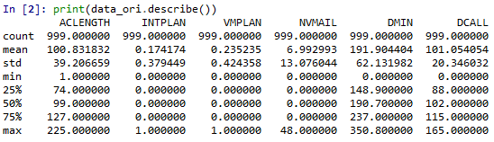
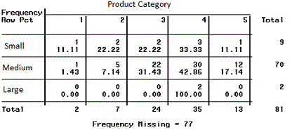
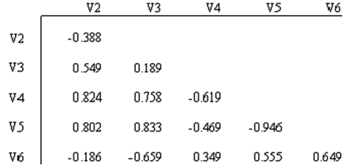
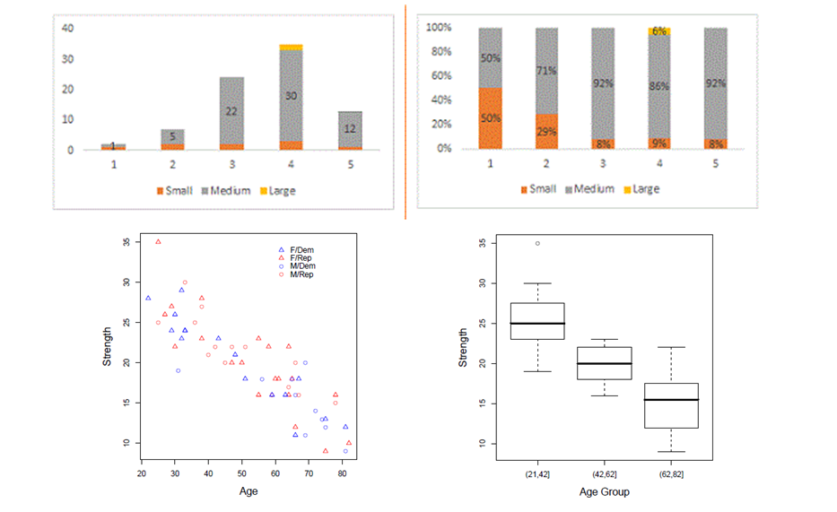
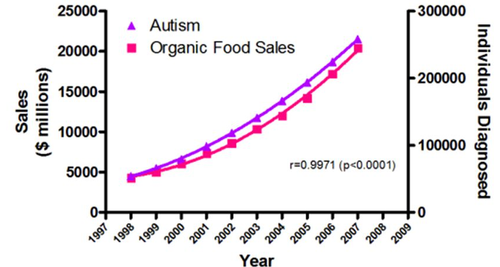
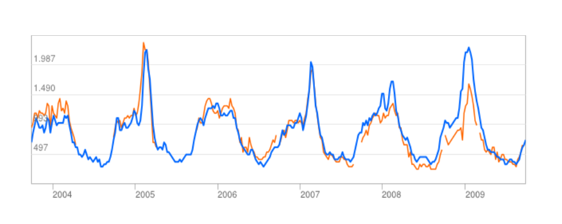
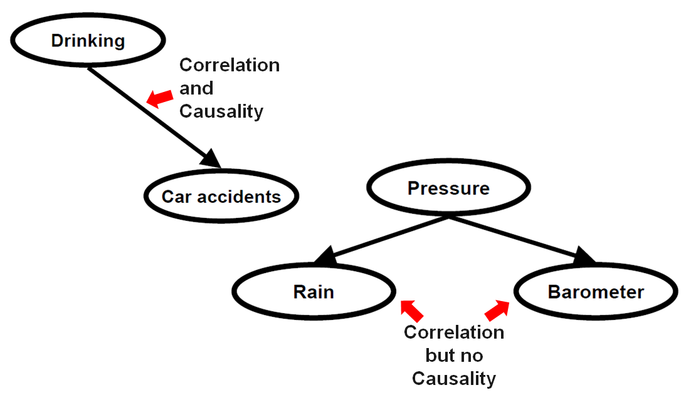
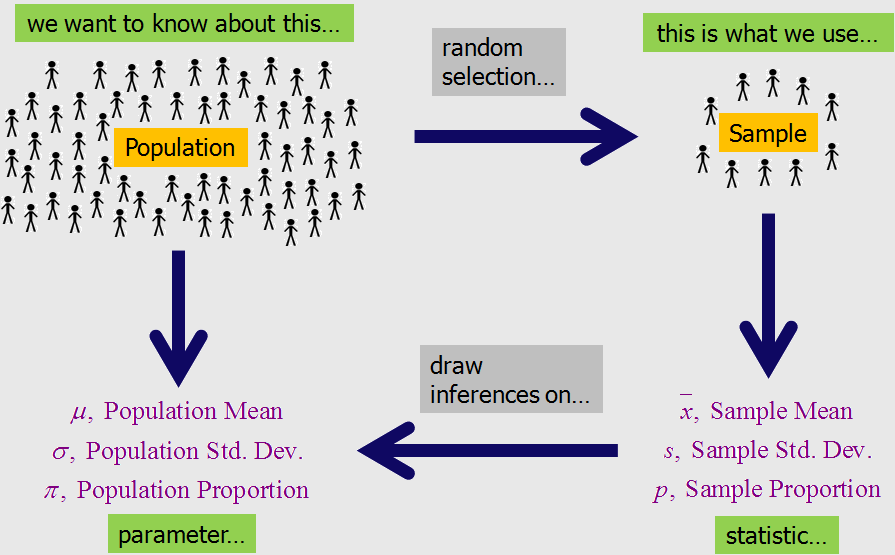

## {data-state="hide-menubar"}

<br><br><br><br><br>

::: {.learning-objectives}
- **Describe** key characteristics of variables and patterns between variables.
- **Explore** data sets by using appropriate descriptive and visual techniques in Python (*exercise*).
- **Explain** the role of exploratory data analysis in business decision-making.
:::

## Table of Contents {data-state="hide-menubar"}
<ul class="menu"><ul>

# Motivation {data-stack-name="Motivation"}

## The role of EDA

process (pre-model), aims, techniques (graphical, non-graphical, ...)

## "limitations of EDA"

- Descriptive vs. inferential statistics
- no model/explanation/prediction (correlation vs causality)
- sampling error, unless EDA is run on the whole population (e.g., in some Big Data settings)
-> starting point for building predictions (explanations, hypotheses, models, causality)


# Univariate exploratory data analysis {data-stack-name="Univariate EDA"}

## Exploratory Data Analysis

> In Exploratory Data Analysis (EDA), there is no hypothesis and there is no model.

> People are not very good at looking at a column of numbers or a whole data table and then determining important characteristics of the data. EDA techniques have been devised as an aid in this situation.

> Reasons for EDA:

- gain intuition about the data
- make comparisons between distributions
- sanity checking (making sure the data is on the scale you expect, in the format you thought it should be)
- find out where data is missing or if there are outliers
- summarize the data

> Exploratory data analysis is generally cross-classed in two ways. First, each method is either non-graphical or graphical. And second, each method is either univariate or multivariate.


## Univariate Non-Graphical EDA

> Non-graphical exploratory data analysis is the first step when beginning to analyze the data. This preliminary data analysis step focuses on four points:

- measures of central tendency, i.e. mean and median. The median, known as 50th percentile, is more resistant to outliers.
- measures of spread, i.e. variance, standard deviation, and interquartile range
- the shape of the distribution
- the existence of outliers

> The characteristics of interest for a categorical variable are simply the range of values and the frequency of occurrence for each value.



## Data types

Representing the “real world” in computer requires to use appropriate data types

From a statistical point of view, there are four fundamental data types, known as measurement scales:

Qualitative description of objects

- Nominal (special case: binary)
- Ordinal

Quantitative description objects

- Interval
- Ratio

## Nominal scale (qualitative)

Values of a nominal / categorical attribute are symbols or names of things. Each value represents some kind of category, code, or state

This scale assumes existence of a finite number of equivalency classes, where each class is named or labeled

The values do not have any meaningful order

Examples:

- Hair color = {auburn, black, blond, brown, grey, red, white, …}
- Fruits = {apple, banana, strawberry, …}
- Postal codes = {96052, 96047, …}

Special case of the nominal scale: Binary scale

-Nominal attribute with only 2 states (0/1, or TRUE / FALSE) – also called Boolean
- 0/FALSE typically means absence and 1/TRUE presence

There are two types of binary objects:

- Symmetric binary: both outcomes equally important, e.g., gender
- Asymmetric binary: outcomes not equally important, e.g., medical test (positive vs. negative)

It is recommended to assign 1 to the most important, and often rare, outcome that is subject to investigation (e.g. people that purchase a product, have a disease)

Examples:

- Smoking: 1 indicates patients in a trial that smoke, 0 otherwise.
- Purchase: 1 indicates that a person purchased a product, 0 otherwise.

## Ordinal / rank scale (qualitative)


- A categorical attribute with values that have a meaningful order, but the magnitude between successive values is not known
- The ordinal scale is useful for registering subjective assessments and things that cannot be measured objectively (often used in surveys for ratings)

Values cannot be multiplied or added, even if the numbers belong to the same scale.

Relations between values:

- Transitivity: If A>B, B>C, then A>C,
- Symmetry: : If A>B, then B<A

Examples:

- School grades = {A < B < C < D < E < F} or {1 < 2 < 3 < 4 < 5 < 6}
- Places in a competition = {1st, 2nd, 3rd, 4th, …}

## Interval scale (quantitative)

- A numeric measureable attribute in the form of integer or real values. The distance between the numbers or units on this scale is equal over all levels of the scale. Values of the interval scale have no natural “zero” point
- Invariant under a linear transformation 𝑎𝑥 + 𝑏, 𝑎 > 0, 𝑏 ≥ 0
- Although the sum of two interval-scale measurements is not meaningful by itself, their average can be computed

Examples:

- Celsius scale of temperature (there is no natural zero, 0°C is arbitrarily defined), a Celsius value 𝑐 can be linearly transformed to a Fahrenheit value 𝑓: 𝑓 = 9/5 ∗ 𝑐 + 32
- Dates and time (e.g., conversion from Julian to Gregorian calendar is possible)

## Ratio scale (quantitative)

- Numeric values with a meaningful zero point (e.g., “zero” means absence)
- All arithmetic rules and functions can be applied (addition, subtraction)

Examples:

- Money, person’s age, market share, quantities purchased, speed, …
- Kelvin (K) temperature (has a true zero-point (0 °K=− 273.15 ℃): It is the point at which the particles that comprise matter have zero kinetic energy


## Possible mathematical operations for each scale type

Due to the different mathematical properties, not all statistical measures can be computed on different measurement scales:

| Scale    | Mathematical operations possible                     | Mode | Frequency | Percentiles / Median | Mean / Variance / SD |
|----------|----------------------------------------------------|------|-----------|----------------------|----------------------|
| Nominal  | =, ≠                                               | X    | X         |                      |                      |
| Ordinal  | =, ≠, <, >                                         | X    | X         | X                    |                      |
| Interval | =, ≠, <, >, linear transformation                  | X    | (X)       | X                    | X                    |
| Ratio    | =, ≠, <, >, *, /, +, −                             | X    | (X)       | X                    | X                    |


The frequency (relative / absolute) may be calculated for a numeric variable, but makes only sense when the number of possible values is low

## Descriptive statistics

How to describe data (not the data type)?

| Customer ID | Name         | Year of birth | Tariff |
|-------------|-------------|---------------|--------|
| 100216      | Kevin Meyer | 1983          | A      |
| 271692      | Lars Knopp  | 1963          | B      |
| 892615      | Anton Albert| 1954          | C      |
| 331625      | Peter Pan   | 1988          | D      |
| ...         | ...         | ...           | ...    |

## Describing data using descriptive statistics

::: columns

::: {.column width="50%"}

- Basic statistical descriptions can be used to identify characteristics of the data and highlight which data values should be treated as noise or outliers.

- A good way to get an impression of continuous / numeric data is the **histogram**.

- The graph shows the range of observations on the horizontal axis, with a bar showing how many times each value occurred in the data set.

:::

::: {.column width="50%"}

```{python}
import numpy as np
import matplotlib.pyplot as plt

# Simulated year-of-birth data (similar distribution as in the slide)
np.random.seed(42)
years = np.concatenate([
    np.random.normal(1965, 15, 40000),
    np.random.normal(1980, 8, 20000)
])

years = years[(years > 1920) & (years < 2020)]

plt.figure()
plt.hist(years, bins=20)
plt.title("Year of birth - Histogram")
plt.xlabel("Year of birth")
plt.ylabel("Frequency")
plt.show()
```
:::

:::

## What are the “key figures” of a distribution?

- Graphics work well for single variables, but for comparison of different variables and their distributions and later working with the data, numeric indicators are necessary

- Descriptive statistics provide us with numbers describing the characteristics of a distribution

- For qualitative / categorical data
  - **Mode**
  - **Relative frequency**

- For quantitative / numerical data
  - **Mean** (also known as **Expected Value**) – describing the position of the center
  - **Variance** (or **Standard Deviation**) – describing the spread
  - **Percentiles** (also known as quantiles / quintiles) – more detailed figures on the distribution


## Mode

::: columns

::: {.column width="50%"}

- The mode is the value that appears most in a set of data values

- The highest mode also has the highest relative frequency (see next slide)

- Example: On a party, you meet many other students, and you ask what they are studying.

:::

::: {.column width="50%"}

```{python}
import matplotlib.pyplot as plt

# Example data
fields = [
    "Computer Science",
    "Information Systems",
    "Business Administration",
    "Engineering"
]

counts = [20, 25, 17, 12]

plt.figure()
plt.barh(fields, counts)
plt.title("What is your background?")
plt.xlabel("Number of students")
plt.ylabel("")
plt.xlim(0, 30)
plt.show()
```
:::

:::

## The relative frequency

::: columns

::: {.column width="55%"}

Your company purchases fancy retro light bulbs from overseas.
Because of the transport or the low quality of the supplier, 80 of 200 light bulbs are defect.
The relative frequency of defect light bulbs in the shipment is

\[
p = \frac{\text{Number of outcomes representing the event}}
         {\text{Total number of possible outcomes}}
\]

\[
p = \frac{80}{200} = 0.4
\]

The relative frequency approach can be used as a probability assessment.
However, larger samples must be used, the probability should be observed over longer time, and potential sampling issues must be considered.

:::

::: {.column width="45%"}

TODO


:::

:::


## The mean / expected value

::: columns

::: {.column width="55%"}

The *arithmetic* mean is calculated as

\[
\bar{x} = \sum_{i=1}^{n} \frac{x_i}{n}
= \frac{x_1 + x_2 + \dots + x_n}{n}
\]

where \(x_1, x_2, \dots, x_n\) is a set of \(n\) observations.
The mean is often denoted as \(\mu\) or with the symbol \(\bar{x}\).

Treating the empirical distribution as a probability function of a random variable, the **expected value** can be **estimated by the mean**:

\[
E(X) = \bar{x}
\]

**Interpretation:** If you (randomly) select customers from the sample depicted right, you can expect that they have a mean year of birth of approximately 1967.

:::

::: {.column width="45%"}

```{python}
import numpy as np
import matplotlib.pyplot as plt

# Simulated year-of-birth data
np.random.seed(42)
years = np.concatenate([
    np.random.normal(1965, 15, 40000),
    np.random.normal(1980, 8, 20000)
])

years = years[(years > 1920) & (years < 2020)]

mean_year = np.mean(years)

plt.figure()
plt.hist(years, bins=20)
plt.axvline(mean_year)
plt.title("Year of birth - Histogram")
plt.xlabel("Year of birth")
plt.ylabel("Frequency")
plt.text(mean_year, plt.ylim()[1]*0.95, f"x̄ = {mean_year:.3f}")
plt.show()
```
:::

:::


## Boxplot

::: columns

::: {.column width="50%"}

- The boxplot is a condensed illustration of a distribution

- It consists of
  - Median (thick line)
  - 25% / 75% percentiles
  - “Whiskers”: the quartiles ± 1.5 × IQR
  - Outliers that are higher/lower than the whiskers

:::

::: {.column width="50%"}

```{python}
import numpy as np
import matplotlib.pyplot as plt

# Simulated year-of-birth data
np.random.seed(42)
years = np.concatenate([
    np.random.normal(1965, 15, 40000),
    np.random.normal(1980, 8, 20000)
])

years = years[(years > 1920) & (years < 2020)]

fig, ax = plt.subplots(2, 1, figsize=(6, 6))

# Histogram
ax[0].hist(years, bins=20)
ax[0].set_title("Year of birth - Histogram")
ax[0].set_xlabel("")
ax[0].set_ylabel("Frequency")

# Boxplot
ax[1].boxplot(years, vert=False)
ax[1].set_xlabel("Year of birth")
ax[1].set_yticks([])

plt.tight_layout()
plt.show()
```
:::

:::


## Boxplots can be used to compare different distributions

::: columns

::: {.column width="50%"}

**Example:**

- In an experiment, households received different types of feedback on their electricity consumption

- The “control” group received no feedback

- The plot shows boxplots of the savings in electricity consumption after three weeks with feedback

- One can – for example – see that there is a higher spread in group 2A compared to the others

:::

::: {.column width="50%"}

```{python}
import numpy as np
import matplotlib.pyplot as plt

np.random.seed(42)

# Simulated savings data (kWh per day)
group_1A = np.random.normal(0.6, 0.8, 100)
group_1B = np.random.normal(0.5, 0.9, 100)
group_2A = np.random.normal(1.0, 1.8, 100)   # higher spread
group_2B = np.random.normal(0.9, 1.0, 100)
control  = np.random.normal(0.4, 0.7, 100)

data = [group_1A, group_1B, group_2A, group_2B, control]
labels = ["1A", "1B", "2A", "2B", "control"]

plt.figure()
plt.boxplot(data, labels=labels)
plt.axhline(0)
plt.ylabel("average el. consumption (kWh) per day")
plt.xlabel("experiment group")
plt.title("Savings = cons. treatment - cons. baseline")
plt.show()
```
:::

:::


# Multivariate exploratory data analysis {data-stack-name="Multivariate EDA"}


## Multivariate Non-Graphical EDA

TODO: maybe mention at the very beginning that there are non-graphical and graphical forms of EDA (uni/multivariate)?

> Multivariate non-graphical EDA techniques generally show the relationship between two or more variables in the form of either cross-tabulation for categorical variables or correlation statistics for numerical variables.

<div style="display:flex;justify-content:center;margin-top:4em">
<div class="Multivariate-wrapper" >

</div>
<div class="Multivariate-wrapper">

</div>
</div>


## Multivariate Graphical EDA

> Multivariate graphical EDA techniques are scatterplots for numerical variables, Barcharts for categorical variables, or Boxplots for mixed types.




## Bivariate statistics

- So far, we focused on the description of one variable (univariate statistics)

- In many cases, we are interested in the interactions between variables
  (probably not in spurious correlations but in meaningful ones…)

::: columns

::: {.column width="50%"}

**Per capita cheese consumption**
correlates with
**Number of people who died by becoming tangled in their bedsheets**

<br><br><br>

<div style="height:300px; border:1px solid #ccc; display:flex; align-items:center; justify-content:center;">
  <em>Figure placeholder</em>
</div>

:::

::: {.column width="50%"}

**Worldwide non-commercial space launches**
correlates with
**Sociology doctorates awarded (US)**

<br><br><br>

<div style="height:300px; border:1px solid #ccc; display:flex; align-items:center; justify-content:center;">
  <em>Figure placeholder</em>
</div>

:::

:::

These and more online: https://www.tylervigen.com/spurious-correlations


## TODO : correlation (Hopf slides: not sure I want to cover covariance)


## Correlation



::: aside
— Source: Organic Trade Association, 2011 Organic Industry Survey, U.P. Department of Education, Office of Special Education Programs, Data Analysis System (DANS)
:::

> Organic food sales and the rate of autism seem to have a very strong correlation, but no one is suggesting that one causes the other!


## Correlation vs. Causality (I)



**Correlation:** Two data series behave "similar"

**Causality:** Principle of Cause and Effect


## Correlation vs. Causality (II)




## Correlation vs. Causality (III)

> But: Sometimes it is better to know/predict something even if we cannot explain it instead of doing nothing!


## Statistical Estimation

TODO: TBD whether we cover it here!



::: aside
— Source: http://www.dxbydt.com/the-size-of-your-sample
:::


<!--
        ## Tests on Outliers

        > Outlier are data objects, which are clearly different from the others.

        > Usually, the detection of outliers is an unsupervised process, because they are not known before analyses.

        > In the case of **numerical attributes** the Interquartil Range can be used. Here, an outlier is defined if the attribute lies outside the interval.

        

        > Usually, k has a value between 1.5 and 3. The bigger k, the more different the values must be to be classified as outliers.

        > Can be visualized by a Box-and-Whisker Plot:

        


        ## Handling Outliers

        - Outlier have to be **eliminated** if they
          - would bias the analysis, e.g. if 9 persons have an age between 20 and 30 and the 10th person is 80 years old.
          - are erogenous data, e.g. as a result of input errors or a defect sensor.
        - It is not always acceptable to drop an observation just because it is an outlier. They can be legitimate observations and are sometimes interesting ones. It’s important to investigate the nature of the outlier before deciding.
        - In those cases where you shouldn’t drop the outlier, one option is to try a transformation. **Log transformations** pull in high numbers. This can reduce the impact of a single point if the outlier is an independent variable.

        


        ## Univariate Graphical EDA

        > Non-graphical and graphical EDA methods complement each other, they have the same focus. While the non-graphical methods are quantitative and objective, they do not give a full picture of the data. The distribution of a variable tells us what values the variable takes and how often each value occurs.

        > Types of displays:

        - for numerical variables: Histograms, Boxplots, Quantile-normal plots, …
        - for categorical variables: Pie charts, Bar graphs, …

        <div style="display:flex;justify-content:center">
        <div style="height:600px;width:400px">
        
        </div>
        <div style="height:600px;width:400px">
        
        </div>
        <div style="height:600px;width:400px">
        
        </div>
        </div>


-->


## TODO : add clustering!


## Introductory Example

> Assume you are a wholesale distributor and each row of your dataset corresponds to a customer showing the following attributes:

1) FRESH: annual spending on fresh products (Continuous);
2) MILK: annual spending on milk products (Continuous);
3) GROCERY: annual spending on grocery products (Continuous);
4) FROZEN: annual spending on frozen products (Continuous);
5) DETERGENTS_PAPER: annual spending on detergents and paper products (Continuous);
6) DELICATESSEN: annual spending on delicatessen products (Continuous);
7) CHANNEL: customers buying channel (Nominal);
8) REGION: customers region (Nominal)

> Your goal is to segment the users. That means finding similar types of users and bunching them together.  
> Why would you want to do this?  
> You might want to give different users different experiences. Marketing often does this; for example, to offer toner to people who are known to own printers.  
> You might have a model that works better for specific groups. Or you might have different models for different groups.


## Cluster Analysis

Cluster analysis is a type of multivariate statistical analysis. It is used to group data into separate clusters. The main objective of clustering is to find similarities between data objects, and then group similar objects together to assist in understanding relationships that might exist among them. Cluster analysis is based on a mathematical formulation of a measure of similarity.

There are different types of cluster analysis methods:

- Clustering Methods

TODO: fix missing?


## Partitioning Cluster Methods

The partitioning cluster methods divide the data into a predetermined number of clusters. The most popular technique is the K-Means algorithm.

Given a set of observations (x1, x2,…, xn), where each observation is a m-dimensional real vector, k-means clustering aims to partition the n observations into k ≤ n segments S = {S1, S2,…, Sk} so as to minimize the within-cluster sum of squares (WCSS).

The objective is to find where  is the mean of points in Si.


> **Procedure of K-Means:**

> Step 1: Randomly partition the data objects into k clusters.  
> Step 2: Calculate the cluster centroids.  
> Step 3: Calculate the distance from every data point to all centroids.  
> Step 4: If a data point is closest to its own centroid, leave it where it is. If the data point is not closest to its own centroid, assign it to the cluster with the closest centroid.  
> Step 5: Repeat the step 2 to 4 until a complete pass through of all the data points results in no data point changing from one cluster to another.


## Example of a K-Means Cluster Analysis


**Between cluster variance:**

**Within cluster variance:**

## Finding the Optimal Number of Clusters (I)

> The aim of the cluster analysis is the segmentation of objects into clusters, which are preferably homogeneous in it selves and heterogeneous to each other. The less variance exists within the clusters and the more variance exists between the clusters, the better is the number of clusters.

> **Total variance:**

> **Accumulated variance within the k clusters:**

> This results in the variance between the clusters:

> with n = number of objects

> m = number of attributes


## Finding the Optimal Number of Clusters (II)

> If you put V in on the ordinate and the number of cluster k on the abscissa, it often results in a curve with one or several kinks. At the point where exists the (first) significant kink, you can find the optimal number of clusters:

> **Total variance V_tot**

> **Between cluster variance V_betw**

> **Within cluster variance V_in**

> **Number of clusters**


## Finding the Optimal Number of Clusters (III)

> Instead of visually identifying the optimal cluster number, we can calculate the distances from the points on the elbow curve to a straight line linking the first and the last point on the curve. The cluster number with the largest distance is then chosen as the one with the strongest kink.


## Hierarchical Cluster Methods

- There are two types of hierarchical cluster methods:
  - Agglomerative hierarchical clustering is a bottom-up clustering method. It starts with every single data object in a single cluster. Then, in each iteration, it agglomerates (merges) the closest pair of clusters by satisfying some similarity criteria, until all of the data is in one cluster.
  - Divisive hierarchical clustering is a top-down clustering method. It works in a similar way to agglomerative clustering but in the opposite direction. This method starts with a single cluster containing all data objects, and then successively splits resulting clusters until only clusters of individual data objects remain.


## Process of the Hierarchical Cluster Analysis


## Measuring Similarity between Clusters (I)


> Distance between two clusters is the distance between the closest points:

> **Complete Linkage:**


> Distance between two clusters is the distance between the farthest pair of points:


> Distance between two clusters i and j is the distance between their centroids:


## Measuring Similarity between Clusters (II)

> **Average Linkage:**

> Distance between clusters is the average distance between the cluster points:


> **Ward’s Method / Minimum Variance Method (only Agglomerative):**


> Ward's minimum variance criterion minimizes the total within-cluster variance. At each step the pair of clusters is merged that leads to minimum increase in total within-cluster variance after merging. This can be calculated as the square of the distance between cluster means divided by the sum of the reciprocals of the number of observations in each cluster:

> For a comparison of the methods see: Ferreira, L.; Hitchcock, D. B. (2009): A Comparison of Hierarchical Methods for Clustering Functional Data, http://people.stat.sc.edu/Hitchcock/compare_hier_fda.pdf


## Single Linkage Example (I)


::: aside
— Source: Fred, Ana: Unsupervised Learning, Universidade Técnica de Lisboa
:::


## Single Linkage Example (II)


::: aside
— Source: Fred, Ana: Unsupervised Learning, Universidade Técnica de Lisboa
:::


## Dendrogram

> A dendrogram is a tree diagram frequently used to illustrate the arrangement of the clusters produced by hierarchical clustering. The y-axis represents the value of this distance metric (e.g. euclidean distance) between the clusters.

> In a dendrogram the widths of the horizontal lines give an impression about the dissimilarity of the merging object. Thus, a good cluster number might be at a point from where the width of the following horizontal lines is significantly smaller in length. The red line in the graph below shows such a point:

> Counting the points that cut this line might be a good answer for the number of clusters the data can have. It is the number 6 in this case.


# Visualization {data-stack-name="Visualization"}

## TODO

TBD: (grammar of graphics? plotly?)

TBD: we could even use Pandas built-in visualization

## pandas and matplotlib

Example:

```{python}
#| echo: true
#| output: true

import pandas as pd
import numpy as np

df = pd.DataFrame({
    "A": np.random.randn(100)
})

df.hist()
```

## TODO

show all (?) visualization covered on the previous slides
TBD: clustering?!

## Summary {data-state="hide-menubar"}

TODO

# References {data-state="hide-menubar"}