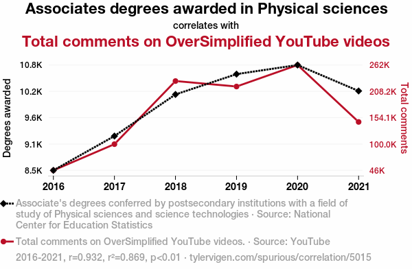
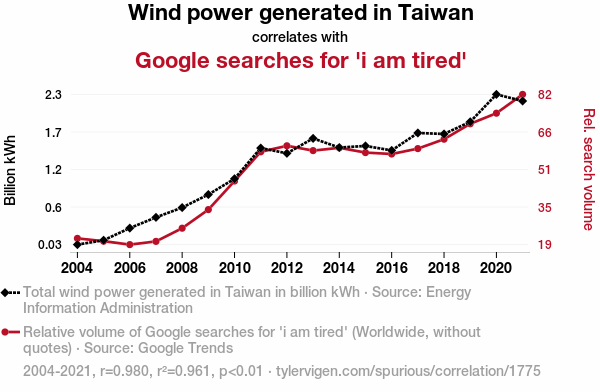
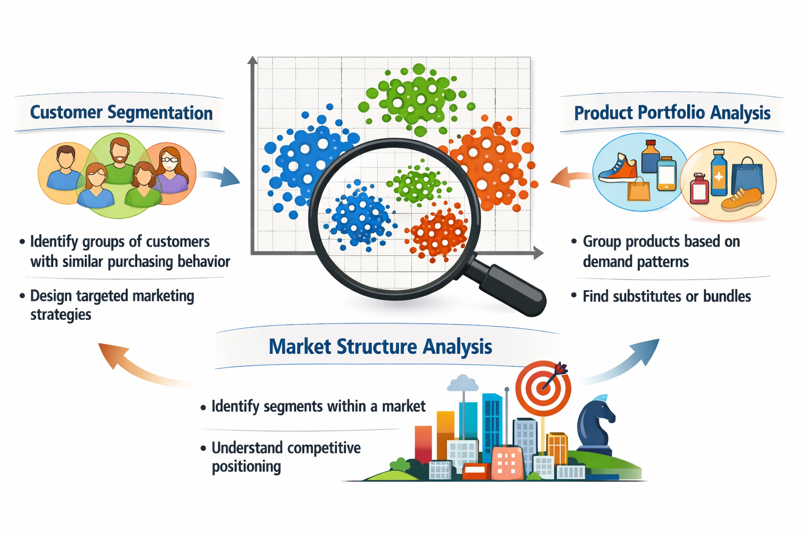

## {data-menu-title="Learning objectives" data-state="hide-menubar"}

<br><br><br><br><br>

::: {.learning-objectives}
- **Describe** variables, relationships between variables, and underlying structure in the data (e.g., clusters).
- **Prepare and explore** data sets using appropriate descriptive and visual techniques.
- **Explain** the role of exploratory data analysis in business decision-making.
:::

## Table of contents {data-state="hide-menubar"}
<ul class="menu"><ul>

## Foundations {data-state="hide-menubar"}

Before building analytical models, analysts typically engage in **data preparation and exploratory data analysis (EDA)**.

These activities are **closely intertwined and often iterative**:
we prepare and structure the data while simultaneously exploring it to understand its characteristics and potential issues.

Typical activities include:

* **Data preparation** (e.g., structuring, cleansing, integration)
* **Descriptive statistics** (e.g., mean, variance, frequencies)
* **Visualization techniques** (e.g., histograms, boxplots, scatterplots)

**Goal:**
develop an initial understanding of the data, detect patterns or anomalies, and ensure that the data is suitable for further analysis or modeling.


# Data preparation {data-stack-name="Data preparation"}

## Data types

Conducting EDA and representing the “real world” requires us to use appropriate data types.
Typically, we distinguish four fundamental data types, known as measurement scales:

Qualitative description of objects

- Nominal (special case: binary)
- Ordinal

Quantitative description objects

- Interval
- Ratio

## Qualitative: Nominal scale

- Values of a nominal (aka. categorical) attribute are symbols or names of things
- Each value represents some kind of category, code, or state.
- This scale assumes existence of a finite number of equivalency classes, where each class is named or labeled.
- The values do not have any meaningful order.

Examples:

- Hair color = {black, blond, brown, grey, red, white, …}
- Postal codes = {96047, 96048, …}

. . . 

Special case of the nominal scale: Binary scale – also called Boolean

- Nominal attribute with only 2 states
- 0/FALSE typically means absence and 1/TRUE presence.

Examples:

- Smoking: 1 indicates patients in a trial that smoke, 0 otherwise.
- Purchase: 1 indicates that a person purchased a product, 0 otherwise.

## Qualitative: Ordinal scale^[Also known as a "rank scale".]

- A categorical attribute with values that have a meaningful order, but the magnitude between successive values is not known
- The ordinal scale is useful for registering subjective assessments and things that cannot be measured objectively (often used in surveys for ratings)

Values cannot be multiplied or added, even if the numbers belong to the same scale.

Relations between values:

- Transitivity: If A>B, B>C, then A>C,
- Symmetry: : If A>B, then B<A

Examples:

- School grades = {A < B < C < D < E < F} or {1 < 2 < 3 < 4 < 5 < 6}
- Places in a competition = {1st, 2nd, 3rd, 4th, …}

## Quantitative: Interval scale

- A numeric measureable attribute in the form of integer or real values.
  The distance between the numbers or units on this scale is equal over all levels of the scale.
  Values of the interval scale have no natural “zero” point.
- Invariant under a linear transformation 𝑎𝑥 + 𝑏, 𝑎 > 0, 𝑏 ≥ 0
- Although the sum of two interval-scale measurements is not meaningful by itself, their average can be computed

Examples:

- Celsius scale of temperature (there is no natural zero, 0°C is arbitrarily defined), a Celsius value 𝑐 can be linearly transformed to a Fahrenheit value 𝑓: 𝑓 = 9/5 ∗ 𝑐 + 32
- Dates and time (e.g., conversion from Julian to Gregorian calendar is possible)

## Quantitative: Ratio scale

- Numeric values with a meaningful zero point (e.g., “zero” means absence)
- All arithmetic rules and functions can be applied (addition, subtraction)

Examples:

- Money, person’s age, market share, quantities purchased, speed, …
- Kelvin (K) temperature (has a true zero-point (0 °K=− 273.15 ℃): It is the point at which the particles that comprise matter have zero kinetic energy

## Scales and mathematical operations

Due to the different mathematical properties, not all statistical measures can be computed on different measurement scales:

<br><br>

| Scale    | Mathematical operations possible                     | Mode | Frequency | Percentiles / Median | Mean / Variance / SD |
|----------|----------------------------------------------------|------|-----------|----------------------|----------------------|
| Nominal  | =, ≠                                               | X    | X         |                      |                      |
| Ordinal  | =, ≠, <, >                                         | X    | X         | X                    |                      |
| Interval | =, ≠, <, >, linear transformation                  | X    | (X)       | X                    | X                    |
| Ratio    | =, ≠, <, >, *, /, +, −                             | X    | (X)       | X                    | X                    |

<br>

<p style="font-size:0.8em; color:gray;">
\(X\) The frequency (relative / absolute) may be calculated for a numeric variable, but makes only sense when the number of possible values is low
</p>

::: {.learning_note .fragment}
**Learning focus**

No need to memorize the table.  
Be able to **explain the scales and give examples of operations that are appropriate**.
:::

## Data quality and preparation

In business analytics, we rarely work with carefully curated datasets. Instead, data often comes from **multiple systems, processes, and teams**, where it is primarily created for **operational purposes rather than analysis**.
Because these data sources are not always standardized or under the analyst’s control, quality issues are common:

- **Missing values** (e.g., incomplete historical market data)
- **Outdated values** (e.g., customer address has changed)
- **Inconsistent formats or units** (e.g., dates stored as text, mixed currencies)
- **Duplicate records** (e.g., customers with multiple accounts)
- **Measurement or data entry errors** (e.g., human data entry, broken sensors)

. . .

Before conducting analysis, we must ensure that the **data is fit for use** [@StrongLeeWang1997].

::: {.highlight_must_learn}

**Typical data preparation actions**

1. Data structuring
2. Data cleansing
3. Data integration
4. Data transformation

:::

. . . 

 In many real-world analytics projects, **data preparation and cleaning can take up to ~80% of the total effort.**

## Data structuring: Example

There are many ways to structure the same dataset.
<br>

:::: {.columns}

::: {.column width="60%"}

**Option A (wide)**

<div class="smaller">

| Region | Year | Sales_Q1 | Sales_Q2 | Sales_Q3 | Sales_Q4 |
|------|------|------|------|------|------|
| Europe | 2023 | 120 | 140 | 160 | 150 |
| Asia | 2023 | 100 | 110 | 120 | 130 |

</div>

:::

::: {.column width="40%"}

**Option B (long)**

<div class="smaller">

| Region | Year | Quarter | Sales |
|------|------|------|------|
| Europe | 2023 | Q1 | 120 |
| Europe | 2023 | Q2 | 140 |
| Europe | 2023 | Q3 | 160 |
| Europe | 2023 | Q4 | 150 |
| Asia | 2023 | Q1 | 100 |
| Asia | 2023 | Q2 | 110 |
| Asia | 2023 | Q3 | 120 |
| Asia | 2023 | Q4 | 130 |

</div>

:::

::::

➡ **Which would you select as an input for a data analytics tool?**

. . . 

<br>

→ Solution: **Option B**, because this is what **data analytics tools typically expect**.

## Data structuring: Principles

Data structure *typically* expected by data analytics tools

<br>

::: {.highlight_must_learn}

**Vocabulary**

- A **dataset** is a collection of **values** (e.g., nominal, categorical, numeric).
- Each value belongs to a **variable** and an **observation**

**Expected data structure**

- Each variable forms a column
- Each observation forms a row
- Each type of observational unit forms a table

:::

. . . 

<br>

 Data must be structured according to the expectations of the analytical tool being used.
Reviewing the tool’s documentation and example datasets can help clarify the required format.

::: aside
Based on the Tidyverse and the work of @Wickham2014.
:::

## Data structuring: Example continued

**Dataset  `df` (wide)**

<div class="smaller">

| Region | Year | Sales_Q1 | Sales_Q2 | Sales_Q3 | Sales_Q4 |
|------|------|------|------|------|------|
| Europe | 2023 | 120 | 140 | 160 | 150 |
| Asia | 2023 | 100 | 110 | 120 | 130 |

</div>

Convert wide → long

```python
long_df = df.melt(
    id_vars=["Region", "Year"],
    var_name="Quarter",
    value_name="Sales"
)

long_df
```

. . . 

Result:

<div class="smaller">

| Region | Year | Quarter  | Sales |
| ------ | ---- | -------- | ----- |
| Europe | 2023 | Sales_Q1 | 120   |
| Asia   | 2023 | Sales_Q1 | 100   |
| Europe | 2023 | Sales_Q2 | 140   |
| Asia   | 2023 | Sales_Q2 | 110   |
| ...    | ...  | ...      | ...   |

</div>

## Data structuring: Example continued

As a last step, we need to clean the `Quarter` column by removing the `"Sales_"` prefix:

```python
long_df["Quarter"] = long_df["Quarter"].str.replace("Sales_", "")
```

. . . 

<br>

Final tidy dataset:

<div class="smaller">

| Region | Year | Quarter | Sales |
| ------ | ---- | ------- | ----- |
| Europe | 2023 | Q1      | 120   |
| Europe | 2023 | Q2      | 140   |
| Europe | 2023 | Q3      | 160   |
| Europe | 2023 | Q4      | 150   |
| Asia   | 2023 | Q1      | 100   |
| Asia   | 2023 | Q2      | 110   |
| Asia   | 2023 | Q3      | 120   |
| Asia   | 2023 | Q4      | 130   |

</div>

::: aside
Note: we will cover selected transformation operations like melt in the exercises.
:::

## Data cleansing

<br>

::: {.highlight_must_learn}

| Data issue                    | Example                                         | Data cleansing action                                                          |
| ----------------------------- | ----------------------------------------------- | ------------------------------------------------------------------------------ |
| Missing values                | Historical market data missing for some days    | Impute values (e.g., interpolate prices), fill with mean/median, or mark as NA |
| Outdated values               | Customer moved but old address still stored     | Update records from CRM, external address verification service                 |
| Outliers / implausible values | Age = 250, salary = −5000                       | Detect and remove, cap values, or replace with plausible values                |
| Inconsistent formats          | Dates stored as `"03/01/23"` and `"2023-01-03"` | Standardize to a single format (e.g., ISO date `YYYY-MM-DD`)                   |
| Inconsistent units            | Revenue in USD and EUR mixed in one column      | Convert to common currency                                                     |
| Duplicate records             | Same customer registered twice                  | Identify duplicates and merge records                                          |
| Data entry errors             | `"Munich"` vs `"Munch"`                         | Correct spelling using reference tables                                        |
| Sensor errors                 | Temperature sensor reports `9999`               | Remove invalid values or replace with interpolated measurements                |

:::

## Data integration

Organizations often store data in **different systems** (e.g., CRM, sales systems, web analytics).  

:::: {.columns}

::: {.column width="50%"}

**Customer database (CRM)**

<div class="smaller">

| Customer_ID | Name | Country | Email |
|---|---|---|---|
| 101 | Alice | Germany | alice@example.com |
| 102 | Bob | France | bob@example.com |
| 103 | Clara | Germany | clara@example.com |

</div>

:::

::: {.column width="50%"}

**Sales transactions**

<div class="smaller">

| Customer_ID | Order_ID | Revenue |
|---|---|---|
| 101 | 5001 | 200 |
| 101 | 5002 | 150 |
| 103 | 5003 | 300 |

</div>

:::

::::

For analysis, we can **integrate these datasets** using the shared key `Customer_ID`.

```python
integrated_data = customers.merge(sales, on="Customer_ID")
```

. . . 

This creates a combined dataset that links customer information with sales.

<div class="smaller">

| Customer_ID | Name  | Country | Email                                         | Order_ID | Revenue |
| ----------- | ----- | ------- | --------------------------------------------- | -------- | ------- |
| 101         | Alice | Germany | [alice@example.com](mailto:alice@example.com) | 5001     | 200     |
| 101         | Alice | Germany | [alice@example.com](mailto:alice@example.com) | 5002     | 150     |
| 103         | Clara | Germany | [clara@example.com](mailto:clara@example.com) | 5003     | 300     |

</div>

. . . 

<br>

 For analytical purposes, **redundant values are often acceptable**.
  The goal is to organize data into a **tidy structure**, where **each row represents one observation** and all relevant variables are available for analysis.

::: aside
Note: We will cover data integration in more detail in the next lecture.
:::


## Data transformation: Example

::: columns

::: {.column width="50%"}

Often, the way data is **stored** determines which mathematical operations are possible.

**Example: timestamps stored as strings**

<div class="smaller">

| user_id | timestamp |
|---|---|
| 101 | "2025-03-12 14:23:05" |
| 102 | "2025-03-12 18:02:11" |
| 103 | "2025-03-13 09:15:42" |

</div>

If treated as a **string**, we can only perform operations such as:

- equality checks (`=` / `≠`)
- simple filtering or sorting

This **severely limits analysis**.

:::

::: {.column width="50%" .fragment}

**Format conversions** help transform raw data into representations suitable for EDA and analytical models:

<div class="smaller">

| Representation | Example | Possible analysis |
|---|---|---|
| Numeric timestamp | 1741789385 | time differences, time series |
| Hour of day | 14 | activity patterns during the day |
| Day of week | Wednesday | weekday vs. weekend behavior |
| Day of year | 71 | seasonal patterns |

</div>

:::

:::

. . .

<br>
 Data preparation transforms raw data into **formats that allow meaningful mathematical operations and analysis**.


# Univariate exploratory data analysis {data-stack-name="Univariate EDA"}

## Foundations

> People are not very good at looking at a column of numbers or a whole data table and then determining important characteristics of the data.
  EDA techniques have been devised as an aid in this situation.

<br>

The following forms of EDA are typically distinguished:

<table style="border-collapse:collapse; margin:auto; font-size:20px; text-align:center;">
  <tr>
    <td style="border:none; width:170px;"></td>
    <td style="border:none; padding:10px 24px; font-weight:600;">Univariate</td>
    <td style="border:none; padding:10px 24px; font-weight:600;">Multivariate</td>
  </tr>
  <tr>
    <td style="border:none; padding:18px 14px; font-weight:600; text-align:right;">Non-graphical</td>
    <td style="border:3px solid #444; padding:22px 28px; background:#f8f8f8;">
      mean, median<br>frequencies
    </td>
    <td style="border:3px solid #444; padding:22px 28px; background:#f8f8f8;">
      cross-tabs<br>correlations
    </td>
  </tr>
  <tr>
    <td style="border:none; padding:18px 14px; font-weight:600; text-align:right;">Graphical</td>
    <td style="border:3px solid #444; padding:22px 28px; background:#f8f8f8;">
      histograms<br>dot plots
    </td>
    <td style="border:3px solid #444; padding:22px 28px; background:#f8f8f8;">
      scatter plots<br>clustering
    </td>
  </tr>
</table>

## Descriptive statistics

How to describe data (not the data type)?

| Customer ID | Name         | Year of birth | Tariff |
|-------------|-------------|---------------|--------|
| 100216      | Kevin Meyer | 1983          | A      |
| 271692      | Lars Knopp  | 1963          | B      |
| 892615      | Anton Albert| 1954          | C      |
| 331625      | Peter Pan   | 1988          | D      |
| ...         | ...         | ...           | ...    |


## What are the “key figures” of a distribution?

- Graphics work well for single variables, but for comparison of different variables and their distributions and later working with the data, numeric indicators are necessary

- Descriptive statistics provide us with numbers describing the characteristics of a distribution

- For qualitative / categorical data
  - **Mode**
  - **Relative frequency**

- For quantitative / numerical data
  - **Mean** (also known as **Expected Value**) – describing the position of the center
  - **Variance** (or **Standard Deviation**) – describing the spread
  - **Percentiles** (also known as quantiles / quintiles) – more detailed figures on the distribution

## Describing data using descriptive statistics

::: columns

::: {.column width="50%"}

- Basic statistical descriptions can be used to identify characteristics of the data and highlight which data values should be treated as noise or outliers.

- A good way to get an impression of continuous / numeric data is the **histogram**.

- The graph shows the range of observations on the horizontal axis, with a bar showing how many times each value occurred in the data set.

:::

::: {.column width="50%"}

```{python}
import numpy as np
import matplotlib.pyplot as plt

# Simulated year-of-birth data (similar distribution as in the slide)
np.random.seed(42)
years = np.concatenate([
    np.random.normal(1965, 15, 40000),
    np.random.normal(1980, 8, 20000)
])

years = years[(years > 1920) & (years < 2020)]

plt.figure()
plt.hist(years, bins=20)
plt.title("Year of birth - Histogram")
plt.xlabel("Year of birth")
plt.ylabel("Frequency")
plt.show()
```
:::

:::


## Mode

::: columns

::: {.column width="50%"}

- The mode is the value that appears most in a set of data values
- The highest mode also has the highest relative frequency (see next slide)
- Example: On a party, you meet many other students, and you ask what they are studying.

:::

::: {.column width="50%"}

```{python}
import matplotlib.pyplot as plt

# Example data
fields = [
    "Computer Science",
    "Information Systems",
    "Business Administration",
    "Engineering"
]

counts = [20, 25, 17, 12]

plt.figure()
plt.barh(fields, counts)
plt.title("What is your background?")
plt.xlabel("Number of students")
plt.ylabel("")
plt.xlim(0, 30)
plt.show()
```
:::

:::

## Boxplot

::: columns

::: {.column width="50%"}

- The boxplot is a condensed illustration of a distribution

- It consists of
  - Median (thick line)
  - 25% / 75% percentiles
  - “Whiskers”: the quartiles ± 1.5 × IQR
  - Outliers that are higher/lower than the whiskers

:::

::: {.column width="50%"}

```{python}
import numpy as np
import matplotlib.pyplot as plt

# Simulated year-of-birth data
np.random.seed(42)
years = np.concatenate([
    np.random.normal(1965, 15, 40000),
    np.random.normal(1980, 8, 20000)
])

years = years[(years > 1920) & (years < 2020)]

fig, ax = plt.subplots(2, 1, figsize=(6, 6))

# Histogram
ax[0].hist(years, bins=20)
ax[0].set_title("Year of birth - Histogram")
ax[0].set_xlabel("")
ax[0].set_ylabel("Frequency")

# Boxplot
ax[1].boxplot(years, vert=False)
ax[1].set_xlabel("Year of birth")
ax[1].set_yticks([])

plt.tight_layout()
plt.show()
```
:::

:::


## Boxplots can be used to compare different distributions

::: columns

::: {.column width="50%"}

**Example:**

- In an experiment, households received different types of feedback on their electricity consumption

- The “control” group received no feedback

- The plot shows boxplots of the savings in electricity consumption after three weeks with feedback

- One can – for example – see that there is a higher spread in group 2A compared to the others

:::

::: {.column width="50%"}

```{python}
import numpy as np
import matplotlib.pyplot as plt

np.random.seed(42)

# Simulated savings data (kWh per day)
group_1A = np.random.normal(0.6, 0.8, 100)
group_1B = np.random.normal(0.5, 0.9, 100)
group_2A = np.random.normal(1.0, 1.8, 100)   # higher spread
group_2B = np.random.normal(0.9, 1.0, 100)
control  = np.random.normal(0.4, 0.7, 100)

data = [group_1A, group_1B, group_2A, group_2B, control]
labels = ["1A", "1B", "2A", "2B", "control"]

plt.figure()
plt.boxplot(data, labels=labels)
plt.axhline(0)
plt.ylabel("average el. consumption (kWh) per day")
plt.xlabel("experiment group")
plt.title("Savings = cons. treatment - cons. baseline")
plt.show()
```
:::

:::

# Multivariate exploratory data analysis {data-stack-name="Multivariate EDA"}

## Multivariate non-graphical EDA

Multivariate non-graphical EDA techniques generally show the relationship between two or more variables in the form of either cross-tabulation for categorical variables or correlation statistics for numerical variables.

<div style="display:flex;justify-content:center;margin-top:4em">
<div class="Multivariate-wrapper" >

</div>
<div class="Multivariate-wrapper">

</div>
</div>

## Multivariate graphical EDA

Multivariate graphical EDA techniques are scatterplots for numerical variables, Barcharts for categorical variables, or Boxplots for mixed types.

{fig-align=center}

## Bivariate statistics: Correlation

<!--
So far, we focused on the description of one variable (univariate statistics).
But in many cases, we are interested in the interactions between variables.
-->

**Correlation** measures how strongly two variables move together.
Suppose we observe two variables for the same observations:

$$X = (x_1, x_2, ..., x_n)$$

$$Y = (y_1, y_2, ..., y_n)$$

The **Pearson correlation coefficient** is calculated as:

$$r =
\frac{\sum_{i=1}^{n}(x_i-\bar{x})(y_i-\bar{y})}
{\sqrt{\sum_{i=1}^{n}(x_i-\bar{x})^2}\sqrt{\sum_{i=1}^{n}(y_i-\bar{y})^2}}$$


::: columns

::: {.column width="50%"}

```{python}
import numpy as np
import matplotlib.pyplot as plt

np.random.seed(1)
x = np.random.normal(size=100)
y = np.random.normal(size=100)

plt.figure(figsize=(7,4))
plt.scatter(x, y, color="#002EFF", s=40, alpha=0.8)
plt.title("Low correlation (r ≈ 0)")
plt.xlabel("X")
plt.ylabel("Y")
plt.show()
```

:::

::: {.column width="50%"}

```{python}
#| fig-width: 4
#| fig-height: 1

import numpy as np
import matplotlib.pyplot as plt

np.random.seed(1)
x = np.random.normal(size=100)
y = 0.8*x + np.random.normal(scale=0.3, size=100)

plt.figure(figsize=(7,4))
plt.scatter(x, y, color="#002EFF", s=40, alpha=0.8)
plt.title("High correlation (r ≈ 0.8)")
plt.xlabel("X")
plt.ylabel("Y")
plt.show()
```

:::

:::


## Correlation vs. causality

**Correlation:** Two data series behave "similar"

**Causality:** Principle of cause and effect

. . . 

<br>

::: columns

::: {.column width="50%"}
{width=60% fig-align="center" }
:::

::: {.column width="50%"}
{width=60% fig-align="center" }
:::

:::

. . . 

 Correlation does not imply causation.

. . . 

 Bivariate correlations are often insufficient for prediction or explanation, requiring more powerful analytical models.

. . . 

  If causal explanations are unavailable, decisions may need to rely on predictions.

::: aside
More examples are available at: [https://www.tylervigen.com/spurious-correlations](https://www.tylervigen.com/spurious-correlations)
<!-- Note: CC-BY licensed  -->
:::

## Clustering in EDA

In **multivariate exploratory data analysis**, we often want to understand whether **observations form natural groups**.

**Clustering** is an EDA technique that groups **similar observations** based on their characteristics.

<br>
Common use cases include:

{width=50% fig-align=center}

::: {.notes}
Timing: ~4 minutes.

Emphasize: clustering is usually **not the final model**.
It is used to **understand structure in the data**.

Typical workflow:

EDA → clustering → interpretation → downstream analytics.
:::

## Families of clustering methods

Clustering algorithms can be grouped into several **families of approaches**.

<br>

<div class="smaller">

| Family | Examples | Key characteristics |
|------|------|------|
| **Segmentation / Partitioning methods** | **k-means**, k-medoids (PAM), bisecting k-means | divide observations into *k predefined clusters*; scalable for **large datasets**; widely used for **business/customer segmentation** |
| **Hierarchical methods** | **Agglomerative clustering**, divisive clustering | clusters formed through **successive merging or splitting**; produce **dendrograms (cluster trees)**; useful for **exploratory structure discovery** |
| **Density-based methods** | DBSCAN, HDBSCAN | clusters defined as **regions of high density**; identify **arbitrary shapes** and **outliers/noise** |
| **Probabilistic / model-based methods** | Gaussian mixture models | clusters modeled as **probability distributions**; allow **soft cluster membership** when groups overlap |

</div>
. . . 

In this lecture we focus on **k-means** (segmentation) and **agglomerative hierarchical clustering**.

::: {.notes}
Timing: ~5 minutes.

Goal: give students a quick mental map of clustering methods.

Emphasize that many algorithms exist, but we focus on the two most intuitive and widely taught ones:
- k-means
- agglomerative hierarchical clustering.
:::

## Segmentation clustering

Segmentation methods divide observations into **k clusters**.

Goal:

* maximize similarity **within clusters**
* maximize differences **between clusters**

The most widely used algorithm:

**k-means clustering**

Key assumption:

clusters are roughly **spherical and similar in size**.

::: {.notes}
Timing: ~2 minutes.

Explain the intuition first before showing the algorithm.
:::

<!--
      ## Partitioning cluster methods

      Given a set of observations (x1, x2,…, xn), where each observation is a m-dimensional real vector, k-means clustering aims to partition the n observations into k ≤ n segments S = {S1, S2,…, Sk} so as to minimize the within-cluster sum of squares (WCSS).

      The objective is to find where  is the mean of points in Si.

-->

## k-means algorithm

For a given **k**, the algorithm finds cluster centers that minimize **within-cluster sum of squares**.

::: {.highlight_must_learn}
Steps:

```{.python code-line-numbers="false"}
Randomly assign data points to k clusters

Loop:

    calculate centroids for each cluster

    for each data point:
        compute distance to all centroids

        if x is not closest to its current centroid:
            assign x to the nearest centroid

    if no changes in centroids and cluster assignments:
        break
```
:::

. . . 

<br>

Strengths: fast and scalable, easy to interpret

Limitations: must choose **k**, sensitive to scaling and outliers.

::: {.notes}
Timing: ~4 minutes.
:::

## How cluster solutions evolve

```{python}

import numpy as np
import matplotlib.pyplot as plt
from sklearn.datasets import make_blobs
from sklearn.cluster import KMeans
import ipywidgets as widgets

# generate synthetic data
X, _ = make_blobs(n_samples=300, centers=4, cluster_std=1.2, random_state=42)

def plot_k(k):
    import matplotlib.pyplot as plt
    from sklearn.cluster import KMeans

    kmeans = KMeans(n_clusters=k, random_state=42)
    labels = kmeans.fit_predict(X)

    plt.figure(figsize=(3.6, 2.8))
    plt.scatter(X[:, 0], X[:, 1], c=labels, s=10)
    plt.scatter(
        kmeans.cluster_centers_[:, 0],
        kmeans.cluster_centers_[:, 1],
        c='red', marker='x', s=60, linewidth=2
    )
    plt.title(f"k={k}", fontsize=10)
    plt.xticks([])
    plt.yticks([])
    plt.tight_layout()
    plt.show()
```

<br>

:::: {layout="[25,25,25,25]"}

::: {.fragment}
```{python}
plot_k(1)
```
:::

::: {.fragment}
```{python}
plot_k(2)
```
:::

::: {.fragment}
```{python}
plot_k(3)
```
:::

::: {.fragment}
```{python}
plot_k(4)
```
:::

::: {.fragment}
```{python}
plot_k(5)
```
:::

::: {.fragment}
```{python}
plot_k(6)
```
:::

::: {.fragment}
```{python}
plot_k(7)
```
:::

::: {.fragment}
<br><br><br>
**…**

:::

::::

::: aside
**Note:** The plots show the final result after the algorithm has converged, i.e., once observation assignments and cluster centroids no longer change.
:::

## k-means in Python

The following runs a k-means clustering analysis in Python:
<br>

```python
from sklearn.cluster import KMeans

kmeans = KMeans(n_clusters=k)
labels = kmeans.fit_predict(X)
```
. . .

  `KMeans(...)` + `fit_predict(X)` runs the iterative algorithm we saw earlier:

- initialize centroids, assign points to nearest centroid, update centroids (repeat until convergence)  

It returns an array of cluster labels (corresponding to each observation).
. . .

 Input data `X` must have a specific structure, as discussed in data preparation:

- rows = observations (data points)  
- columns = features (dimensions)  

**Example:**

```python
X = [
    [1.2, 3.4],
    [1.0, 3.0],
    [5.5, 8.1],
]
```

## Choosing the number of clusters

A common heuristic is the **elbow method**.

**Idea:**

- increase k  
- measure improvement in model fit  
- look for point where improvement slows  

. . .

**Example metric:** within-cluster variance (inertia)

```{python}
#| fig-align: center
#| out-width: 70%

from sklearn.cluster import KMeans

ks = range(1,10)
inertia = []

for k in ks:
    model = KMeans(n_clusters=k, random_state=42)
    model.fit(X)
    inertia.append(model.inertia_)

plt.figure(figsize=(5,3))
plt.plot(ks, inertia, marker="o")
plt.xlabel("k")
plt.ylabel("Within-cluster variance")
plt.title("Elbow method")
plt.show()
```
. . .

Choose k at the **“elbow”** (diminishing returns)

::: {.notes}
Timing: ~3 minutes.

Key point: inertia always decreases → we look for where gains flatten out.

Emphasize: heuristic, not a strict rule.
:::

## Choosing the number of clusters

An alternative is the **silhouette score**.

**Idea:**

- evaluate cohesion (within clusters)  
- evaluate separation (between clusters)  
- combine both into a single score  

. . .

Choose k that **maximizes the score**

```{python}
#| fig-align: center
#| out-width: 70%

from sklearn.metrics import silhouette_score

ks = range(2,10)
scores = []

for k in ks:
    model = KMeans(n_clusters=k, random_state=42)
    labels = model.fit_predict(X)
    scores.append(silhouette_score(X, labels))

plt.figure(figsize=(5,3))
plt.plot(ks, scores, marker="o")
plt.xlabel("k")
plt.ylabel("Silhouette score")
plt.title("Silhouette analysis")
plt.show()
```

. . .

Higher = better separation and compactness

::: {.notes}
Contrast with elbow:

- elbow → diminishing returns  
- silhouette → clear maximum  

Highlight: combines two criteria (cohesion + separation).
:::

## Hierarchical clustering

Hierarchical clustering builds a **tree of clusters**.

There are two types of hierarchical cluster methods:

- **Agglomerative hierarchical clustering** is a bottom-up clustering method. It starts with every single data object in a single cluster.
  Then, in each iteration, it agglomerates (merges) the closest pair of clusters by satisfying some similarity criteria, until all of the data is in one cluster.
- **Divisive hierarchical clustering** is a top-down clustering method.
  It works in a similar way to agglomerative clustering but in the opposite direction.
  This method starts with a single cluster containing all data objects, and then successively splits resulting clusters until only clusters of individual data objects remain.

<!-- https://www.bioinformaticscrashcourse.com/9.1_Clustering.html -->

## Dendrogram

A dendrogram is a tree diagram frequently used to illustrate the arrangement of the clusters produced by hierarchical clustering.
The y-axis represents the value of this distance metric (e.g. euclidean distance) between the clusters.

In a dendrogram the widths of the horizontal lines give an impression about the dissimilarity of the merging object.
Thus, a good cluster number might be at a point from where the width of the following horizontal lines is significantly smaller in length.

This allows us to explore clusters at **multiple levels of granularity**.

```{python}
#| fig-align: center
#| out-width: 70%

from scipy.cluster.hierarchy import dendrogram, linkage

Z = linkage(X, method='ward')

plt.figure(figsize=(6,4))
dendrogram(Z)
plt.title("Dendrogram")
plt.xlabel("Observations")
plt.ylabel("Distance")
plt.show()
```

## Measuring similarity between clusters

When merging clusters, we must define **distance between clusters**.

Common linkage choices:

* **single linkage**

  * nearest neighbor distance

* **complete linkage**

  * farthest neighbor distance

* **average linkage**

  * average pairwise distance

* **Ward linkage**

  * merges clusters minimizing variance increase.

::: {.notes}
Timing: ~3 minutes.

Ward is often used with Euclidean distance.
:::

<!--
      ## Measuring similarity between clusters (I)

      

      > Distance between two clusters is the distance between the closest points:

      > **Complete Linkage:**

      

      > Distance between two clusters is the distance between the farthest pair of points:

      

      > Distance between two clusters i and j is the distance between their centroids:


      ## Measuring similarity between clusters (II)

      > **Average Linkage:**

      > Distance between clusters is the average distance between the cluster points:

      

      > **Ward’s Method / Minimum Variance Method (only Agglomerative):**

      

      > Ward's minimum variance criterion minimizes the total within-cluster variance. At each step the pair of clusters is merged that leads to minimum increase in total within-cluster variance after merging. This can be calculated as the square of the distance between cluster means divided by the sum of the reciprocals of the number of observations in each cluster:

      > For a comparison of the methods see: Ferreira, L.; Hitchcock, D. B. (2009): A Comparison of Hierarchical Methods for Clustering Functional Data, http://people.stat.sc.edu/Hitchcock/compare_hier_fda.pdf


      ## Single linkage example (I)

      

      ::: aside
      — Source: Fred, Ana: Unsupervised Learning, Universidade Técnica de Lisboa
      :::

      ## Single linkage example (II)

      

      ::: aside
      — Source: Fred, Ana: Unsupervised Learning, Universidade Técnica de Lisboa
      :::
-->

## Validation and interpretation

⚠ Clustering algorithms will **always produce groups**, even when no meaningful structure exists.

Therefore clusters must be **validated**.

Common validation approaches:

* **internal validation**

  * silhouette score
  * cluster stability

* **external validation**

  * compare with known labels or metadata

* **interpretability checks**

  * do cluster profiles make business sense?

::: aside
Based on @BalijepallyMangalarajIyengar2011.
:::

::: {.notes}
Timing: ~3 minutes.

Key warning:

Clusters ≠ truth.
They are hypotheses about structure in the data.
:::

## Why clustering is useful in analytics workflows

Clustering often supports **later analytical steps**.

For example:

* **Customer segments in data warehouses**

  * segments stored as features for reporting or dashboards

* **Heterogeneity in regression models**

  * different segments may follow different behavioral patterns
  * subgroup analysis or separate models

* **Machine learning pipelines**

  * clustering can generate **features** or **latent groups**

* **Hypothesis generation and model development**

  * clusters can reveal **previously unnoticed patterns or structures**
  * these patterns may suggest **new hypotheses** about behavior or relationships in the data
  * clustering can therefore **inform model specification**, variable selection, or interaction terms

::: {.notes}
Timing: ~3 minutes.

Key message:
Clustering often produces **insights that guide later modeling**.
:::

## Summary {data-state="hide-menubar"}

**Exploratory Data Analysis (EDA)** helps us understand data **before modeling**.

**Key steps:**

- **Prepare data**
  - ensure data quality (missing values, outliers, formats)
  - structure data appropriately (rows = observations, columns = features)

- **Describe variables**
  - univariate statistics (mean, variance, distributions)
  - visualization (histograms, boxplots)

- **Analyze relationships**
  - multivariate patterns (correlation, scatterplots)
  - ⚠ correlation ≠ causation

- **Identify structure**
  - segmentation (elbow method/silhouette score))
  - hierarchical clustering (dendogram)

   EDA is **not the final analysis**, but a **foundation** for model building, decision-making, and hypothesis generation.

## Survey: Session 2 {data-state="hide-menubar"}

<br><br>

::: {style="display:flex; justify-content:center;"}

 width=400 height=400 >}}

:::

<br><br>

[]()

::: aside
Note: Responses may be analyzed and published in anonymized form.

Please complete the survey before you leave today — thank you 🙏
:::

# References {data-state="hide-menubar"}
