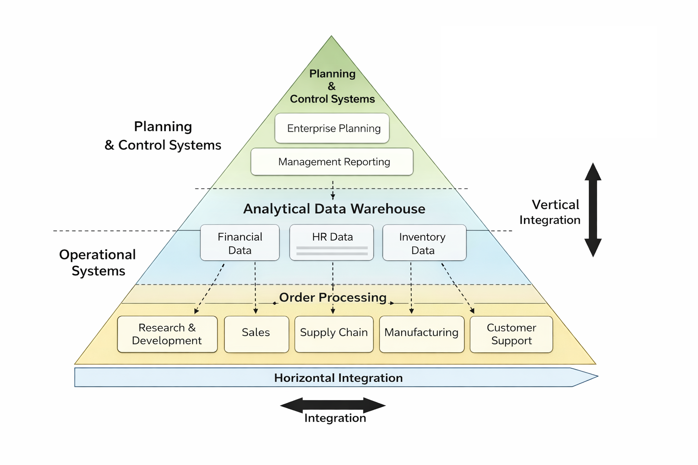
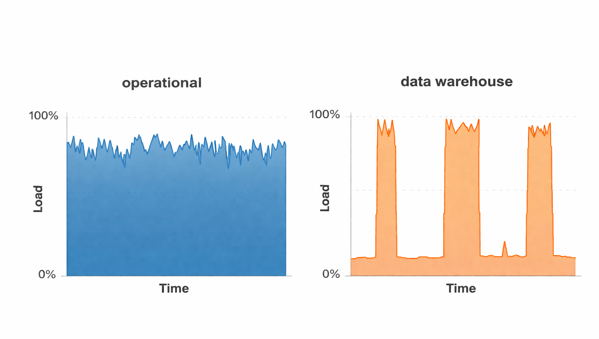
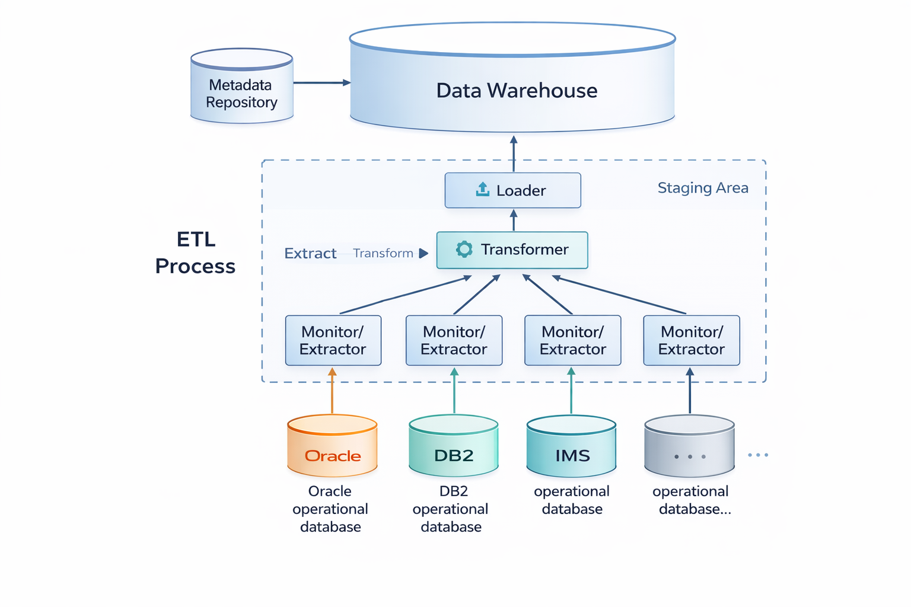
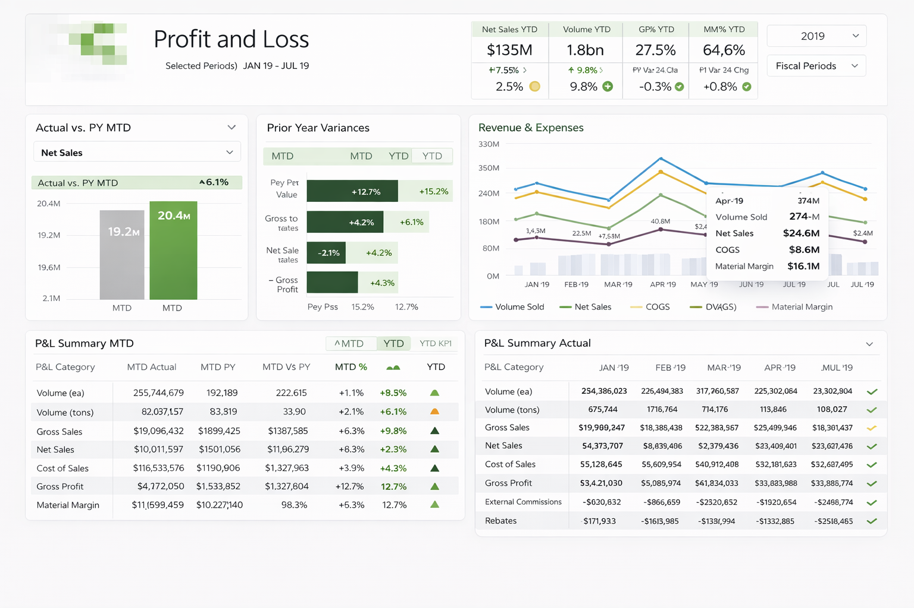
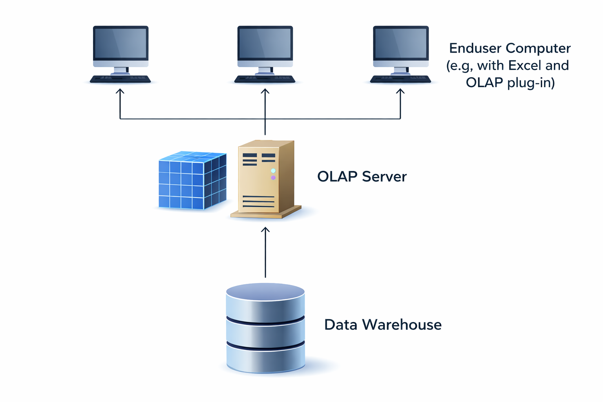

## {data-menu-title="Learning objectives" data-state="hide-menubar"}

<br><br><br><br><br>

::: {.learning-objectives}
- **Outline** the architecture of data warehouses.
- **Explain** dimensional modeling concepts and common schemata.
- **Design** fact and dimension schemata from business questions and operational data.
:::

<!--
    - descriptive analytics in the context of data warehouses, including ETL/staging, metadata, and the separation from operational systems
    - dimensional modeling concepts (facts, dimensions, hierarchies) and common schema variants (star, snowflake, galaxy)
-->

# Data warehouse {data-stack-name="Data warehouse"}

## Application systems pyramid

{fig-align="center" width="70%"}


## Typical descriptive questions

{fig-align="center" width="50%"}

::: aside
— Source: Alfred Schlaucher, Oracle, p. 15
:::


## Characteristics of operational and analytical databases

<br><br>

|                           | Operational database    | Analytical database         |
|---------------------------|-------------------------|-----------------------------|
| Target group              | Operational employees   | Management, Analysts        |
| Access frequency          | High                    | Slow to medium              |
| Data volume per access    | Low to medium volume    | High volume                 |
| Required response time    | Very short              | Short to medium             |
| Level of data             | Detailed                | Aggregated, processed       |
| Queries                   | Predictable, periodic   | Unpredictable, ad hoc       |
| Given period              | Current                 | Past to future              |
| Time horizon              | 1–3 months              | Years or decades            |


## Contradiction between operational data architecture and analytical information needs

{fig-align="center" width="50%"}

Organizations structure operational data by departments and processes, but analytical questions require cross-departmental views.

::: aside
— Source: Jung/Winter (2000): Data Warehousing Strategie: Erfahrungen, Methoden, Visionen, Berlin, p. 7.
:::


## Different intensities of use

The hardware load differs in operational application systems and data warehouse systems over time

{fig-align="center" width="50%"}

=> A data warehouse relieves the operational systems

::: aside
— Source: @Inmon2005, p. 23.
:::


## Definition: Data warehouse

The term Data Warehouse was coined by @Inmon1995, who defined it as follows:

> **"A data warehouse is a subject-oriented, integrated, time-variant and non-volatile collection of data in support of management's decision making process."**

. . . 

He defined the terms in the sentence as follows:

**Subject Oriented:** Data that gives information about a particular subject instead of about a company's ongoing operations.

**Integrated:** Data that is gathered into the data warehouse from a variety of sources and merged into a coherent whole.

**Time-variant:** All data in the data warehouse is identified with a particular time period.

**Non-volatile:** Data is stable in a data warehouse. More data is added but data is never removed. This enables management to gain a consistent picture of the business.


## The data warehouse concept

<br>

{fig-align="center" width="60%"}

## Layers of a data warehouse system

{fig-align="center" width="50%"}


## Components of a data warehouse

{fig-align="center" width="50%"}


## Structure of the database

The database represents the core of the data warehouse. It contains current and historical data from all relevant areas of the company. In contrast to the operational databases, the data here is not structured according to the business processes and functions of the company, but is aligned with the facts that determine the company. They are organized in such a way that they can be viewed from different dimensions.

Frequently used dimensions are:

- Company structure (e.g., business units, organizational structure, legal entities)
- Product structure (e.g., product groups and individual products)
- Regional structure (e.g., region, country, continent)
- Customer structure (e.g., customer groups or segments, and individual customers)
- Time structure (e.g., month, quarter, year)
- Business parameters (e.g., sales, contribution margin, profit)
- Characteristics (e.g., target, actual, deviations)


## Examples of aggregation levels in a data warehouse

{fig-align="center" width="50%"}


# ETL pipeline {data-stack-name="ETL pipeline"}

## ETL tools

The data in the data warehouse can normally only be accessed in a read-only manner. The only exception to this are ETL tools, which are responsible for transferring data from internal and external information sources. They automate the process of data acquisition from these sources.

The timeliness with which the transfer to the database is performed can be defined flexibly, e.g., within defined time intervals, immediately after each change, or at the explicit request of the user.

ETL programs include:

- **Monitors:** Detect and report changes in individual sources that are relevant to the data warehouse.

- **Extractors:** Select and transport data from the data sources into the workspace.

- **Transformers:** Unify, clean, integrate, consolidate, aggregate, and augment extracted data in the workspace.

- **Loaders:** Load transformed data from the workspace into the data warehouse after the data retrieval process is complete.


## Staging area

The staging area is a temporary cache that performs the ETL process. It includes the extraction, transformation and loading of the data into the data warehouse.

Neither the operational systems nor the data warehouse are affected by the process. The data can be transferred incrementally from the operational systems without having to have a permanent connection to them. It is stored temporarily and only transformed when it is sufficiently complete.

It is then loaded en bloc into the data warehouse, so that no inconsistencies can occur here either.

If the ETL process is successful, the data is deleted from the staging area.


## The metadata repository

Metadata supports data management and serves as a descriptor for an object that holds some data or information. In data warehouses, it is collectively organized in a catalog called the metadata repository.

Metadata is classified into three types:

- **Technical metadata:** Provides information about the structure of data, where it resides, and other technical details related to locating data in its native database.

- **Business metadata:** Describes the actual data in business-understandable terms. It can provide insights into the type of data, its origin, definition, quality, and relationships with other entities in the data warehouse.

- **Process metadata:** Stores information about the occurrence and outcomes of operations taking place in the data warehouse.


## Data warehouse and data mart

A single-subject data warehouse is typically referred to as a Data Mart, while Data Warehouses are generally enterprise in scope.

<br><br>

Comparison: Data warehouse and data mart

<br>

|                    | Data mart            | Data warehouse        |
|--------------------|----------------------|-----------------------|
| Application        | Division/Department  | Company               |
| Data design        | Optimized            | Generalistic          |
| Data volume        | Gigabyte scale       | Terabytescale         |
| Origin             | Task oriented        | Data model oriented   |
| Requirements       | Specific             | Versatile             |


# Dimensional modeling {data-stack-name="Dimensional modeling"}

## Architectural variants of data warehouses in practice

{fig-align="center" width="50%"}


## From transactions to reports

{fig-align="center" width="50%"}


## Example of a dashboard

<br>

{fig-align="center" width="50%" .boxed-image}


## Star schema (I)

The Star schema has a central fact table and exactly one dimension table for each dimension.

{fig-align="center" width="50%"}

The cardinality between the fact table and a dimension table is n∶1, i.e. a fact (e.g. sales: 67,000 euros) is described by one dimension expression for each dimension (e.g. time: 1st quarter, region: Hesse, product group: books). A dimension characteristic (e.g. product group: books) is associated with 0, 1 or n facts.


## Star schema (II)

```{dot}
digraph G {
    graph [ranksep=1.2, nodesep=1.0];
    node [fontname="Arial"];
    edge [fontname="Arial"];

    S [label="Sales = 142,000 €", shape=ellipse, style=filled, fillcolor="#fff59d"];

    W [label="Netherlands", shape=ellipse, style=filled, fillcolor="#ffe082"];
    T [label="2025 – Quarter 4", shape=ellipse, style=filled, fillcolor="#ffe082"];
    P [label="Service subscriptions", shape=ellipse, style=filled, fillcolor="#ffe082"];
    O [label="...", shape=ellipse, style=filled, fillcolor="#ffe082"];

    { rank=same; W; S; P }

    S -> W [label="Where?", dir=back];
    S -> T [label="When?"];
    S -> P [label="With what?"];
    S -> O [label="..."];
}
```

## Star schema (III)

::: columns
::: column

:::
::: column

:::
:::


## Star schema table design (I)

{fig-align="center" width="50%"}


## Star schema table design (II)

{fig-align="center" width="50%"}

::: aside
— Source: https://www.guru99.com/star-snowflake-data-warehousing.html
:::


## Star schema example

{fig-align="center" width="50%"}

## Queries on the star schema

**Example:**

**In which years were the most cars purchased by female customers in Hesse in the 1st quarter?**

```sql
select z.Year as Year, sum(v.Amount) as Total_Amount
from Branch f, Product p, Time z, Customer k, Sales v
where z.Quarter = 1 and k.gender = 'f' and p.Product_type = 'Car' and f.state = 'Hesse' and v.Date = z.Date and v.ProductID = p.ProductID and v.Branch = f.Branchname and v.CustomerID = k.CustomerID
group by z.Year
order by Total_Amount Descending;
```

| Year | Total amount |
|------|--------------|
| 2004 | 745          |
| 2005 | 710          |
| 2003 | 650          |

::: aside
— Source: Hartung (2011), p. 37
:::


## Snowflake schema

In the Snowflake schema, the redundancies in the Star schema are resolved in the dimension tables and the hierarchy levels are each modeled with their own tables:

{fig-align="center" width="50%"}

::: aside
— Source: https://www.guru99.com/star-snowflake-data-warehousing.html
:::


## Star schema vs. snowflake schema

- Speed of query processing is in favor of Star scheme
- Data volume tends to be lower with Snowflake schema
- Snowflake schema is easier to change (maintenance)


## Galaxy schema

The Galaxy schema contains more than one fact table. The fact tables share some but not all dimensions. The Galaxy schema thus represents more than one data cube (multi-cubes).

{fig-align="center" width="50%"}

## Table structure of the Galaxy schema

{fig-align="center" width="50%"}


```{mermaid}
erDiagram

    DELIVERY {
        int id_product PK
        int id_supplier PK
        int id_date PK
        float amount
        float volume
    }

    SALES {
        int id_product PK
        int id_client PK
        int id_shop PK
        int id_date PK
        float amount
        float volume
    }

    PRODUCT {
        int id_product PK
        int id_brand
        string name
        string description
    }

    BRAND {
        int id_brand PK
        int id_supplier
        string name
    }

    SUPPLIER {
        int id_supplier PK
        int id_country
        string name
        string address
    }

    COUNTRY {
        int id_country PK
        string name
        string code_name
    }

    TIME {
        int id_date PK
        int week_no
    }

    CLIENT {
        int id_client PK
        int id_client_group
        string name
        string last_name
    }

    CLIENT_GROUP {
        int id_client_group PK
        string group_name
        string segment_name
    }

    SHOP {
        int id_shop PK
        int id_city
        string name
        string business_type
    }

    CITY {
        int id_city PK
        int id_region
        string name
    }

    REGION {
        int id_region PK
        string name
        string country
    }

    DELIVERY }o--|| PRODUCT : product
    DELIVERY }o--|| SUPPLIER : supplier
    DELIVERY }o--|| TIME : date

    PRODUCT }o--|| BRAND : brand
    BRAND }o--|| SUPPLIER : supplier

    SUPPLIER }o--|| COUNTRY : country

    SALES }o--|| PRODUCT : product
    SALES }o--|| CLIENT : client
    SALES }o--|| SHOP : shop
    SALES }o--|| TIME : date

    CLIENT }o--|| CLIENT_GROUP : group

    SHOP }o--|| CITY : city
    CITY }o--|| REGION : region
```
# OLAP operations {data-stack-name="OLAP operations"}

## Subject of OLAP

Online Analytical Processing (OLAP) is software technology focused on the analysis of dynamic, multidimensional data.

The goal is to provide executives with the information they need quickly, flexibly and interactively.

OLAP functionality can be characterized as dynamic, multidimensional analysis of consolidated enterprise data, which includes the following components:

- Calculations of key figures over different dimensions and aggregation levels
- Trend analysis over definable time intervals
- "What if" analyses
- Multidimensional visualization methods


## Facts and dimensions

{fig-align="center" width="50%"}


## Organizing data as hypercube

{fig-align="center" width="50%"}


## OLAP operations: Slicing and dicing

{fig-align="center" width="50%"}


## OLAP operations: Rotate

{fig-align="center" width="50%"}


## OLAP operations: Drill down and roll up

{fig-align="center" width="50%"}


## OLAP operations: Nest

The result of a nest operation physically represents a two-dimensional matrix. It is extended by displaying different hierarchy levels of one or more dimensions on one axis (column or row) in nested form. In the following example, three dimensions are displayed:

{fig-align="center" width="50%"}


## OLAP as Excel plug-in

{fig-align="center" width="50%"}


## Architecture of an OLAP system

<br>

{width="50%" fig-align="center"}

## Summary {data-state="hide-menubar"}

TODO

## Survey: Session 3 {data-state="hide-menubar"}

<br><br>

::: {style="display:flex; justify-content:center;"}

{{< qrcode {{ var sessions.session_3.survey_url }} width=400 height=400 >}}

:::

<br><br>

[{{ var sessions.session_3.survey_url }}]({{ var sessions.session_3.survey_url }})

::: aside
Note: Responses may be analyzed and published in anonymized form.

Please complete the survey before you leave today — thank you 🙏
:::


# References {data-state="hide-menubar"}