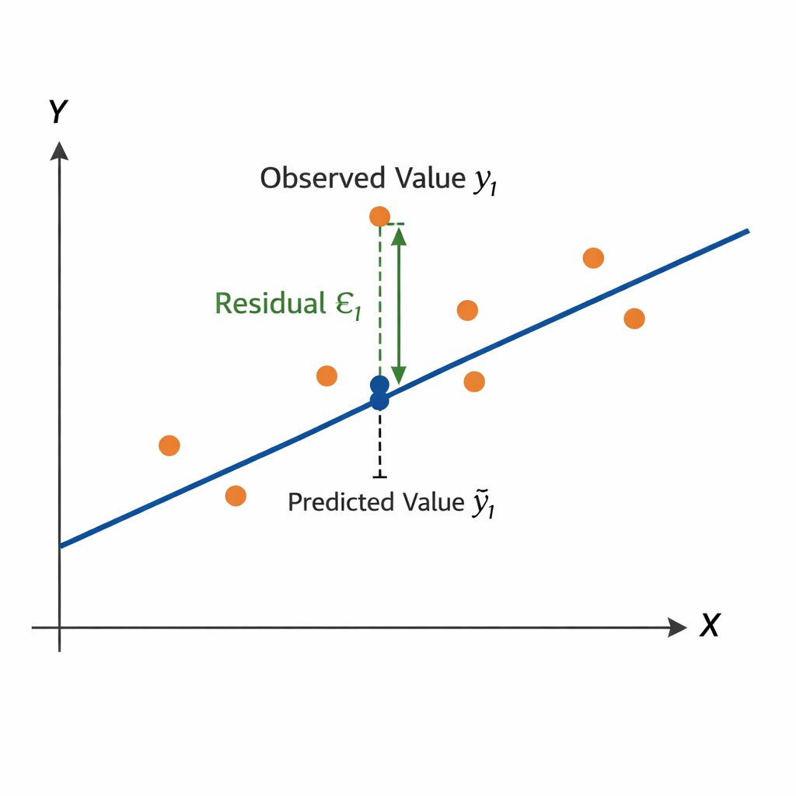

## {data-menu-title="Learning objectives" data-state="hide-menubar"}

<br><br><br><br><br>

::: {.learning-objectives}
- **Explain** the stages of a model-based analytics workflow using linear regression as an example.
- **Interpret** linear regression models, including coefficients, OLS estimation, and model evaluation.
- **Describe** how regression models are implemented in Python.
:::

<!--
, mapping conceptual components of the analytics process to their realization in `scikit-learn`
-->

## Process {data-state="hide-menubar"}

<br>

In this session, we follow the CRISP-DM process:

<br><br>

```{dot}
digraph CRISPDM {
  layout=neato;
  overlap=false;
  splines=true;
  fontname="Helvetica";

  node [
    shape=box,
    style="rounded,filled",
    fillcolor="#f4f6fb",
    fontname="Helvetica",
    fontsize=20,
    width=2.8,
    height=1
  ];

  edge [
    penwidth=1.6,
    arrowsize=1.1
  ];

  // --- Circular positions ---
  A [label="Business\nUnderstanding", pos="-2,2!"];
  B [label="Data\nUnderstanding", pos="2,2!"];
  C [label="Data\nPreparation", pos="3,0!"];
  D [label="Modeling", pos="2,-2!"];
  E [label="Evaluation", pos="-2,-2!"];
  F [label="Deployment", pos="-4,0!", fillcolor="#e6f4ea"];

  // --- Central Database ---
  X [
    label="Data",
    shape=cylinder,
    fillcolor="#e9f2ff",
    fontsize=22,
    width=1.9,
    height=1.4,
    pos="0,0!"
  ];

  // --- Main Flow ---
  A -> B;
  B -> C;
  C -> D;
  D -> E;
  E -> F;

  // --- True Bidirectional Iterations ---
  B -> A;
  A -> B;

  D -> C;
  C -> D;

  E -> A;
  A -> E;
}
```

# Business understanding {data-stack-name="Business understanding"}


## Case: House prices — What drives property value?

:::: {.columns}

::: {.column width="35%"}
{width="480"}

:::

::: {.column width="60%"}

Housing markets represent one of the largest asset classes in most economies. Residential real estate accounts for a substantial share of household wealth, and even small pricing errors can translate into large financial consequences.

Understanding what drives house prices is therefore highly relevant:

- **Real estate firms** use pricing models to advise clients.
- **Banks** rely on valuation models to assess collateral and manage mortgage risk.
- **Insurers and policymakers** use property data for risk assessment, taxation, and urban planning.

How could we use analytical models, such as regression models, to understand the drivers of prices?

:::

::::

<!--

    ## Use cases
    # Motivation {data-stack-name="Motivation"}

          ## Example 1: House Prices — Introducing Regression

          **Core idea:**
          Use the Ames Housing dataset to explain how regression helps identify and quantify the drivers of house prices.

          **Business question:**
          Which property characteristics (e.g., size, quality, age, neighborhood) explain variation in selling prices?

          **Dataset:**
          Ames Housing Dataset
          - Kaggle: https://www.kaggle.com/datasets/prevek18/ames-housing-dataset
          - Documentation: http://jse.amstat.org/v19n3/decock/DataDocumentation.txt

          **Teaching logic:**
          1. Start with a scatterplot (living area vs. price).
          2. Estimate a simple regression (price ~ size).
          3. Extend to multiple regression (add quality, garage, age, location).
          4. Discuss interpretation, model fit, and assumptions.

          **Learning goals:**
          - Interpret coefficients economically (marginal effects).
          - Understand “ceteris paribus.”
          - Distinguish explanation vs. prediction.
          - Recognize limits of causal interpretation.

          This example provides an intuitive, decision-relevant setting that can later be expanded to transformations, diagnostics, and model validation.
-->

# Data understanding {data-stack-name="Data understanding"}


## Dataset: Ames Housing (Kaggle)

To answer our question, we need a dataset that includes:

* Sale prices
* Physical attributes (e.g., size, rooms)
* Quality indicators
* Location characteristics

. . . 

To address this, we turn to a **publicly available dataset** on Kaggle: the **Ames Housing dataset**, which provides detailed information on residential properties and their sale prices.

<br>

::: {.callout-note title="About Kaggle"}
**Kaggle** is a popular data science platform offering:

* Public datasets
* Notebooks for analysis
* Competitions
* An active community
:::

<!--

This makes it well suited for **regression analysis**.

### Resources

* House Prices: Advanced Regression Techniques
* Ames Housing Dataset

[Competition](https://www.kaggle.com/competitions/house-prices-advanced-regression-techniques/overview) · [Dataset](https://www.kaggle.com/datasets/prevek18/ames-housing-dataset/data)


 https://www.kaggle.com/datasets/prevek18/ames-housing-dataset -->


## Load the data

As a first step, we retrieve the dataset and load it into our Python environment for analysis.

```{python}
#| echo: true     # show code
#| output: true   # show output

import pandas as pd

USAhousing = pd.read_csv('../exercises/data/ames.csv')
USAhousing.head()
```

. . . 

<br>

> An important step is to **understand the meaning of the variables**—that is, what each column represents and how the data was collected.


<!--
https://www.kaggle.com/code/faressayah/practical-introduction-to-10-regression-algorithm
-->

## Understanding the variables

To understand the variables, we consult the **dataset documentation** and create a structured overview.

We create a small table that summarizes key variables:

<!--
      | Variable              | Meaning                                            | Unit / Values                      |
      | --------------------- | -------------------------------------------------- | ---------------------------------- |
      | `Order`               | Observation number                                 | —                                  |
      | `PID`                 | Parcel identification number                       | —                                  |
      | `area`                | Above-ground living area                           | Square feet                        |
      | `price`               | Sale price of the property (target variable)       | USD                                |
      | `MS.SubClass`         | Type of dwelling (e.g., 1-story, 2-story, duplex)  | Categorical codes (e.g., 020, 060) |
      | `MS.Zoning`           | General zoning classification                      | Categorical (e.g., RL, RM, FV)     |
      | `...`                 | Additional variables (e.g., lot size, street type) | —                                  |
-->

<div class="smaller">

| Variable      | Meaning                                            | Unit / Values                      | Notes                                                                    |
| ------------- | -------------------------------------------------- | ---------------------------------- | ------------------------------------------------------------------------ |
| `Order`       | Unique order number                                | —                                  | Check for duplicates, NA not allowed                                     |
| `PID`         | Parcel identification number                       | —                                  | Same property can appear multiple times (e.g., repeated sales)           |
| `area`        | Above-ground living area                           | Square feet                        | Check for **plausible ranges and consistency** (e.g., no extreme values) |
| `price`       | Sale price of the property (target variable)       | USD                                | Check **format, missing values, and outliers**                           |
| `MS.SubClass` | Type of dwelling                                   | Categorical codes (e.g., 020, 060) | Retrieve **code definitions** and check consistency with other variables |
| `MS.Zoning`   | General zoning classification                      | Categorical (e.g., RL, RM, FV)     | TODO: Understand categories (may require **external expertise**)         |
| `...`         | Additional variables (e.g., lot size, street type) | —                                  | ...                                                                      |

</div>

. . . 

<br>

> For the Housing dataset, this overview is already available.
> In practice, however—especially in organizational contexts—this step often involves **acquiring access to data, extracting it from systems, consulting documentation, talking to domain experts, and making sense of how the data was collected and defined**.

::: aside
For the Ames Housing dataset, we rely on this data description:
 [http://jse.amstat.org/v19n3/decock/DataDocumentation.txt](http://jse.amstat.org/v19n3/decock/DataDocumentation.txt)
:::

# Data preparation {data-stack-name="Data preparation"}

## Prepare and explore the data 

<!--
TODO: typically involves: identifying and formatting variables (as already discussed) + assumptions of the model (state, mention that some assumptions are more important for inference than for prediction, infobox: no need to memorize the assumptions)
-->

Before estimating a regression model, we first **prepare and explore the data**.
Key steps include:

* **Check data quality**

  * What are the units and possible values?
  * Missing values, duplicates, inconsistencies
  * Plausibility of values (e.g., extreme prices or sizes)

* **Format and transform variables**

  * Numeric vs. categorical variables
  * Encoding categories, scaling if needed

* **Explore relationships**

  * Summary statistics
  * Distributions and scatter plots

::: {.callout-note title="Note"}
These steps were covered in detail in the **data preparation lecture**.
Here, we focus on the **analytical modeling**.
:::


# Modeling {data-stack-name="Modeling"}

## Model choice

::: {.highlight_must_learn}

**1. Specify prediction task**

- Define the **target variable** (e.g., price as a continuous variable)

:::

. . .

::: {.highlight_must_learn}

**2. Collect candidate models** *(selective overview)*

<!--
    <div class="smaller">

    | Model family | Strengths | Limitations |
    |-------------|----------|------------|
    | **Regression** | Interpretable, simple | Limited flexibility |
    | **Clustering** | Finds structure | Not for prediction |
    | **ML models** | High performance, flexible | Less interpretable, risk of overfitting |

    </div>
-->

<div class="smaller">

| Model family (examples)                               | Strengths                              | Limitations                                       |
| ----------------------------------------------------- | -------------------------------------- | ------------------------------------------------- |
| **Regression models** (Linear, Ridge, Lasso)          | Interpretable, simple, well understood | Limited prediction performance, few predictors |
| **Clustering** (e.g., k-means)                        | Identifies structure in data           | Not designed for prediction tasks |
| **Machine learning models** (e.g., Neural Networks) | Strong predictive performance, flexible | Less interpretable, require tuning, can overfit |

</div>

:::

. . .

::: {.highlight_must_learn}

**3. Select model**

- **Trade-offs:** interpretability vs. performance; simplicity vs. flexibility  
- **Model complexity:** flexible models capture patterns but may overfit  
- **Performance:** unknown → must be **tested empirically**

:::

. . .

::: {.highlight_must_learn}

**4. Test and compare**

→ Start with a  **simple, interpretable baseline** (e.g., linear regression)  
→ Then implement **more complex models for comparison**

:::

::: aside
See @ProvostFawcett2013, chapter 3 and 4.
:::


## Regression: Model assumptions

Regression models rely the following **statistical assumptions**:

* Linear relationship between predictors and outcome
* Independent observations
* Constant variance of errors (*homoscedasticity*)
* Errors normally distributed

::: {.callout-important}

For many **prediction tasks**, violations are often less problematic.
Assumptions become **more important when doing statistical inference** (e.g., interpreting p-values or confidence intervals).

:::

<!--
  ::: {.learning_note .fragment}
  **Learning focus**
  You **do not need to memorize all regression assumptions**.
  :::
-->

## Regression models: A visual illustration


Model formula: $$price = \beta_0 + \beta_1*squarefoot$$


```{ojs}
n = 40

mulberry32 = (a) => () => {
  a |= 0; a = a + 0x6D2B79F5 | 0
  let t = Math.imul(a ^ a >>> 15, 1 | a)
  t = t + Math.imul(t ^ t >>> 7, 61 | t) ^ t
  return ((t ^ t >>> 14) >>> 0) / 4294967296
}
rand = mulberry32(12345)

data = Array.from({length: n}, () => {
  const squarefoot = 500 + rand() * 3000
  const noise = (rand() - 0.5) * 100000
  const price = 50000 + squarefoot * 180 + noise
  return {squarefoot, price}
})

xmin = Math.min(...data.map(d => d.squarefoot))
xmax = Math.max(...data.map(d => d.squarefoot))

fitLine = [
  { squarefoot: xmin, price: beta0 + beta1 * xmin },
  { squarefoot: xmax, price: beta0 + beta1 * xmax }
]
```

:::: {.columns}

::: {.column width="30%"}

**Data**

```{ojs}
Inputs.table(data, {
  columns: ["squarefoot", "price"],
  height: 420
})
```

:::

::: {.column width="70%" .fragment}

**Visualization**

```{ojs}
viewof combinedSliders = {
  const b0 = Inputs.range([0, 300000], {value: 50000, step: 5000, label: "β₀ (base price)"})
  const b1 = Inputs.range([50, 400], {value: 180, step: 5, label: "β₁ (price per sq ft)"})
  const div = html`<div style="display:flex; gap:2rem; align-items:center;">${b0}${b1}</div>`
  div.value = {beta0: b0.value, beta1: b1.value}
  b0.addEventListener("input", () => {
    div.value = {beta0: b0.value, beta1: b1.value}
    div.dispatchEvent(new Event("input"))
  })
  b1.addEventListener("input", () => {
    div.value = {beta0: b0.value, beta1: b1.value}
    div.dispatchEvent(new Event("input"))
  })
  return div
}

beta0 = combinedSliders.beta0
beta1 = combinedSliders.beta1
```

```{ojs}
Plot.plot({
  height: 480,
  marginLeft: 70,
  grid: true,
  x: { label: "squarefoot" },
  y: {
    label: "price ($)",
    domain: [0, Math.max(...data.map(d => d.price)) * 1.1]
  },
  marks: [
    Plot.dot(data, {x: "squarefoot", y: "price", r: 3}),
    Plot.line(fitLine, {x: "squarefoot", y: "price", stroke: "crimson", strokeWidth: 3})
  ]
})
```

:::

::::


## Interpreting the regression model

```{ojs}
exampleData = [
  {squarefoot: 800,  price: 196000},
  {squarefoot: 1200, price: 272000},
  {squarefoot: 1500, price: 322000},
  {squarefoot: 1900, price: 394000},
  {squarefoot: 2300, price: 466000},
  {squarefoot: 2700, price: 538000},
]

exampleFit = [
  {squarefoot: 800,  price: 50000 + 180 * 800},
  {squarefoot: 2700, price: 50000 + 180 * 2700}
]
```

:::: {.columns}

::: {.column width="48%"}

**The model**

$$\hat{y} = \beta_0 + \beta_1 \cdot x$$

$$\hat{\text{price}} = 50{,}000 + 180 \cdot \text{squarefoot}$$

<br>

**β₀ = 50,000** — *intercept*
: The predicted price for a house with 0 sq ft. Rarely meaningful on its own — it anchors the line.

**β₁ = 180** — *slope*
: Each additional square foot is associated with **+$180** in predicted price, on average.

:::

::: {.column width="52%" .fragment}

**Prediction example**

> *How much would a **1,500 sq ft** house cost?*

$$\hat{y} = 50{,}000 + 180 \times 1{,}500 = \$322{,}000$$
```{ojs}
Plot.plot({
  height: 320,
  marginLeft: 70,
  grid: true,
  x: { label: "squarefoot", domain: [600, 2900] },
  y: { label: "price ($)", domain: [100000, 550000] },
  marks: [
    Plot.dot(exampleData, {x: "squarefoot", y: "price", r: 5, fill: "#334155"}),
    Plot.line(exampleFit,  {x: "squarefoot", y: "price", stroke: "crimson", strokeWidth: 2.5}),

    // vertical dashed line at x = 1500
    Plot.ruleX([1500], {stroke: "#f59e0b", strokeWidth: 2, strokeDasharray: "6,4"}),
    // horizontal dashed line at y = 322000
    Plot.ruleY([322000], {stroke: "#f59e0b", strokeWidth: 2, strokeDasharray: "6,4"}),

    // annotation dot at prediction point
    Plot.dot([{squarefoot: 1500, price: 322000}], {
      x: "squarefoot", y: "price", r: 7,
      fill: "#f59e0b", stroke: "white", strokeWidth: 2
    }),

    // label
    Plot.text([{squarefoot: 1560, price: 335000}], {
      x: "squarefoot", y: "price",
      text: ["$322,000"],
      fill: "#f59e0b",
      fontSize: 13,
      fontWeight: "bold"
    })
  ]
})
```

:::

::::


## Including multiple predictor variables

We can include many additional variables to predict the price of a house.
Each coefficient (β) captures the **differential effect of a variable**—that is, how much the price is expected to change when that variable increases while the others are held constant.

<br>

```{dot}
digraph regression_model {
  rankdir=LR
  bgcolor="transparent"

  node [
    shape=circle
    style=filled
    fillcolor="#0B2A66"
    fontcolor="white"
    fontsize=22
    fixedsize=true
    width=2
    height=2
  ]

  edge [
    fontsize=20
    fontcolor="black"
  ]

  sqft   [label="Square\nfootage"]
  beds   [label="Bed-\nrooms"]
  age    [label="Age"]
  school [label="School\nRating"]
  price  [label="Price"]

  sqft -> price [label="β₁"]
  beds -> price [label="β₂"]
  age -> price [label="β₃"]
  school -> price [label="β₄"]

  {rank=same; sqft beds age school}

  sqft -> beds   [style=invis]
  beds -> age    [style=invis]
  age  -> school [style=invis]
}
```

<br>

As we add more predictors, the model becomes multidimensional, making it increasingly difficult to visualize.


## Ordinary Least Squares Regression (OLS)

OLS is a **linear approach for predicting a quantitative response** $(Y)$ based on a set of predictor variables $X_j$.

$$ y_i = \beta_0 + \beta_1 x_{1,i} + \beta_2 x_{2,i} + \dots + \beta_p x_{p,i} + \epsilon_i $$

or in vector form

$$ y_i = \beta_0 + \beta' x_i + \epsilon_i $$

<!-- OLS assumes there is **approximately a linear relationship between \(X\) and \(Y\)**. -->

The optimal **regression line** minimizes the **Residual Sum of Squares (RSS)**:

$$
RSS = \sum_{i=1}^{n} \epsilon_i^2
    = \sum_{i=1}^{n} (y_i - \hat{y}_i)^2
    = \sum_{i=1}^{n} (y_i - \beta_0 - \beta' x_i)^2
$$

{width="20%" fig-align="center"}

::: notes
$\hat{y}$ is the fitted/predicted value (without $\epsilon$)
:::

## Matrix representation

$$ y = X\beta + \epsilon $$

where

$$
y =
\begin{bmatrix}
Y_1 \\
Y_2 \\
\vdots \\
Y_n
\end{bmatrix}
\quad
X =
\begin{bmatrix}
1 & x_{1,1} & \dots & x_{m,1} \\
1 & x_{1,2} & \dots & x_{m,2} \\
\vdots & \vdots & \ddots & \vdots \\
1 & x_{1,n} & \dots & x_{m,n}
\end{bmatrix}
$$

**Closed-form solution**

The parameter vector can be estimated by

$$ \beta = (X'X)^{-1}X'y $$

::: {.learning_note .fragment}
**Learning focus**

Aim to **understand and explain** the OLS procedure.
You are **not required to memorize** the formulas for RSS or the closed-form OLS solution.
:::

::: notes
In a statistics lecture, we would derive the closed form solution mathematically.  
Here, we simply take away that it exists and that it can be computed efficiently.
:::

## Implementation in Python

<!--
Live demo: see [notebook](TODO).
. . . 
-->

<br>

```python
import pandas as pd                      
from sklearn.linear_model import LinearRegression  # <1>

df = pd.read_csv("data/ames.csv")        # <2>

predictors = ["squarefoot", "Overall.Qual"]      # <3>
X = df[predictors]
y = df["price"]

model = LinearRegression()               # <4>
model.fit(X, y)                          # <5>
```
1. Import relevant libraries
2. Load the Ames housing dataset
3. Select predictor variables
4. Create the regression model
5. Estimate the model on the data

<!--
**TODO: clarify expectations (TBD: what is reasonable when ChatGPT would be available? - knowing code structure, reproducing? - add example exam questions)**

::: aside
Data available at [https://www.openintro.org/data/index.php?data=ames](https://www.openintro.org/data/index.php?data=ames)
:::
-->

## Implementation in Python

```python
# Coefficient estimates (β̂)
print("Intercept:", model.intercept_)     # β0

# Map coefficients to variable names
coef_df = pd.DataFrame({
    "Predictor": predictors,
    "Coefficient": model.coef_           # β1, β2, ...
})
print(coef_df)

# Model fit (R²)
r2 = model.score(X, y)
print("R^2:", r2)
```

. . . 

<br>

```{.text code-line-numbers="false"}
Intercept: 180,921

Predictor        Coefficient
squarefoot        110.85
Overall.Qual   28,567.43

R^2: 0.56
```


<!--
# Simple regression {data-stack-name="Simple regression"}

      # Simple regression {data-stack-name="Simple regression"}

      ## Example


              ## Example Regression - Fitting the model

              


              ## Example Regression - Testing the model

              

      ## Formula

      TBD: fit/R^2 (understanding how low/high R^2 helps/hinders prediction)

      # OLS {data-stack-name="OLS"}

      ## Visual?

      ## Optimization

      # Multiple regression {data-stack-name="Multiple regression"}

      ## Example

      ## Formula / visual

      # Python {data-stack-name="Python"}

      ## scikit learn
-->


# Evaluation {data-stack-name="Evaluation"}


## Overall model

<!--
    When we evaluate a regression model, we ask:

    * **How well does the model explain variation in the target variable?**
    * **How accurate are its predictions?**
    * **Does it generalize beyond the sample used to estimate it?**
-->

::: {.highlight_must_learn}

A common measure to assess the performance of a regression model is **$R^2$** (the coefficient of determination):

$$ R^2 = 1 - \frac{RSS}{TSS} $$

* Measures the **share of variance in the target variable explained by the model**
* Example: **($R^2$ = 0.56)** means the model explains **56% of the variation in house prices**
* Values range from **0 to 1**, with **higher $R^2$** generally indicating a better fit
* But a high $R^2$ **does not automatically mean** the model is useful in practice. $R^2$ says little about:

  * whether predictions are accurate enough for decisions
  * whether the model generalizes to new data
  * whether coefficients should be interpreted causally

:::

. . .

**Other evaluation measures**

* **MAE (Mean Absolute Error)**
  Average absolute prediction error
  → easy to interpret in the unit of the target variable

* **RMSE (Root Mean Squared Error)**
  Penalizes large errors more strongly
  → useful when large mistakes are especially costly

* **Out-of-sample performance**
  Evaluate on test data, not only on training data
  → helps detect **overfitting**

::: notes
Main takeaway: students should understand R² well.
Other measures can be introduced as complementary metrics, especially because they are in the original unit of the target variable.
Emphasize that model evaluation is not just “how well did it fit the training data?”
:::


## Coefficients

::: {.highlight_must_learn}

Regression coefficients tell us how the predicted outcome changes when a predictor changes, **holding the other predictors constant**.

For a coefficient $\beta_j$:

* **Sign**
  Positive: higher $x_j$ is associated with higher predicted price
  Negative: higher $x_j$ is associated with lower predicted price

* **Magnitude**
  Indicates the expected change in the target variable for a one-unit increase in $x_j$

Example:

* $\beta_\text{squarefoot}$ = 110.85
  → one additional square foot is associated with about **+$110.85** in predicted price

* $\beta_{\text{Overall.Qual}}$ = 28,567.43
  → one additional quality point is associated with about **+$28,567** in predicted price

:::

. . .

**When evaluating coefficients, consider both:**

**1. Statistical significance**

* Asks whether the estimated relationship is likely different from zero
* Commonly assessed with **standard errors**, **t-tests**, **p-values**, **confidence intervals**

**2. Practical significance**

* Asks whether the effect is **large enough to matter in practice**
* A coefficient can be statistically significant but still have little managerial or business relevance

::: notes
This slide should distinguish clearly between “is there evidence of an effect?” and “does the effect matter?”
Since you use scikit-learn, you may want to note orally that p-values are not directly provided there.
That helps avoid confusion when students compare packages like statsmodels and sklearn.
:::

<!--

    ## Overall model

    - R^2: does it help to predict? + interpretation (must-learn)
    - Other measures

    ## Coefficients

    - statistical and practical significance of beta coefficients
-->


## Next steps

Once we move beyond a simple regression model, two practical questions arise:

* **Which predictors should we include?**

  → Approaches such as **forward selection** and **backward selection** help identify a useful subset of variables  
  → **Forward selection** starts with a very simple model and **adds predictors step by step** if they improve the model  
  → **Backward selection** starts with a model containing many predictors and **removes the least useful ones step by step**

* **Why not include all available variables?**

  → Adding too many predictors can create problems such as:

  * **dependence between predictors**: predictors overlap strongly, making coefficients unstable
  * **overfitting**: the model fits the training data well but performs poorly on new data

. . .

::: {.callout-note title="Takeaway"}
A good regression model is usually not the one with the **most variables**, but the one that achieves a good balance between **interpretability**, **stability**, and **predictive performance**.
:::


# Deployment {data-stack-name="Deployment"}

## From model to use in practice

Once a regression model has been estimated and evaluated, it can be **deployed** to support decisions in practice.

Typical uses include:

* **Describe**
  Identify which factors are associated with higher or lower prices

* **Predict**
  Estimate the expected price for a new house based on its characteristics

* **Prescribe**
  Use predictions as input for action, for example:

  * setting an asking price
  * prioritizing properties for review
  * comparing renovation options

. . .

::: {.callout-note title="Key idea"}
A regression model does not only help us **understand** the data.
It can also be embedded in workflows to support **future decisions**.
:::

::: notes
This is a good place to connect back to the broader analytics logic:
describe = understand patterns,
predict = estimate future/unknown outcomes,
prescribe = support action.
Prescriptive use is indirect here: the regression itself predicts, and decisions build on top of those predictions.
:::

---

## Deployment example: Making a prediction

Suppose our fitted model is:

$$ \widehat{\text{price}} = 180{,}921 + 110.85 \cdot \text{squarefoot} + 28{,}567.43 \cdot \text{Overall.Qual} $$

For a house with:

* `squarefoot = 1500`
* `Overall.Qual = 7`

the predicted price is:

$$ \widehat{\text{price}} = 180{,}921 + 110.85 \cdot 1500 + 28{,}567.43 \cdot 7 $$

$$
\widehat{\text{price}} \approx 547{,}150
$$

. . .

This prediction could be used to:

* compare a listing price to the model-based estimate
* flag unusually overpriced or underpriced houses
* support pricing decisions together with human judgment

<!--
    ::: {.callout-important title="Important"}
    Predictions should be used with care:
    they depend on the quality of the data, the validity of the model, and whether new cases are similar to the data used for training.
    :::
-->

 
## Deployment example in Python

A fitted model can be **saved** and **loaded** for later use.

```python
import joblib

# Save trained model
joblib.dump(model, "house_price_model.joblib")

# Load trained model later
loaded_model = joblib.load("house_price_model.joblib")

# New data for prediction
new_house = pd.DataFrame([{
    "squarefoot": 1500,
    "Overall.Qual": 7
}])

predicted_price = loaded_model.predict(new_house)
```

. . .

<!--
    ```{.text code-line-numbers="false"}
    [547149.51]
    ```
-->

::: {.callout-note title="Why save the model?"}
Saving a model makes it possible to reuse it in applications, dashboards, scripts, or decision-support systems without fitting it again each time.
:::

::: notes
You may mention that joblib is commonly used for scikit-learn objects.
Also useful to note that deployment requires the same variable names and preprocessing steps as in training.
:::

---

## Deployment considerations

Before using a regression model in practice, we should ask:

* **Does it generalize?**
  Does it still perform well on new data?

* **Is it robust?**
  Are predictions stable when conditions change?

* **Is it interpretable?**
  Can decision makers understand how outputs are generated?

* **Is it used responsibly?**
  Could predictions reinforce bias or lead to unfair decisions?

. . .

::: {.callout-note title="Takeaway"}
Deployment is not the end of the analytics process.
Models should be **monitored, reviewed, and updated** as data, environments, and decision needs change.
:::


## Vocabulary {data-state="hide-menubar"}

A **method** is a composition of formalized principles that form the basis for a stringent calculation process.

An **algorithm** is a procedure or set of steps or rules to accomplish a task. It is usually the implementation of a method. Algorithms are used to build models.

In the given context, a **model** is the description of the relationship between variables. It is used to create output data from given input data, for example to make predictions.

**Fitting a model** means that you estimate the model using the observed data. You are using your data as evidence to help approximate the real-world mathematical process that generated the data. Fitting the model often involves optimization methods and algorithms, such as maximum likelihood estimation, to help get the parameters.

**Overfitting** is the term used to mean that you used a dataset to estimate the parameters of your model, but your model isn’t that good at capturing reality beyond your sampled data.

TOOD: DV, IV, predictor, target, explaining/explained

::: aside
— Source: @SchuttONeil2014
:::

## Summary {data-state="hide-menubar"}

- Regression is a core example of a structured, model-based analytics process: from business question to data, modeling, evaluation, and potential deployment.
- Linear regression models quantify relationships between variables through coefficients, estimated via optimization (OLS) and evaluated using metrics such as R² while considering generalization and overfitting.
- In practice, the analytics workflow can be implemented in Python: define a model, fit it to data, generate predictions, and evaluate performance — a pattern that extends to many other modeling approaches.

## Survey: Session 4 {data-state="hide-menubar"}

<br><br>

::: {style="display:flex; justify-content:center;"}



:::

<br><br>

[https://forms.gle/GtBNSMdCTZ92ix549](https://forms.gle/GtBNSMdCTZ92ix549)

::: aside
Note: Responses may be analyzed and published in anonymized form.
:::

# References {data-state="hide-menubar"}