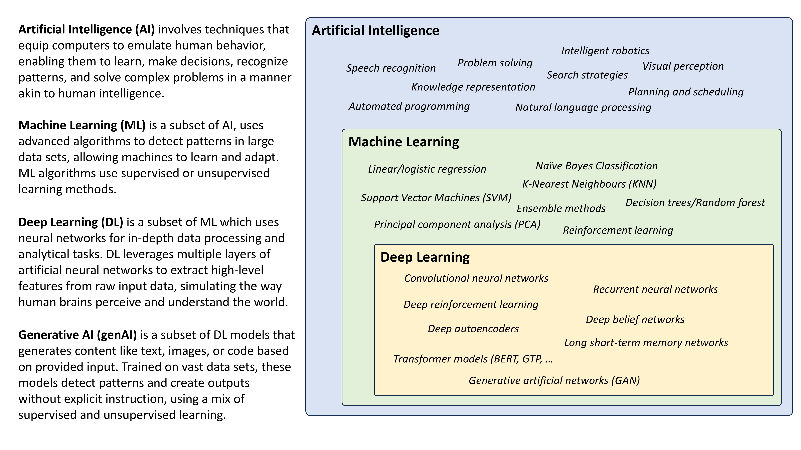
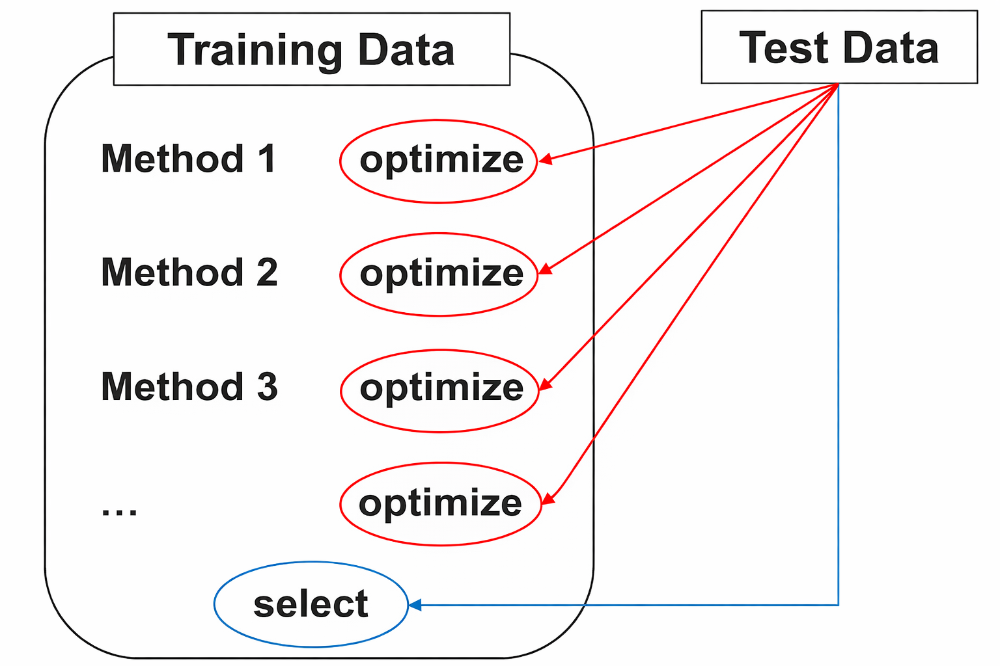
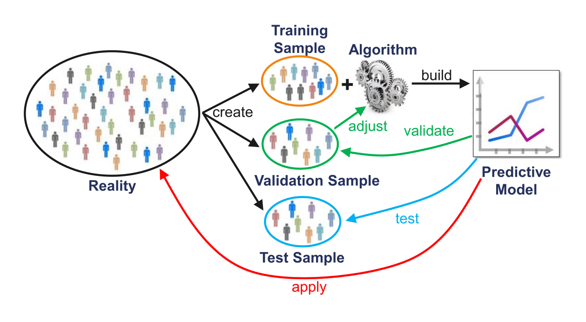
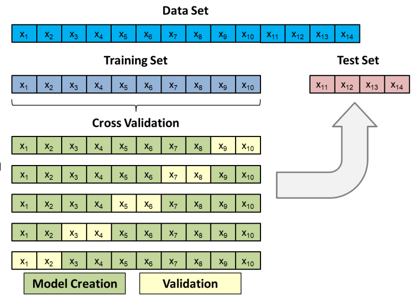
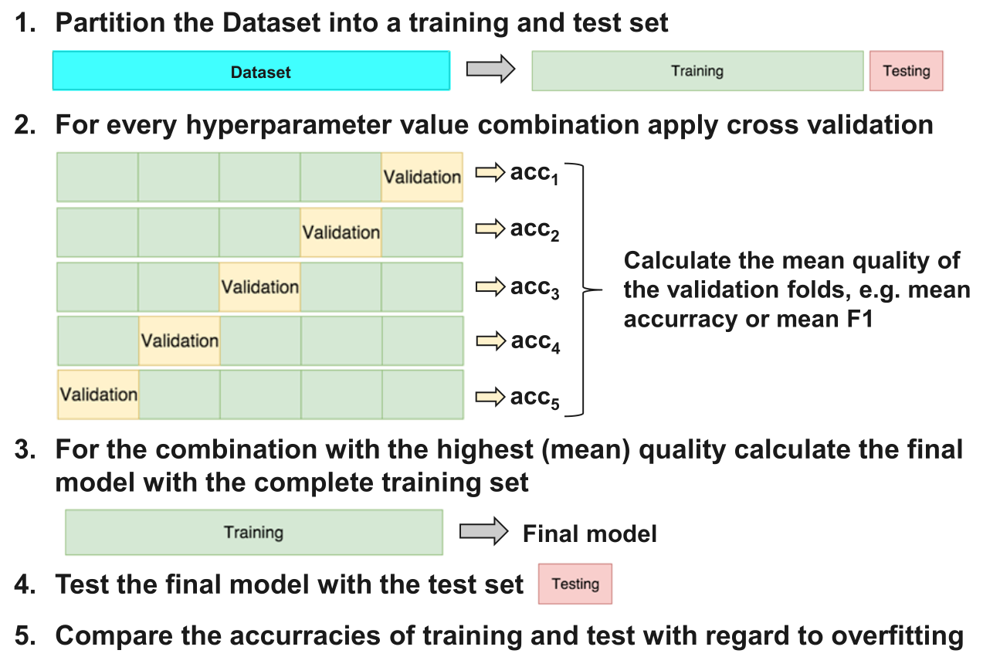
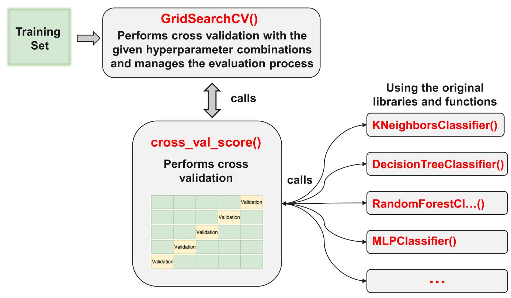

## {data-menu-title="Learning objectives" data-state="hide-menubar"}

<br><br><br><br><br>

::: {.learning-objectives}
- **Distinguish** between supervised and unsupervised machine learning approaches and explain the generalization problem in supervised machine learning.
- **Describe** the workflow of supervised machine learning, including feature engineering, train–test splitting, model training, cross-validation, and evaluation.
- **Connect** conceptual machine learning procedures to Python implementations, including preprocessing, model training, and evaluation using scikit-learn. (*see exercise*)
:::

<!--

## Applications of machine learning {data-state="hide-menubar"}

TODO: include specific / few examples, similar to https://www.youtube.com/watch?v=vcE9WGbi4QY
TBD: fast ML image processing (e.g., in package routing), accuracy (early signs)


The applications of machine learning

* **E-Commerce & Online Services (Recommender Systems)**

  * Data: clicks, purchases, browsing behavior
  * Tasks: preference prediction, ranking
  * Examples: product recommendations, personalized content

* **Logistics & Supply Chain**

  * Data: shipments, inventory, delivery times
  * Tasks: demand forecasting, delay prediction, classification
  * Examples: demand prediction, delivery risk classification

* **Finance & Payments**

  * Data: transactions, account behavior
  * Tasks: classification
  * Examples: fraud detection, credit scoring

* **Operations & Process Optimization**

  * Data: process logs, operational metrics
  * Tasks: classification, anomaly detection
  * Examples: defect detection, process monitoring

* **Text & Document Processing**

  * Data: emails, documents, customer messages
  * Tasks: classification, information extraction
  * Examples: spam detection, ticket routing
-->

# Foundations {data-stack-name="Foundations"}

## Distinguishing concepts

:::: {.columns}

::: {.column width="50%"}

::: {.highlight_must_learn}

**Artificial Intelligence (AI)** involves techniques that equip computers to emulate human behavior, enabling them to learn, make decisions, recognize patterns, and solve complex problems in a manner akin to human intelligence.

**Machine Learning (ML)** is a subset of AI and uses advanced algorithms to detect patterns in large datasets, allowing machines to learn and adapt. ML algorithms use supervised or unsupervised learning methods.

**Deep Learning (DL)** is a subset of ML that uses neural networks for in-depth data processing and analytical tasks.
It leverages multiple layers of artificial neural networks to extract high-level features from raw input data, simulating the way human brains perceive and understand the world.

:::

:::

::: {.column width="50%"}
{width=85% fig-align=center}
:::

::::

::: aside
Generative AI (genAI) is a subset of DL models that generates content like text, images, or code based on provided input. Trained on vast datasets, these models detect patterns and create outputs without explicit instruction, using a mix of supervised and unsupervised learning.
:::


::: notes
Highlight:

- AI often refers to a general system or field of study. ML/DL to techniques/methods/algorithms
- reinforcement learning: interactive environment
- deep learning/neural networks: learn abstractions from raw data (feature engineering is more important for supervised ML)
- genAI/LLM/GPT: unstructured/semistructured/structured output (beyond classification/regression)
- Prompt: what would the role of genAI be in the context of descriptive, predictive, prescriptive analytics? (descriptive: summarizing/narrative layer; predictive: limited, maybe generating code for predictive models; prescriptive: translating and explaining recommendations/trade-offs)

TODO: definition of machine learning (similar to https://www.youtube.com/watch?v=vcE9WGbi4QY)
Also: AI vs ML vs deep learning (see https://www.youtube.com/watch?v=chfwJiXvBMA)
:::

## Supervised and unsupervised learning

<!--
    ## Supervised Learning
    
    ## Unsupervised Learning
    
-->

{width=55% fig-align=center}

. . . 

**Note**: Our focus will be primarily on supervised machine learning:

$$\underbrace{\text{Dataset}}_\text{Features, Targets} + \underbrace{\text{Learning Algorithm}}_\text{Model Class + Objective + Optimizer } \to \text{Predictive Model}$$ 


<!--
Brief reminder: logistic regression from previous lecture

- What problem does it solve?
- Why it is already a form of supervised machine learning

  Motivation for today:

  - Logistic regression is **powerful but limited** (linear decision boundary)
  - Many real-world problems require **non-linear** or more flexible models
  - Today’s goal: understand the **general ML workflow** and explore other supervised ML methods

-->

::: notes
- Define both approaches
- Connect to what students already know:
  - “Unsupervised → clustering” (covered in exploratory data analysis)
- Emphasize: focus of this lecture + next lecture is **supervised learning**
:::

<!--
## Statistics vs. Machine Learning

> **Statistics** about finding valid conclusions about the underlying applied theory, and on the interpretation of parameters in their models. It insists on proper and rigorous methodology, and is comfortable with making and noting assumptions. It cares about how the data was collected and the resulting properties of the estimator or experiment (e.g. p-value). The focus is on hypothesis testing.

> **Machine Learning (ML)** aims to derive practice-relevant findings from existing data and to apply the trained models to data not previously seen (prediction). It tries to predict or classify with the most accuracy. It cares deeply about scalability and uses the predictions to make decisions. Much of ML is motivated by problems that need to have answers. ML is happy to treat the algorithm as a black box as long as it works.


TODO: note: our focus will be on machine learning. in the big-data section, we will cover neural networks (suitable for complex data, including images, speech, natural language)

-->

# The generalization problem {data-stack-name="The generalization problem"}


## The traditional analytics process

{fig-align=center}

## Over- and underfitting

{fig-align=center}

Due to the problem of overfitting, the main goal is to maximize the prediction quality and not to fit the data that is used for the model estimation as well as possible. This is equivalent to minimizing the risk that the model will have weak predictive ability.

<!--

    ## Creation and Use of Models

    

-->

## Best fit vs. best generalization

::: {.highlight_must_learn}
{fig-align=center}
:::

## The bias-variance tradeoff

:::: {.columns}

::: {.column width="60%"}

::: {.highlight_must_learn}

The prediction error is influenced by three components:

**Error = Bias + Variance + Noise**

- Bias is the inability of the used method to learn the relevant relations between the inputs and the outputs. It reflects the method quality, e.g. if a method only produces linear models.

- Variance represents the deviation resulting from the sensitivity of the created model to small fluctuations in the data.

- Typically, there is a tradeoff between bias and variance.

- Noise is everything that arises from random variations in the data. It cannot be controlled.

:::

:::

::: {.column width="40%"}
{fig-align=center}
:::

::::


## Generalization problem

**Generalization problem:**
Modern machine learning models are highly flexible and trained on large datasets. While this enables them to fit complex patterns, it also creates a risk:

> the model may **fit the training data extremely well** but fail to capture patterns that hold more generally.

The core question is therefore:

> How can we tell whether a model has learned something **generalizable**, rather than just memorizing the data?

<!--
**Cliffhanger (toward the solution):**
To answer this, we need a way to **separate learning from evaluation** and test the model under realistic conditions.

👉 This leads directly to the **machine learning workflow**—in particular, the idea of **splitting data and evaluating models on data they have not seen during training**.
-->

# The machine learning workflow {data-stack-name="The workflow"}


## The supervised machine learning workflow

<br><br>

{width=70% fig-align=center}

<!--
Introduce the high-level pipeline (Modern Analytics Process)

    ## The Data Analytics Process - Technical View

    

    ::: aside
    — Source: http://blogs.msdn.microsoft.com/martinkearn/2016/03/01/machine-learning-is-for-muggles-too/
    :::

## Steps

workflow: and explain why each step is necessary for generalizable results

2.1 Labeled Data

- Input features (X) and target labels (y)
- Importance of data quality and representativeness

2.2 Feature Engineering

- Transformations, encoding, normalization
- Why features matter more than the model itself

2.3 Train–Test Split

- Why we split data into training and testing sets
- Preventing information leakage
- Hold-out, cross-validation (brief mention)

2.4 Model Training

- Fit model on training data
- Conceptual: "learning patterns/parameters"

2.5 Hyperparameter Tuning (Validation / Cross-Validation)  

2.6 Final Evaluation on Test Data

- Predict on unseen data
- Establish generalization performance

2.7 Applying the Model Beyond the Known Sample

- Using the model in decision-making or prediction for future cases
-->

## Partitioning the data

Data is partitioned into **training** and **test sets** to assess whether a model **generalizes** beyond the data used for estimation.

* The model is **trained** on the training data
* Its performance is **evaluated** on the test data

If performance is substantially worse on the test data, the model is likely **overfitting**—capturing patterns specific to the training data rather than general relationships.

**How can the data be split?**

* **Random / stratified sampling**
  *(common, but may limit reproducibility)*
* **Predefined lists**
* **Rule-based splits**
  *(e.g., first/last observations, time-based rules)*

## Applying training and test data

{fig-align=center}

::: aside
— Source: http://www.cs.kent.edu/~jin/BigData/Lecture10-ML-Classification.pptx
:::

<!--
## Partitioning

{fig-align=center}
-->

## Problems with fixed training and test samples

:::: {.columns}

::: {.column width="50%"}

<br><br>

::: {.highlight_must_learn}

**Problematic use of test data for two purposes:**

<span style="color: red;">1. Optimize the model training</span>  
<span style="color: blue;">2. Select the best model via testing the model quality</span>  

This contradicts the idea of independent testing and results in:

  - Endogenization of the test data
  - Selection bias

**Rule: NEVER use any information from the test data for model training!**

:::

:::


::: {.column width="50%"}



:::

::::


## Addressing the endogeneity problem

<br>

::: {.highlight_must_learn}
{width=60% fig-align=center}
:::

## Selection bias

Training and test error can be highly variable, depending on precisely which observations are included in the training set and which observations are included in the validation set (**selection bias**).

:::: {.columns}

::: {.column width="40%"}
<br><br><br>
Example of different OLS models as a result of different samples:
:::

::: {.column width="60%"}

```{python}
# Clear, high-variance selection bias illustration (Quarto / revealjs friendly)

import numpy as np
import matplotlib.pyplot as plt

np.random.seed(42)

# --- True data generating process ---
n = 200
x = np.linspace(0, 10, n)
y = 5 - 1.2 * x + np.random.normal(0, 1.0, n)

# Full sample regression (reference)
coef_full = np.polyfit(x, y, 1)
y_full = np.polyval(coef_full, x)

# --- Plot ---
fig, ax = plt.subplots(figsize=(9, 6))

# Background data
ax.scatter(x, y, alpha=0.15)

# --- Construct clearly different biased samples ---
for _ in range(80):
    mode = np.random.choice(["left", "right", "middle", "extremes"])

    if mode == "left":
        mask = x < np.random.uniform(3, 6)

    elif mode == "right":
        mask = x > np.random.uniform(4, 7)

    elif mode == "middle":
        center = np.random.uniform(3, 7)
        width = np.random.uniform(0.5, 1.5)
        mask = (x > center - width) & (x < center + width)

    elif mode == "extremes":
        # Only very low + very high x → unstable slopes
        threshold_low = np.random.uniform(2, 4)
        threshold_high = np.random.uniform(6, 8)
        mask = (x < threshold_low) | (x > threshold_high)

    x_sample = x[mask]
    y_sample = y[mask]

    # Keep small samples → high variance lines
    if 5 < len(x_sample) < 60:
        coef = np.polyfit(x_sample, y_sample, 1)
        y_pred = np.polyval(coef, x)

        ax.plot(x, y_pred, color="green", alpha=0.35, linewidth=1.5)

# Full sample regression (central reference)
ax.plot(x, y_full, color="red", linewidth=3, label="Full sample fit")

# Formatting
ax.axhline(0, linewidth=1)
ax.set_xlabel("x")
ax.set_ylabel("y")
ax.set_title("Illustration of selection bias (linear regression)")
ax.legend()

plt.tight_layout()
plt.show()
```

:::

::::

To avoid such problems, one can use so-called resampling methods.

## Cross validation

:::: {.columns}

::: {.column width="50%"}
Cross validation can be used for model selection and adjustment.
In these cases, cross validation is applied to the training dataset.
For every iteration, k-1 folds are used for model fitting and the remaining fold for testing the model (Validation). Every time, the quality measure (e.g. accuracy) for the validation fold is captured.
At the end of this step, the average and the standard deviation of the measures are calculated.
The best model is the one with the best ratio in high average and low standard deviation.

Once the model type and its optimal parameters have been selected, a final model is trained using these hyper-parameters on the full training set, and the generalization quality is measured on the test set.
:::

::: {.column width="50%"}

:::

::::


## Cross validation and grid search

::: {.highlight_must_learn}
{width=70% fig-align=center}
:::

## Cross validation and grid search in Python

{width=70% fig-align=center}

<!--
## Variants of hyperparameter optimization

1. **Grid Search** sequentially goes through a preselected list of permutations for each hyperparameter and evaluates the entire search space.
2. **Random Search** selects values for hyperparameters at random within a predefined distribution.

While a grid search is able to find the best model given the provided options, limited compute resources means that in practice, the search space selected will have to be limited.
A random search on the other hand does not iterate over the entire search space.
-->

## Feature leakage

::: {.highlight_must_learn}
Feature leakage occurs when a model uses **information that would not be available at prediction time**.
The model appears to perform very well on training/test data, but fails in real-world application.
:::
. . .

::: {.highlight_must_learn}
Typical causes:

1. Using future information or features that are proxies of the target

::: {.callout-note title="Examples"}
- Predicting fraud  
  → Feature: *“transaction flagged by manual review”*
- Predicting loan default  
  → Feature: *“number of missed payments in next 3 months”*
:::

2. Leakage from test set into training

::: {.callout-note title="Examples"}
- Scaling (mean/std) computed on the full dataset
- Feature selection using all data before splitting
- Cross-validation done after preprocessing on full data
:::
:::

::: notes
Information from the **test data influences the model during training**
Variables that are **not the target itself but strongly encode it**

> Problem: model “sees the future”
> Problem: test data is no longer “unseen”
> Problem: model learns shortcuts instead of real patterns

> **Key takeaway**: Only use features that are **available at the time of prediction**

:::


<!--
TBD: cover?

## Overview of Supervised ML Algorithms

The choice of the method of data analysis depends on the one hand on the scope of application, but on the other hand on the interrelationships of the data to be analyzed.
In the Big Data area, data spaces are often highly-dimensional, making it difficult to visualize the interrelationships.

For this reason, the choice of the method can often not be made ex ante. In these cases, different methods are competitively tried to select the most suitable one.


- **Logistic Regression**
  - Linear boundary, interpretable, limited for non-linear patterns

- **Support Vector Machines (SVM)**
  - Margin maximization
  - Kernel trick for non-linear boundaries

- **Decision Trees / Random Forest Ensembles**
  - Recursive splitting, intuitive but prone to overfitting
  - Reduce overfitting by combining trees

- **Neural Networks**
  - Layers transforming data
  - Extremely flexible but data-hungry and less interpretable

::: notes
Emphasize the *why* behind different models:
Different inductive biases, different levels of flexibility, different data needs.
:::

    ## Linear World

    

    ## Quadratic World

    

    ## Nonlinear World (Type 1)

    

    ## Nonlinear World (Type 2)

    

    ## Nonlinear World (Type 3)

    

    ## Nonlinear World (Type 4)

    

-->

# Feature engineering {data-stack-name="Feature engineering"}

## The feature engineering process

Feature engineering is the process of using domain knowledge of the data to create features that make machine learning algorithms work.
When done correctly, feature engineering increases the predictive power of machine learning algorithms by creating features from raw data that help facilitate the machine learning process.

A feature (variable, attribute) is depicted by a column in a dataset.
Considering a generic two-dimensional dataset, each observation is depicted by a row and each feature by a column, which will have a specific value for an observation:

{fig-align=center}

Features can be of two major types.

- **Raw features** are obtained directly from the dataset with no extra data manipulation or engineering.
- **Derived features** are usually obtained from feature engineering, where we extract features from existing data attributes.
A simple example would be creating a new feature “Age” from an employee dataset containing "Birthdate".

::: aside
— Source: Sarkar, D.: Understanding Feature Engineering, towardsdatascience.com and Shekhar, A.: What Is Feature Engineering for Machine Learning?, medium.com.
:::

<!--
## Models

“Different models require different feature representations.”

Examples:

SVM → scaling matters
trees → scaling less important
linear models → feature engineering critical
-->

## Variants of feature engineering

::: {.highlight_must_learn}
**1. Transformation**

- Convert features (e.g., birth date → age)
- Build lag structures (e.g., time-lags)
- Normalization / standardization / scaling

**2. Type conversion**

- If numerical type is needed, transform categorical into numerical data using dummy features
- If categorical type is needed or more informative, discretize numerical features (e.g., income → poor / rich classes)

**3. Feature combination**

- Create interaction features (e.g., school_score = num_schools × median_school
  with num_schools = number of schools within 5 miles of a property and
  median_school = median quality score of those schools)
- Combine categories (e.g., when there are very few observations or too many dummy features)

**4. Feature composition**

- Build ratios (e.g., returns from prices)
- Principal Component Analysis (Dimensionality Reduction)
:::

## Scaling

Most datasets contain features that vary widely in magnitudes, units, and range.

Most machine learning algorithms have problems with this because they use distance measures or calculate gradients. The features with high magnitudes will weigh in a lot more in the distance calculations than features with low magnitudes and gradients may end up taking a long time or are not accurately calculable.

To overcome this effect, we scale the features to bring them to the same level of magnitudes. The two most discussed scaling methods are Normalization and Standardization.

<br>

**Normalization (Min–Max Scaling: values in [0,1])**

$$
\hat{X}_i = \frac{X_i - X_{\min}}{X_{\max} - X_{\min}}
$$

<br>

**Standardization (Z-score Scaling: values with mean 0 and standard deviation 1)**

$$
\hat{X}_i = \frac{X_i - \mu}{\sigma}
$$

::: aside

For interpretation, inverse transformations are possible:
$X_i = \hat{X}_i \cdot (X_{\max} - X_{\min}) + X_{\min}$ and $X_i = \hat{X}_i \cdot \sigma + \mu$, respectively.

:::

## Type conversion (encoding)

Many machine learning algorithms cannot work with categorical data directly. To convert categorical data to numbers, there exist two variants:

**Label encoding** refers to transforming the word labels into numerical form so that the algorithms can understand how to operate on them. Every categorical value is assigned to one numerical value, e.g. young → 1, middle_age → 2, old → 3. This only works in specific situations where you have somewhat continuous-like data, e.g. if the categorical feature is ordinal.

**One hot encoding** is a representation of a categorical variable as binary vectors. Every categorical value is assigned to an artificial binary variable. If the corresponding categorical value occurs in a data row the value of its binary replacement is equal to 1 else 0, e.g.

{fig-align=center}

It is usual when creating dummy variables to have one less variable than the number of categories present to avoid perfect collinearity (dummy variable trap).

## Example of feature engineering (I)

Datasets often contain date/time features. These features are rarely useful in their original form because they only contain ongoing values. However, they can be useful for extracting cyclical factors, such as weekly or seasonal effects. Suppose, we are given a data "flight date time vs status". Then, given the date-time data, we have to predict the status of the flight.

But the status of the flight may depend on the hour of the day, not on the date-time. To analyze this, we will create the new feature "Hour_Of_Day". Using the "Hour_Of_Day" feature, the machine will learn better as this feature is directly related to the status of the flight.

{fig-align=center}

::: aside
— Source: Shekhar, A.: What Is Feature Engineering for Machine Learning?, medium.com.
:::

## Example of feature engineering (II)

Suppose we are given the latitude, longitude and other data with the objective to predict the target feature "Price_Of_House". Latitude and longitude are not of use in this context if they are alone. So, we will combine the latitude and the longitude to make one feature.

In other cases, it might be appropriate to transform latitude and longitude into categories which reflect regions, for example.

{fig-align=center}


## Example of feature engineering (III)

Suppose we are given a feature "Marital_Status" and other data with the objective to classify customers into "Creditworthy" and "Not_Creditworthy".
In the dataset the marital status has many different values, for example:

- single living alone
- single living with his parents
- married living together
- married living separately
- divorced
- divorced but living together
- registered partnerships
- living in marriage-like community
- widowed
- ...

To avoid transforming into too many and maybe dominating dummy features, we can group the similar classes, e.g. in single, married, widowed.

If there exist some remaining sparse classes which cannot be assigned in a meaningful way they can be joined into a single "other" class.

<!--
TODO: develop/add the following

# SMOTE {data-stack-name="SMOTE"}

## TODO SMOTE for imbalanced data

# Ensembles {data-stack-name="Ensembles"}

## TODO / see ABD slides
-->


## Summary {data-state="hide-menubar"}

- The focus is on **supervised machine learning**, a particular form of machine learning within **AI/ML/DL**, where models learn relationships between **features (X)** and **targets (y)** from labeled data.
  In contrast, **unsupervised learning** identifies structure in data without predefined labels.

- Modern machine learning models are often **highly flexible** and trained on **large datasets**, creating the risk of **overfitting**.
  The central challenge is the **generalization problem**: distinguishing true patterns from those specific to the training data.

- The **machine learning workflow** addresses this challenge by separating model development and evaluation: feature engineering, data splitting (training vs. test), model training, and performance assessment.

- Reliable model evaluation requires strict separation of training and test data, supported by techniques such as **cross-validation** and **hyperparameter tuning**, while avoiding issues like **selection bias** and **feature leakage**.

- **Feature engineering** is a critical step that transforms raw data into meaningful representations (e.g., scaling, encoding, feature construction), often having a stronger impact on performance than the choice of model.


## Survey: Session 6 {data-state="hide-menubar"}

<br><br>

::: {style="display:flex; justify-content:center;"}

" width=400 height=400 >}}

:::

<br><br>

[]()

::: aside
Note: Responses may be analyzed and published in anonymized form.

Please complete the survey before you leave today — thank you 🙏
:::

<!--
TODO: add references

# References {data-state="hide-menubar"}
-->