## {data-menu-title="Learning objectives" data-state="hide-menubar"}

     

::: {.learning-objectives}
- **Distinguish** between supervised and unsupervised machine learning approaches and explain the generalization problem in supervised machine learning.
- **Describe** the workflow of supervised machine learning, including feature engineering, train–test splitting, model training, cross-validation, and evaluation.
- **Assess** the performance of machine learning models, using the confusion matrix and metrics such as precision, recall and F1 score.
- **Connect** conceptual machine learning procedures to Python implementations, including preprocessing, model training, and evaluation using scikit-learn. (*see exercise*)
:::

<!--
workflow: and explain why each step is necessary for generalizable results
-->

# Foundations {data-stack-name="Foundations"}

## Today

Categories of ML: Supervised vs. Unsupervised (10 min)

- Define both approaches
- Connect to what students already know:
  - “Unsupervised → clustering” (covered in exploratory data analysis)
- Emphasize: focus of this lecture + next lecture is **supervised learning**

TBD:
    ## Categories in Machine Learning
    

<!--
    ## Supervised Learning
    
    ## Unsupervised Learning
    
-->

## Supervised and Unsupervised Learning

Brief reminder: logistic regression from previous lecture

- What problem does it solve?
- Why it is already a form of supervised machine learning

Motivation for today:

- Logistic regression is **powerful but limited** (linear decision boundary)
- Many real-world problems require **non-linear** or more flexible models
- Today’s goal: understand the **general ML workflow** and explore other supervised ML methods

Note/TBD: focus on supervised machine learning.

TODO: mention focus on primarily (binary) classification tasks

TODO: add a definition (and intorductory example)

## Statistics vs. Machine Learning

> **Statistics** about finding valid conclusions about the underlying applied theory, and on the interpretation of parameters in their models. It insists on proper and rigorous methodology, and is comfortable with making and noting assumptions. It cares about how the data was collected and the resulting properties of the estimator or experiment (e.g. p-value). The focus is on hypothesis testing.

> **Machine Learning (ML)** aims to derive practice-relevant findings from existing data and to apply the trained models to data not previously seen (prediction). It tries to predict or classify with the most accuracy. It cares deeply about scalability and uses the predictions to make decisions. Much of ML is motivated by problems that need to have answers. ML is happy to treat the algorithm as a black box as long as it works.

## Statistical Regression vs. Machine Learning Algorithms

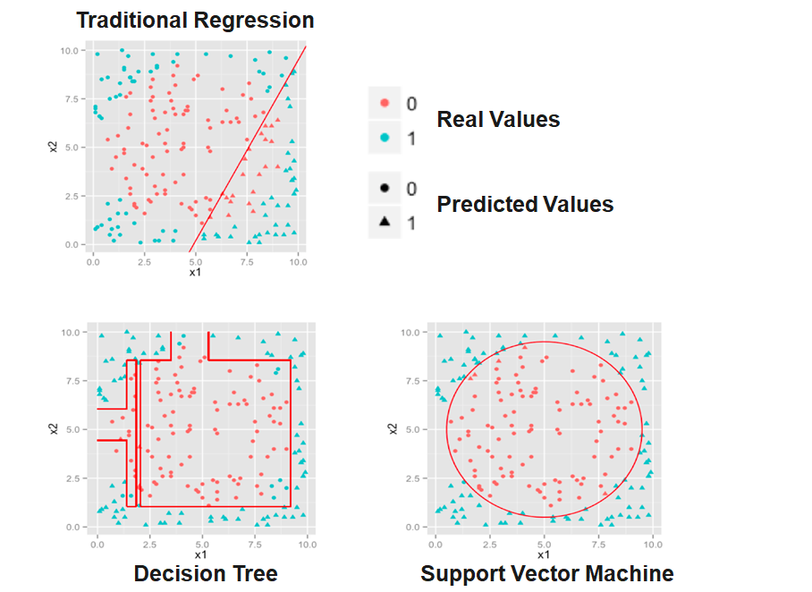

# The Generalization Problem {data-stack-name="Generalization problem"}

## Overfitting (example, ...)

Traditional Analytics Process

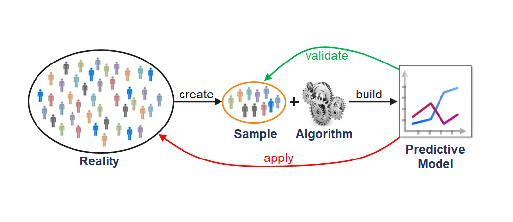

Note: large ML models may create overfitting issues... -> need for separate test set

## Generalization problem

State the generalization problem very clearly.

Ask students for ideas

# The Machine Learning Workflow {data-stack-name="Workflow"}

## The Supervised Machine Learning Workflow

Introduce the high-level pipeline (Modern Analytics Process)

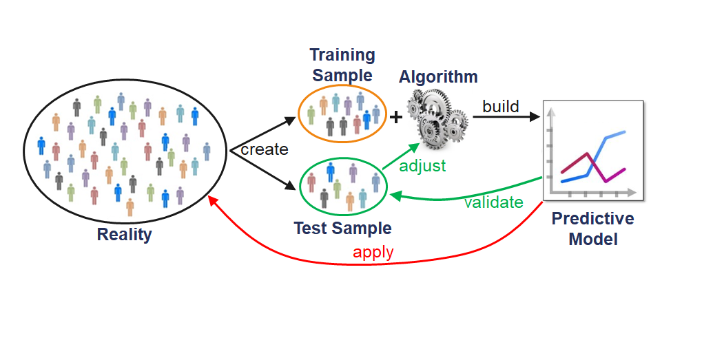

<!--
    ## The Data Analytics Process - Technical View

    

    ::: aside
    — Source: http://blogs.msdn.microsoft.com/martinkearn/2016/03/01/machine-learning-is-for-muggles-too/
    :::
-->

2.1 Labeled Data
- Input features (X) and target labels (y)
- Importance of data quality and representativeness

2.2 Feature Engineering
- Transformations, encoding, normalization
- Why features matter more than the model itself

2.3 Train–Test Split
- Why we split data into training and testing sets
- Preventing information leakage
- Hold-out, cross-validation (brief mention)

2.4 Model Training
- Fit model on training data
- Conceptual: "learning patterns/parameters"

2.5 Evaluation on Test Data
- Predict on unseen data
- Establish generalization performance

2.6 Applying the Model Beyond the Known Sample
- Using the model in decision-making or prediction for future cases

## Overview of Supervised ML Algorithms

Which Method should I choose?

The choice of the method of data analysis depends on the one hand on the scope of application, but on the other hand on the interrelationships of the data to be analyzed.

In the Big Data area, data spaces are often highly-dimensional, making it difficult to visualize the interrelationships.

For this reason, the choice of the method can often not be made ex ante. In these cases, different methods are competitively tried to select the most suitable one.

- **Logistic Regression**
  - Linear boundary, interpretable, limited for non-linear patterns

- **Support Vector Machines (SVM)**
  - Margin maximization
  - Kernel trick for non-linear boundaries

- **Decision Trees**
  - Recursive splitting, intuitive but prone to overfitting

- **Random Forests / Ensembles** (optional brief preview)
  - Reduce overfitting by combining trees

- **Neural Networks**
  - Layers transforming data
  - Extremely flexible but data-hungry and less interpretable

Note: Emphasize the *why* behind different models:
Different inductive biases, different levels of flexibility, different data needs.

## Linear World

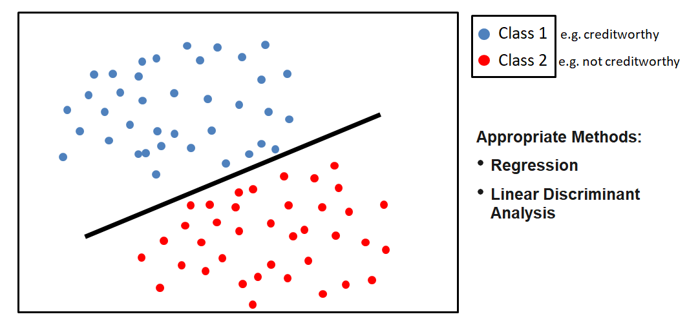

## Quadratic World

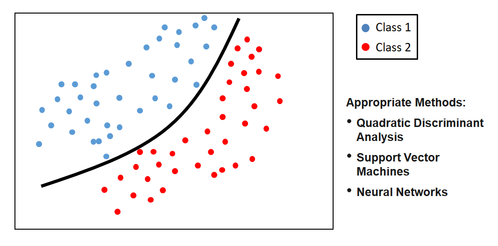

## Nonlinear World (Type 1)

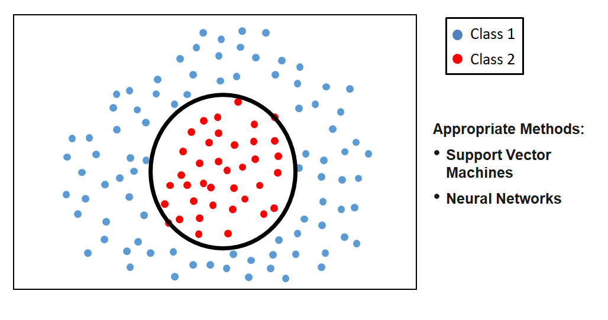

## Nonlinear World (Type 2)

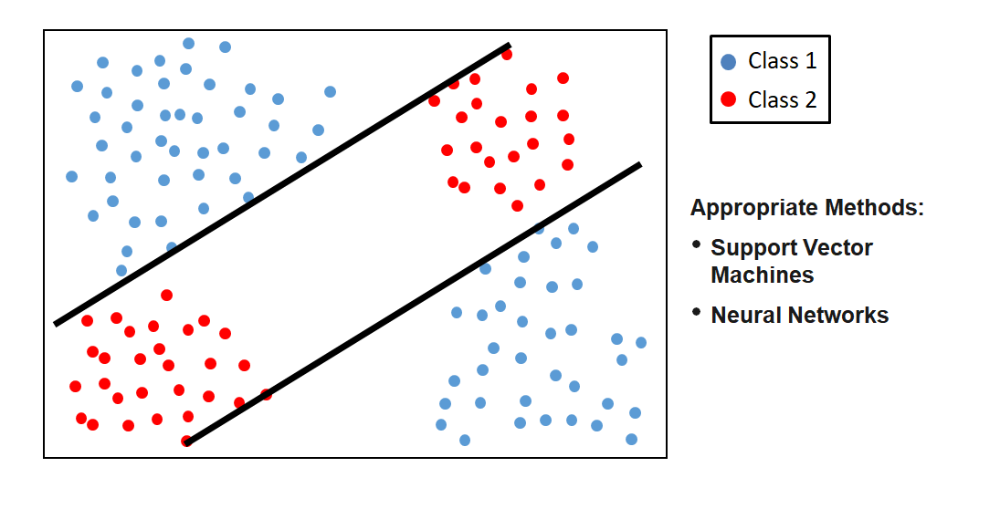

## Nonlinear World (Type 3)

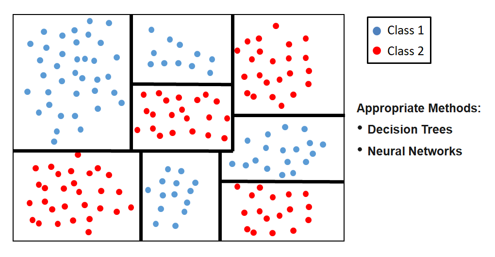

## Nonlinear World (Type 4)

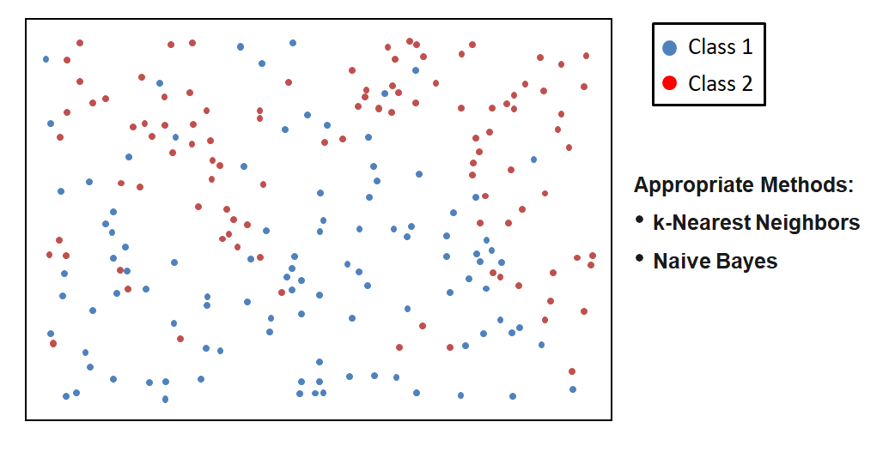

## Feature Engineering

> Feature engineering is the process of using domain knowledge of the data to create features that make machine learning algorithms work. If feature engineering is done correctly, it increases the predictive power of machine learning algorithms by creating features from raw data that help facilitate the machine learning process.

> A feature (variable, attribute) is depicted by a column in a dataset. Considering a generic two-dimensional dataset, each observation is depicted by a row and each feature by a column, which will have a specific value for an observation:

> Features can be of two major types. **Raw features** are obtained directly from the dataset with no extra data manipulation or engineering. **Derived features** are usually obtained from feature engineering, where we extract features from existing data attributes. A simple example would be creating a new feature “Age” from an employee dataset containing "Birthdate".

::: aside
— Source: Sarkar, D.: Understanding Feature Engineering, towardsdatascience.com and Shekhar, A.: What Is Feature Engineering for Machine Learning?, medium.com.
:::

## Variants of Feature Engineering

**1. Transformation**

- convert features (e.g., birth date → age)
- build lag structures (e.g., time-lags)
- normalization / standardization / scaling

**2. Type Conversion**

- if numerical type is needed, transform categorical into numerical data using dummy features
- if categorical type is needed or more informative, discretize numerical features (e.g., income → poor / rich classes)

**3. Feature Combination**

- create interaction features (e.g., school_score = num_schools × median_school
  with num_schools = number of schools within 5 miles of a property and
  median_school = median quality score of those schools)
- combine categories (e.g., when there are very few observations or too many dummy features)

**4. Feature Composition**

- build ratios (e.g., returns from prices)
- Principal Component Analysis (Dimensionality Reduction)

## Scaling

> Most datasets contain features highly varying in magnitudes, units and range.

> Most machine learning algorithms have problems with this because they use distance measures or calculate gradients. The features with high magnitudes will weigh in a lot more in the distance calculations than features with low magnitudes and gradients may end up taking a long time or are not accurately calculable.

> To overcome this effect, we scale the features to bring them to the same level of magnitudes. The two most discussed scaling methods are Normalization and Standardization.

## Type Conversion (Encoding)

> Many machine learning algorithms cannot work with categorical data directly. To convert categorical data to numbers, there exist two variants:

> **Label encoding** refers to transforming the word labels into numerical form so that the algorithms can understand how to operate on them. Every categorical value is assigned to one numerical value, e.g. young → 1, middle_age → 2, old → 3. This only works in specific situations where you have somewhat continuous-like data, e.g. if the categorical feature is ordinal.

> **One hot encoding** is a representation of a categorical variable as binary vectors. Every categorical value is assigned to an artificial binary variable. If the corresponding categorical value occurs in a data row the value of its binary replacement is equal to 1 else 0, e.g.

> It is usual when creating dummy variables to have one less variable than the number of categories present to avoid perfect collinearity (dummy variable trap).

## Example of Feature Engineering (I)

> Data sets often contain date/time features. These features are rarely useful in their original form because they only contain ongoing values. However, they can be useful for extracting cyclical factors, such as weekly or seasonal effects. Suppose, we are given a data "flight date time vs status". Then, given the date-time data, we have to predict the status of the flight.

> But the status of the flight may depend on the hour of the day, not on the date-time. To analyze this, we will create the new feature "Hour_Of_Day". Using the "Hour_Of_Day" feature, the machine will learn better as this feature is directly related to the status of the flight.

::: aside
— Source: Shekhar, A.: What Is Feature Engineering for Machine Learning?, medium.com.
:::

## Example of Feature Engineering (II)

> Suppose we are given the latitude, longitude and other data with the objective to predict the target feature "Price_Of_House". Latitude and longitude are not of use in this context if they are alone. So, we will combine the latitude and the longitude to make one feature.

> In other cases, it might be appropriate to transform latitude and longitude into categories which reflect regions, for example.

## Example of Feature Engineering (III)

> Suppose we are given a feature "Marital_Status" and other data with the objective to classify customers into "Creditworthy" and "Not_Creditworthy". In the data set the martial status has many different values, for example:

- single living alone
- single living with his parents
- married living together
- married living separately
- divorced
- divorced but living together
- registered partnerships
- living in marriage-like community
- widowed
- ...

> To avoid a transformation into too many and maybe dominating dummy features, we can group the similar classes, e.g. in single, married, widowed.

> If there exist some remaining sparse classes which cannot be assigned in a meaningful way they can be joined into a single "other" class.

## Partitioning the Data

> The partitioning of the data in **Training and Test Data** has the aim to proof if the analytical results can be generalized. The analysis (e.g. the development of a classifier) is carried out on the basis of training data. Subsequently, the results are applied to the test data. If the results are significantly worse than the training data, the model is not generalizable, which is called overfitting.

> The partitioning of the data in training and test data can be carried out in the following ways:

- By random/stratified/... sampling (problem with the repeatability)
- according to a list
- according to rules (e.g. the first/last 50 records or every twelfth)

## Applying Training and Test Data

::: aside
— Source: http://www.cs.kent.edu/~jin/BigData/Lecture10-ML-Classification.pptx
:::

## Partitioning

# Performance {data-stack-name="Evaluation"}

## 3. Performance Metrics & Model Behavior (15 min)
Introduce classification performance evaluation:

- Confusion matrix (TP, TN, FP, FN)
- Accuracy, Precision, Recall
- F1 Score and when it is useful
- ROC/AUC (optional, light touch)
- Bias–Variance tradeoff (intro)
- Overfitting vs. underfitting
  - High-level intuition: complexity, flexibility, noise-fitting

TODO: cover cases where some error types are more costly than others
<!--
TBD: unclear?

## Data Errors and their Consequences

-->

## Best Fit vs. Best Generalization

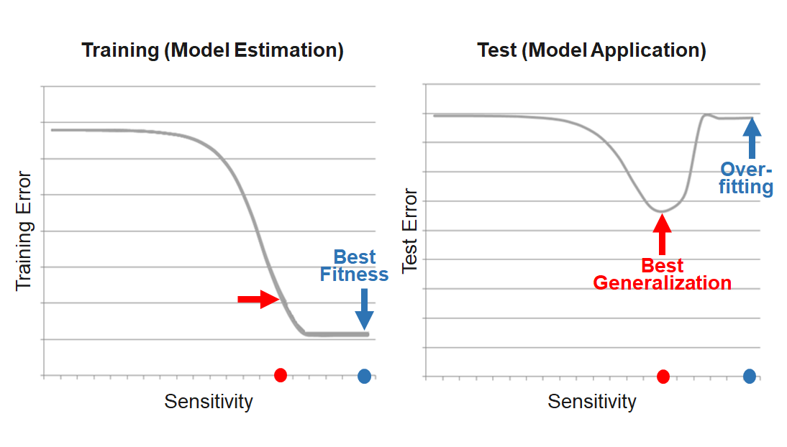

## Over- and Underfitting

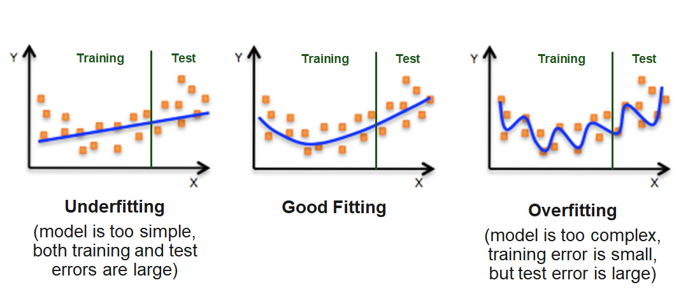

> Due to the problem of overfitting, the main goal is to maximize the prediction quality and not to fit the data that is used for the model estimation as well as possible. This is equivalent to minimizing the risk that the model will have weak predictive ability.

::: {.notes}

Fibonacci Sequence: 0, 1, 1, 2, 3, 5, 8, 13, 21, 34, 55
Measurement Error: 0, 1, 1, 2, 3, 6, 8, 13, 20, 34, 55

:::

## Evaluating the quality of Classification (I)

> True positives (TP), true negatives (TN), false positives (FP), and false negatives (FN), are the four different possible outcomes of a single prediction for a two-class case. A false positive is when the outcome is incorrectly classified as "yes", when it is in fact "no". A false negative is when the outcome is incorrectly classified as negative, when it is in fact positive. True positives and true negatives are obviously correct classifications.

## Evaluating the quality of Classification (II)

> Test metrics are used to assess how accurately the model predicts the known values:

> Most classification algorithms pursue to minimize the misclassification rate. They implicitly assume that all misclassification errors cost equally. In many real-world applications, this assumption is not true. Cost-sensitive learning takes costs, such as the misclassification cost, into consideration. Using costs, the error rate can be calculated via:

## Evaluating the quality of Classification (III)

> Misclassification rate and accuracy can be misleading, for example in the case of imbalanced samples. Extreme case:

> For problems like this additional measures are required to evaluate a classifier.

> **Sensitivity** (true positive rate, recall) measures the proportion of positives that are correctly identified as such. **Specificity** (true negative rate) measures the proportion of negatives that are correctly identified as such.

> Using both measures, we can compute the **Balanced Accuracy**.

## Problem of Imbalancing and Accuracy

> Assume the following case: A credit card company wants to create a fraud detection system to include it into their transactional systems. The outcomes should be "Accept" (Y) and "Reject" (N). Because fraud rarely occurs, the data set consists of 320 observations for Y and 139 for N. They are partitioned into training and test set. Finally, the model is trained and tested.

> Because of the majority of the Y class, the training process concentrates on these cases because their correct classification promises the highest accuracy.

> The results of the test of the model is consequently:

> Thus, the model is blind for the N cases. But these are the ones of primary interest for the company.

## Evaluating the quality of Classification (IV)

> **Precision** measures the proportion of predicted positives who are true positives. A precision of 0.5 means that whenever the model classifies a positive, there is a 50% chance of it really being a positive. The higher the precision the smaller the number of false positives.

> **Recall** measures the percentage of positives the model is able to catch. It is defined as the number of true positives divided by the total number of positives in the dataset. A recall of 50% would mean that 50% of the positives had been predicted as such by the model while the other 50% of positives have been missed by the model.

> ::: aside
— Source: Wikipedia
:::

## Evaluating the quality of Classification (V)

> The F1 Score can be interpreted as the weighted average of both precision and recall. The main idea of the F1 Score is to strike a balance between both precision and recall and measure it in a single metric.

> 

> A F1 score reaches its best value at 1 (perfect precision and recall) and worst at 0.

> It is commonly used in cases of high class imbalance.

## Creation and Use of Models

## The Bias-Variance Tradeoff

The prediction error is influenced by three components:

> Error = Bias + Variance + Noise

- Bias is the inability of the used method to learn the relevant relations between the inputs and the outputs. It reflects the method quality, e.g. if a method only produces linear models.

- Variance represents the deviation resulting from the sensitivity of the created model to small fluctuations in the data.

- Typically, there is a tradeoff between bias and variance.

- Noise is everything that arises from random variations in the data. It cannot be controlled.

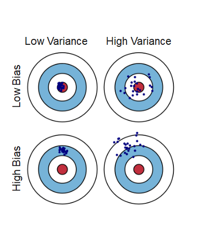

## Summary {data-state="hide-menubar"}

## Survey: Session 6 {data-state="hide-menubar"}

  

::: {style="display:flex; justify-content:center;"}



:::

  

[https://forms.gle/AFmpWcopjMtGfNif6](https://forms.gle/AFmpWcopjMtGfNif6)

::: aside
Note: Responses may be analyzed and published in anonymized form.
:::

# References {data-state="hide-menubar"}