## {data-menu-title="Learning objectives" data-state="hide-menubar"}

<br><br><br><br><br>

::: {.learning-objectives}
- **Explain** the core mechanics of selected algorithms, including regularization in linear models, distance-based prediction (k-NN), recursive partitioning (decision trees), ensemble learning (random forests), and margin maximization (SVMs).
- **Select and justify** an appropriate modeling approach for a given predictive task, considering data characteristics, performance metrics, and the trade-off between interpretability and predictive power.
:::

<!--
 (e.g., k-NN, logistic regression, decision trees, random forests, neural networks)
characteristics: (e.g., dimensionality, non-linearity, class imbalance)
-->

## Models for classification vs. regression

Many models can handle **classification** (predicting categories) and **regression** (predicting numeric values).

<br>

| Model family                  | **Classification**                             | **Regression**                             |
| ----------------------------- | ---------------------------------------------- | ------------------------------------------ |
| **Linear models**             | Logistic regression (Ridge/Lasso)              | Linear regression (Ridge/Lasso)            |
| **Distance-based models**     | k-NN (classification)                          | k-NN (regression)                          |
| **Tree-based models**         | Decision trees, random forest   | Regression trees, random forest |
| **Margin-based models**       | Support vector machine (SVC)                   | Support vector regression (SVR)            |
| **Neural networks**           | Neural networks (classification)               | Neural networks (regression)               |

. . . 

<br>

> *Which model should we choose for a given predictive task?*  
> → depends on:
> 
> - prediction task (classification vs regression)
> - data structure
> - complexity of relationships
> - need for interpretability vs. performance

::: notes

Key idea for this session: We move from:

- **Simple & interpretable models**
  → to
- **More flexible & powerful models**
:::

# Linear models {data-stack-name="Linear models"}

## Regularization

<!--
See https://aunnnn.github.io/ml-tutorial/html/blog_content/linear_regression/linear_regression_regularized.html
-->


Linear models are simple and interpretable—but they can still **overfit**.

- Especially problematic when:
  - many features (**high-dimensional data**)
  - features are **correlated or redundant**
  - noise is present in the data

- Without constraints:
  - the model fits the training data very well  
  - but performs poorly on new data (**low generalization**)


## High dimensionality in linear regression (I)

The figure illustrates the risk of applying OLS when the number of features $p$ is large.
The model's $R^2$ increases to 1 as the number of features increases, and the training set MSE decreases to 0.
At the same time, the MSE on a test set becomes extremely large as the number of features increases.

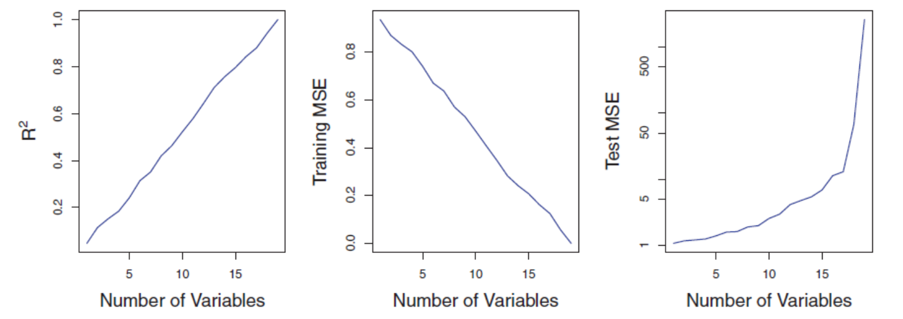{height=400 fig-align=center}

In contrast, methods like ridge regression are particularly useful for performing regression in the high-dimensional setting.
Essentially, these approaches avoid overfitting by using a less flexible fitting approach than least squares.

::: aside
Source: @James2013, pp.240
:::

## High dimensionality in linear regression (II)

OLS is not suitable for high-dimensional data.
Especially when the number of features p is as large as, or larger than, the number of observations, OLS cannot be applied.
Regardless of whether or not there truly is a relationship between the features and the response, OLS will yield a set of coefficient estimates that result in a perfect fit to the data, such that the residuals are zero.

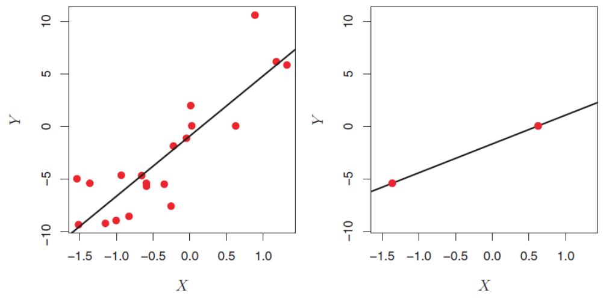{height=400 fig-align=center}

The figure shows two cases. When there are 20 observations, n > p and the OLS line does not perfectly fit the data.
When there are only two observations, then regardless of the values of those observations, the regression line will fit the data exactly.
This is problematic because this perfect fit will almost certainly lead to overfitting of the data.

::: aside
Source: @James2013, pp. 239.
:::

## Core idea of regularization

Prefer **simpler models** that fit the data *well enough*

<br>

::: {.highlight_must_learn}

We modify the objective or loss function (in linear regression: minimizing RSS / OLS):


$$
\text{Loss} = \text{Fit to data} + \lambda \cdot \text{Penalty}
$$

- First term: fit (e.g., squared errors)  
- Second term: penalizes complexity  
- $\lambda$: controls the trade-off  

:::

. . . 

**Common approaches for linear regression**

- **Ridge (L2)**: shrinks coefficients toward zero  
- **Lasso (L1)**: shrinks and sets some coefficients exactly to zero  

. . .


> **Key takeaway**
> 
> Good models balance **fit and simplicity**  
> → Regularization helps control complexity and improve generalization


::: notes
> Regularization is not limited to linear models:

- Trees → depth constraints, pruning  
- k-NN → choice of $k$  
- SVM → margin parameter $C$  
- Neural networks → weight decay, dropout  
:::

<!--
e.g., ridge, lasso, PCA, random-forest: tree-depth boundary
-->


## Ridge regression

Ridge regression is an enhancement of OLS using a technique that constrains or regularizes the coefficient estimates.
This is done by shrinking the coefficient estimates towards zero resulting in a gain in robustness and a higher generalization ability.

Similar to OLS, ridge regression estimates the parameters of the function

$$y_i = \beta_0 + \beta' x_i + v_i$$

but instead of minimizing the residual sum of squares ($v^2$), the function to minimize is


$$
\sum_{i=0}^{n} v_i^2 + \lambda \cdot \sum_{j=1}^{p} \beta_j^2
=
\sum_{i=0}^{n} \left(y_i - \beta_0 - \beta' x_i\right)^2 + \lambda \cdot \sum_{j=1}^{p} \beta_j^2
$$

where $\lambda ≥ 0$ is a tuning parameter, to be determined separately.
It is called a shrinkage penalty and has the effect of shrinking the estimates of $\beta_j$ towards zero.
This is equivalent to reducing complexity.

> $\lambda$ is not applied to the intercept $\beta_0$ !

<!--
TODO: check explanation before including
## Complexity

Complexity can be measured as the size of the set of possible outputs for a given set of inputs.

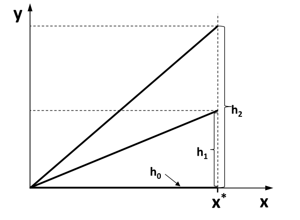{height=500 fig-align=center}

In this example the interval $0$ to $x^*$ represents the set of possible inputs.
Function $h_0$ has the lowest complexity because there is just one output independent of the inputs.
$h_2$ has the highest complexity because here the set of possible outputs is the biggest one.
-->

## Complexity and generalisation

<br>

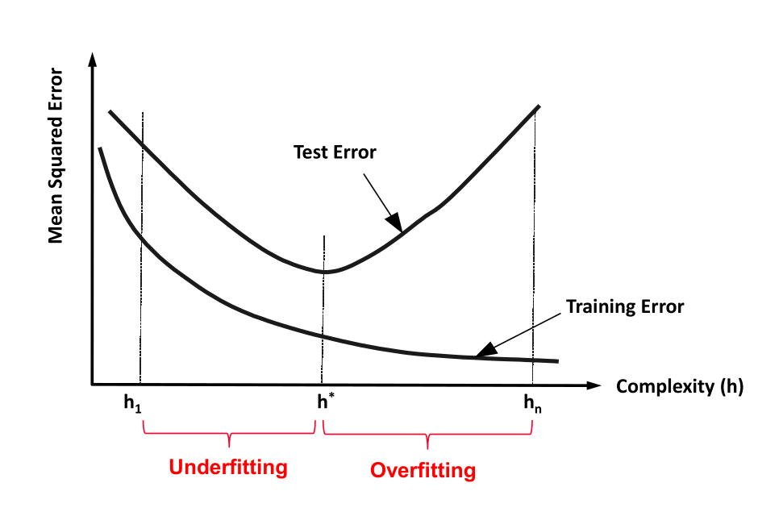{height=600 fig-align=center}

<!--
TODO: illustrate ridge regression geometrically?
-->

## Relationship of $\lambda$ and complexity

$\lambda \rightarrow \infty$: Lowest complexity  
The ridge regression coefficients are equal to zero.
For every input, the result is $\beta_0$.

$\lambda = 0$: Relative high complexity (linear model)  
The penalty term has no effect, and ridge regression will produce the least squares estimates.

Example:

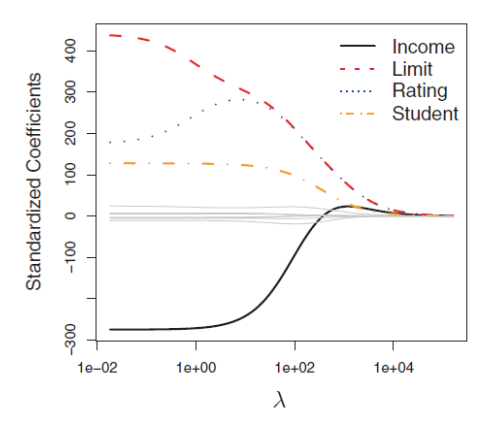{height=450 fig-align=center}

::: aside
Source: @James2013, pp. 215.
:::

# Distance-based models: k-NN {data-stack-name="k-NN"}

## k-NN for classification

:::: {.columns}

::: {.column width="60%"}

k-Nearest Neighbors (k-NN) is often used for clustering, but it can also be adapted to classification and regression tasks. It is particularly useful in settings where a set of observations has already been labeled, and the objective is to assign labels or predict values for new, unlabeled observations.

The method operates by identifying the *k* most similar observations to a given data point, based on a chosen distance metric (e.g., Euclidean distance). In classification tasks, the new observation is assigned the class label that is most frequent among its *k* nearest neighbors. 

**Procedure of k-NN for classification:**

1. Determine parameter k (= number of nearest neighbors)
2. Calculate the distances between the new object and all known labeled objects.
3. Choose the k objects from all known labeled objects having the smallest distance to the new object as nearest neighbors.
4. Count the frequencies of the classes of the nearest neighbors.
5. Assign the new object to the most frequent class.
:::

::: {.column width="40%"}

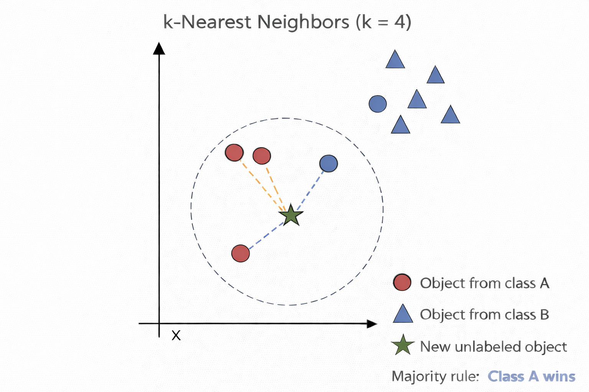

:::

::::

::: aside
Compare with lecture 2 where we used k-NN for clustering.
:::

::: notes
In the case of ties in classification, a predefined rule is applied, such as selecting one of the tied classes at random or weighting neighbors by their distance.
:::


## k-NN for regression

:::: {.columns}

::: {.column width="50%"}
k-NN can also be used for regression.
The only difference in regression is that the prediction is not the result of a majority vote but of an averaging process.

A simple implementation of k-NN regression is to calculate the average of the numerical target of the k-nearest neighbors.
Another approach uses an inverse distance weighted average of the K-nearest neighbors.
k-NN regression uses the same distance functions as k-NN classification.

:::

::: {.column width="50%"}
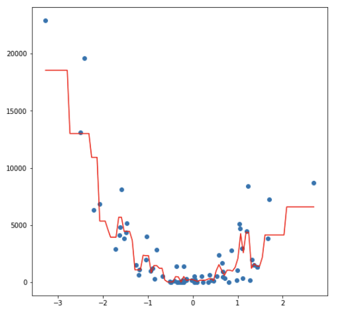{fig-align=center}
:::

::::

# Decision trees {data-stack-name="Decision trees"}

<!--

nice graph: https://medium.com/data-science/entropy-how-decision-trees-make-decisions-2946b9c18c8

TODO: switch to M&A decision example

| Deal | market outlook | deal size | due diligence | team experience | success |
| ---- | -------------- | --------- | ------------- | --------------- | ------- |
| 1    | strong         | large     | low           | junior          | no      |
| 2    | strong         | large     | low           | senior          | no      |
| 3    | moderate       | large     | high          | junior          | yes     |
| 4    | weak           | medium    | high          | junior          | yes     |
| 5    | weak           | small     | high          | junior          | yes     |
| 6    | weak           | small     | high          | senior          | no      |
| 7    | moderate       | small     | high          | senior          | yes     |
| 8    | strong         | medium    | low           | junior          | no      |
| 9    | strong         | small     | high          | junior          | yes     |
| 10   | weak           | medium    | high          | junior          | yes     |
| 11   | strong         | medium    | high          | senior          | yes     |
| 12   | moderate       | medium    | low           | senior          | yes     |
| 13   | moderate       | large     | high          | junior          | yes     |
| 14   | weak           | medium    | low           | senior          | no      |

-->

## Which one is better?

The following decision trees predict whether a person will respond to recent advertisements:

{fig-align=center}


## Introductory example

{fig-align=center}

::: aside
Proportions in the leaves can be interpreted as probabilities.
:::

::: notes
To choose the relevant features, you can apply several methods and after this you may train a selection model using for example logistic regression. The whole process would be very time-consuming and even costly. As an alternative, you can apply a decision tree algorithm which is a stepwise or recursive classification mechanism.

:::


## Decision trees (I)

::: {.highlight_must_learn}
**Decision trees** are hierarchical models used for **classification and regression**, based on **recursive partitioning** of the feature space.

A decision tree consists of:

- a **root node** (topmost node, contains all observations)
- **internal (decision) nodes** (perform splits based on features)
- **leaf nodes** (terminal nodes containing predictions)

Each internal node splits the data into **disjoint subsets** based on a feature and a **splitting criterion** (e.g., Gini index, entropy, or RSS).

The tree is built **recursively**:

- Start with all observations at the root
- Select the feature and split that best improves homogeneity
- Partition the data accordingly
- Repeat the process for each subset until a stopping criterion is met

If each node has exactly two child nodes, the tree is called a **binary tree**.
:::

## Decision trees (II)

Decision tree models partition the **feature space** into a set of regions by recursively splitting the data to achieve **maximum homogeneity** within each region.

They can be interpreted as a set of **decision paths**:
for a given combination of predictor values, an observation follows a specific path from the root to a **leaf node**, where a prediction (classification or regression) is assigned.

Decision trees make **few assumptions** about the functional form of relationships or data distributions.
In contrast to parametric models (e.g., linear regression), they can capture **nonlinear patterns**, **interactions**, and **complex structures** in the data that are difficult to model with linear approaches.

<br>

{height=320px fig-align=center}

<!--
Note: already covered in previous illustration?
    ## Decision Trees (III)

    

    ::: aside
    — Source: http://iopscience.iop.org/article/10.1088/1749-4699/5/1/015004
    :::
-->

## Overview of important decision tree methods

<br><br>

| Name | CART | ID3 | C5.0 | CHAID | Random forests |
| :-- | :-- | :-- | :-- | :-- | :-- |
| **Idea** | Choose the attribute with the highest information content | One of the first methods from Quinlan; uses the concept of information gain | Like ID3 based on the concept of information gain | Choose the attribute that is most dependent on the target variable | Construct many trees with different sets of features and samples (randomly). The result is obtained by voting. |
| **Measure used** | Gini-Index | Information gain (entropy) | Ratio of information gain | Chi-square split | Optional, mostly Gini-Index |
| **Type of Splitting** | Binary | Complete, pruning | Complete, pruning | Complete, pruning | Complete |


## Introductory example

{fig-align=center}


## Splitting with entropy in ID3

:::: {.columns}

::: {.column width="70%"}

**ID3 uses entropy as a measure of impurity of a node $t$:**

$$
\text{entropy}(t) = - \sum_{i=1}^{k} p_i \cdot \log_2(p_i)
$$

where $p_i$ is the **relative frequency** of observations in node $t$ that belong to class $i$.

**Attribute: Wind**

- **light**: 6 × yes, 2 × no  

$$
\text{entropy}(\text{light}) =
- \left(
\frac{6}{8} \cdot \log_2\left(\frac{6}{8}\right)
+
\frac{2}{8} \cdot \log_2\left(\frac{2}{8}\right)
\right)
= 0.811
$$

- **strong**: 3 × yes, 3 × no  

$$
\text{entropy}(\text{strong}) =
- \left(
\frac{3}{6} \cdot \log_2\left(\frac{3}{6}\right)
+
\frac{3}{6} \cdot \log_2\left(\frac{3}{6}\right)
\right)
= 1.0
$$

:::

::: {.column width="30%"}
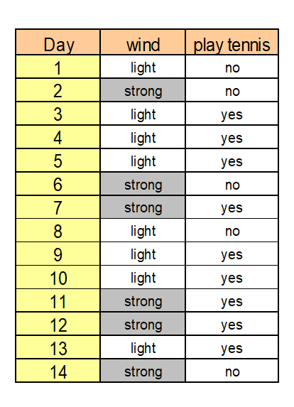{fig-align=center}
:::

::::

::: {.learning_note .fragment}
No need to memorize the formula.
However, you should be able to calculate entropy and   
apply the algorithm on paper when the formula and data are provided.
This also applies to C5.0.
:::

## Calculating the information gain

The information gain is a measure that shows (by combination of the entropies) the appropriateness of an attribute for splitting:

$$
\text{Information gain} =
\text{entropy}(t)
-
\sum_{i=1}^{m} \frac{t_i}{t} \cdot \text{entropy}(t_i)
$$

where 

- m = number of values (here two: light, strong)
- $t_i$ = number of data sets with strong or light wind (8 resp. 6)
- t = total number of data sets (14) and 
- entropy(t) = entropy before splitting.

{width=600px fig-align=center}

$$
\text{Information gain} =
0.94 -
\left(
\frac{8}{14} \cdot 0.811
+
\frac{6}{14} \cdot 1.0
\right)
= 0.048
$$

## Decision using ID3

- Information gain (outlook) = 0.246
- Information gain (humidity) = 0.151
- Information gain (windy) = 0.048
- Information gain (temperature) = 0.029

We choose the attribute with the largest information gain  

→ **Outlook** is used for the first split

## How ID3 builds the tree

ID3 is a **greedy, recursive procedure**:

At each node:

1. Compute information gain for all remaining attributes  
2. Select the best attribute (highest gain)  
3. Split the data  
4. Repeat the process within each subset  

This continues until:

- nodes are pure, or  
- no attributes remain

As solution we, obtain the following tree:

{height=220px fig-align=center}


## Decision using C5.0

ID3 tends to favor attributes that have a large number of values, resulting in larger trees.
For example, if we have an attribute that has a distinct value for each record, then the entropy is 0, thus the information gain is maximal.

To compensate for this, C5.0 is a further development that uses the information gain ratio as a splitting criterion:

$$
\text{Information gain ratio} =
\frac{
\text{entropy}(t) - \sum_{i=1}^{m} \frac{t_i}{t} \cdot \text{entropy}(t_i)
}{
- \sum_{i=1}^{m} \frac{t_i}{t} \cdot \log_2 \left(\frac{t_i}{t}\right)
}
$$

In the case of our example the information gain ratio of *windy* is

$$
\text{Information gain ratio (windy)} =
\frac{0.048}{
- \frac{6}{14} \cdot \log_2\left(\frac{6}{14}\right)
- \frac{8}{14} \cdot \log_2\left(\frac{8}{14}\right)
}
= 0.049
$$

and the information gain ratio of *outlook* is

$$
\text{Information gain ratio (outlook)} =
\frac{0.246}{
- \frac{5}{14} \cdot \log_2\left(\frac{5}{14}\right)
- \frac{4}{14} \cdot \log_2\left(\frac{4}{14}\right)
- \frac{5}{14} \cdot \log_2\left(\frac{5}{14}\right)
}
= 0.156
$$

::: aside
$t$ = total number of observations in the current node (before the split)  
$t_i$ = number of observations in the i-th child node (after the split)
:::


## Handling numerical attributes

Numerical attributes are (typically) split into two groups.
In contrast to categorical attributes many possible splitting points exist.

The splitting point with the highest information gain is looked for.
For this, the potential attribute is sorted according to its values first and then all possible splitting point and the corresponding information gains are calculated.
In extreme cases there exists n-1 possibilities.


:::: {.columns}

::: {.column width="60%"}

**Test the splitting point $\text{temperature} = 71.5$:**

- $\text{temperature} < 71.5$: 4 × yes, 2 × no  

$$
\text{Entropy}(< 71.5) =
- \left(
\frac{4}{6} \cdot \log_2\left(\frac{4}{6}\right)
+
\frac{2}{6} \cdot \log_2\left(\frac{2}{6}\right)
\right)
= 0.918
$$

- $\text{temperature} > 71.5$: 5 × yes, 3 × no  

$$
\text{Entropy}(> 71.5) =
- \left(
\frac{5}{8} \cdot \log_2\left(\frac{5}{8}\right)
+
\frac{3}{8} \cdot \log_2\left(\frac{3}{8}\right)
\right)
= 0.954
$$

**We calculate:**

$$
\text{Information gain} =
0.94 -
\left(
\frac{6}{14} \cdot 0.918
+
\frac{8}{14} \cdot 0.954
\right)
= 0.00143
$$
:::

::: {.column width="30%"}
{width=300px fig-align=center}
:::

::::

<!--
Note: introduce in the next round:

    ## The CART Algorithm

    The CART algorithm (Classification And Regression Trees) constructs trees that have only binary splits.
    Like C5.0, it is able to handle categorical and numerical attributes.

    As a measure for the impurity of a node t, CART uses the Gini Index.
    In the case of two classes the Gini Index is defined as:

    

    ## Splitting in CART

    


    ## Coherence between Entropy and Gini Index

    {fig-align=center}

    > **Remark:** Entropy has been scaled from (0, 1) to (0, 0.5)!
-->

<!--
TODO: also show the resulting tree for C5! (ideally, it should be a bit different from ID3)
-->

## Overfitting

Most decision tree algorithms partition training data until every node contains objects of a single class, or until further partitioning is impossible because two objects have the same value for each attribute but belong to different classes.
If there are no such conflicting objects, the decision tree will correctly classify all training objects.


If tree performance is measured from the number of correctly classified cases it is common to find that the training data gives an over-optimistic guide to future performance, i.e. with new data.
A tree should exhibit generalization, i.e. work well with data other than those used to generate it. When the tree grows during training it often shows a decrease in generalization.
This is because the deeper nodes are fitting noise in the training data not representative over the entire universe from which the training set was sampled. This is called 'overfitting'.

{fig-align=center}

<!--
TODO: include max depth.
-->

<!--
## Overfitting (II)

> The learner overfits to correctly classify the noisy data objects.

{fig-align=center}
-->


## Random forest (I)

Random forest is an ensemble classifier that consists of many decision trees.

For every tree a subset of the data objects and a subset of features is randomly chosen.
Then the tree is constructed usually using the Gini Index.

In the end, a simple majority vote is taken for prediction.

{fig-align=center}

**Algorithm:**

1. Create n samples from the original data. The sample size is often 2/3.
2. For each of the samples, grow a tree, with the following modification: at each node, rather than choosing the best split among all predictors, randomly sample m* of the m predictors and choose the best split from among those variables.
3. Predict by aggregating the predictions of the n trees (majority votes).

## Random forest (II)

Voting principle of random forest:

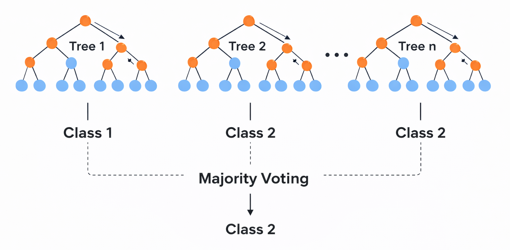{width=60% fig-align=center}

> To avoid overfitting effects, the size and the depth of the trees can be restricted.

<!--

          ## Introductory Example

          

          

          > **websites (features)**

          > 1=visited

          > 0=not visited

          > **ad (target)**

          > 1=clicked

          > 0=not clicked

          > **Giant sparse matrix!**

          > **One matrix for every ad!**

          ::: aside
          — Source: Giant sparse matrix! A sparse matrix is a matrix in which most of the elements are zero. One matrix for every ad! Can be solved by Naïve Bayes! Looking for an alternative
          :::

          ## Why not classical linear regression?

          > It is possible to implement a linear regression on such a dataset where Y={0,1}.

          > Problems:

          > - The predicted values of the linear model can be greater than 1 or less than 0.
          > - e is not normally distributed because Y takes on only two values.
          > - The error terms are heteroscedastic (the error variance is not constant for all values of X).

          ::: aside
          — Source: Bichler (2015): Course Business Analytics, TU München
          :::
-->

## Regression trees

:::: {.columns}

::: {.column width="60%"}
Some of the tree approaches can be used for regression too.
They can be used for nonlinear multiple regression.
The output must be numerical.

The figure shows a regression tree for predicting the salary of a baseball player, based on the number of years that he has played in the major leagues and the number of hits that he made in the previous year.
The predicted salary is given by the mean value of the salaries in the corresponding leaf, e.g. for the players in the data set with Years<4.5, the mean (log-scaled) salary is 5.11, and so we make a prediction of $e^{5.11}$ thousands of dollars, i.e. $165,670, for these players.

Players with Years>=4.5 are assigned to the right branch, and then that group is further subdivided by Hits.
The predicted salaries for the resulting two groups are $1,000*e^{6.00} =\$403,428$ and $1,000*e^{6.74} =\$845,346$.

:::

::: {.column width="40%"}
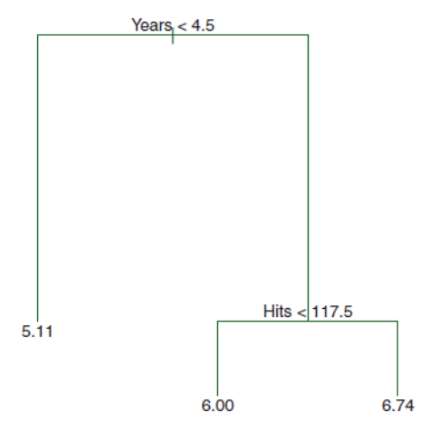{fig-align=center}
:::

::::


::: aside
Source: @James2013, pp.304
:::

## Constructing a regression tree (I)

:::: {.columns}

::: {.column width="60%"}

A regression tree partitions the data objects in the feature space into regions $R_j$, represented by the leaves of the tree.
To construct the tree, the goal is to find regions that minimize the RSS, given by

$$
RSS = \sum_{j=1}^{J} \sum_{i \in R_j} \left(y_i - \bar{y}_{R_j}\right)^2
$$


where $\bar{y}_{R_j}$ is the mean value for the training observations within the jth region with $\hat{y}_{R_j} = \bar{y}_{R_j}$.

To perform the recursive binary splitting, we first select the feature $X_j$ and the cutpoint $s$ such that splitting the feature space into the regions $X_j < s$ and $X_j \ge s$ leads to the greatest possible reduction in RSS.
We consider all features and all possible values of the cutpoint s for each of the features, and then choose the feature and cutpoint such that the resulting tree has the lowest RSS.

:::

::: {.column width="40%"}
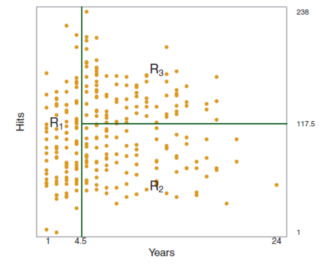
:::

::::


::: aside
Source: @James2013, pp. 305
:::

## Constructing a regression tree (II)

For any feature j and cutpoint s, we seek the value of j and s that minimizes

$$
\sum_{i: x_i \in R_1(j,s)} \left(y_i - \bar{y}_{R_1}\right)^2
\;+\;
\sum_{i: x_i \in R_2(j,s)} \left(y_i - \bar{y}_{R_2}\right)^2
$$

where $\bar{y}_{R_1}$ is the mean value for the training observations in $R_1(j,s)$, and $\bar{y}_{R_2}$ is the mean value for the training observations in $R_2(j,s)$.
After splitting, we repeat the process, looking for the best feature and best cutpoint in order to split the data further so as to minimize the RSS within each of the resulting regions.
The process continues until a stopping criterion is reached; for instance, we may continue until no region contains more than five observations.
Once the regions R1, . . . , RJ have been created, we predict the objects from the test set.
To handle the problem of overfitting, pruning methods exist even for regression trees.

::: aside
@James2013, pp.307
:::

## Random forests for regression

Due to the usage of means as predictors a regression tree usually simplifies the true relationship between the inputs and the output.
The advantage over traditional statistical methods is, that it can give valuable insights about which variables are important and where.
But the prediction ability is poor compared to other regression approaches.

A much better prediction quality can be achieved with the creation of an ensemble of trees, use them for prediction and averaging their results.
This is done, when applying the random forests approach to a regression task.

Regression forests are an ensemble of different regression trees and are used for nonlinear multiple regression.
The principle is the same as in classification, except that the output is not the result of a voting but instead
of an averaging process.

The disadvantage of random forests is that the analysis, which aggregates over the results of many bootstrap trees, does not produce a single, easily interpretable tree diagram.

## Comparing the fitting ability of one vs. many regression trees

<br>

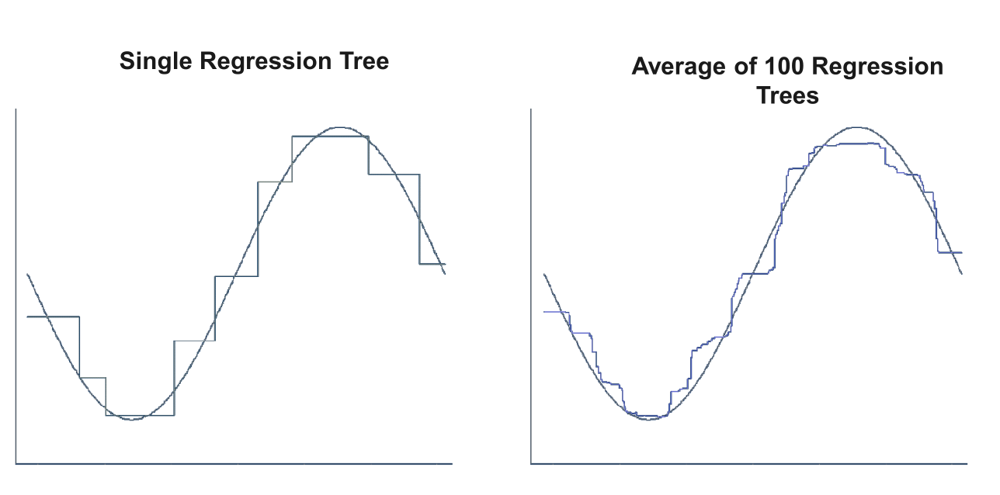{width=70% fig-align=center}

## Limitations of tree methods in regression

When applied to regression problems, tree methods have the limitation that they cannot exceed the range of values of the target variable used in training.
The reason for this lies in their design principle, how the leaves of the trees are created.

Thus, Random Forests may perform poorly when the target data is out of the range of the original training data, e.g. in the case of data with persistent trends.
A solution may be a frequent re-training in this case.

An important strength of Random Forests is that they are able to perform still well in the case of missing data. According to their construction principle, not every tree is using the same features.

If there is any missing value for a feature during the application there usually are enough trees remaining that do not use this feature to produce accurate predictions.


# Support vector machines {data-stack-name="Support vector machines"}

## The idea: separating with a line (or hyperplane)

Imagine you have two groups of points. SVM tries to separate them with a **line** (in 2D) or a **hyperplane** (in higher dimensions).

Mathematically, a hyperplane is:

$$w^\top x + b = 0$$

- $x$: data point (features, e.g., income, age)
- $w$: weight vector (defines orientation)
- $b$: bias (shifts the line)

The predictions are:

- Class +1 if $w^\top x + b > 0$
- Class −1 if $w^\top x + b < 0$

## The key insight: maximize the margin

SVM doesn’t pick *just any* separating line. It chooses the one with the **largest margin** (distance to the closest points).

Those closest points are called **support vectors**.

Margin size is:

$$\text{margin} = \frac{2}{|w|}$$

So maximizing the margin = minimizing $|w|$.


```{python}
#| fig-align: center
#| echo: false
import numpy as np
import matplotlib.pyplot as plt
from sklearn import svm

np.random.seed(42)

n = 50

# clusters closer together + lower variance
X_success = np.random.normal(loc=[4.5, 4.5], scale=0.4, size=(n, 2))
X_unsuccess = np.random.normal(loc=[6.0, 6.0], scale=0.4, size=(n, 2))

X = np.vstack((X_success, X_unsuccess))
y = np.hstack((np.ones(n), -np.ones(n)))

# moderately large C → tight but visible margin
model = svm.SVC(kernel="linear", C=100)
model.fit(X, y)

fig, ax = plt.subplots(figsize=(6, 5))

# plot points
ax.scatter(X_success[:, 0], X_success[:, 1], marker="o", s=35, label="Successful")
ax.scatter(X_unsuccess[:, 0], X_unsuccess[:, 1], marker="x", s=35, label="Unsuccessful")

# highlight support vectors
ax.scatter(
    model.support_vectors_[:, 0],
    model.support_vectors_[:, 1],
    s=120,
    facecolors="none",
    edgecolors="black",
    linewidths=1.5,
    label="Support vectors",
)

# decision boundary and margins
xx = np.linspace(3.5, 7, 200)
yy = np.linspace(3.5, 7, 200)
YY, XX = np.meshgrid(yy, xx)
xy = np.vstack([XX.ravel(), YY.ravel()]).T
Z = model.decision_function(xy).reshape(XX.shape)

ax.contour(XX, YY, Z, levels=[0], linewidths=2)
ax.contour(XX, YY, Z, levels=[-1, 1], linestyles="--")

# zoom in → makes margins visually closer
ax.set_xlim(3.8, 6.8)
ax.set_ylim(3.8, 6.8)

ax.set_xlabel("Team size")
ax.set_ylabel("Experience")
ax.legend()
plt.show()
```


## The optimization problem (hard margin)

If the data is perfectly separable:

$$\min_{w,b} \frac{1}{2} |w|^2
\quad \text{subject to} \quad
y_i (w^\top x_i + b) \geq 1$$

- $y_i \in {-1, +1}$: class labels
- Constraint ensures correct classification with margin

Interpretation: We want all points correctly classified and as far from the boundary as possible.

## Allowing mistakes (soft margin)

Real-world data is messy. So we allow violations using slack variables $\xi_i$:

$$\min_{w,b} \frac{1}{2} |w|^2 + C \sum_i \xi_i
\quad \text{subject to} \quad
y_i (w^\top x_i + b) \geq 1 - \xi_i$$

- $\xi_i$: how much a point violates the margin
- $C$: regularization parameter (trade-off)

  - Large (C): fewer mistakes, tighter fit
  - Small (C): more tolerance, smoother boundary

## Nonlinear boundaries via the kernel trick

What if data isn’t linearly separable?

Instead of transforming data explicitly, SVM uses a **kernel function**:

$$K(x_i, x_j) = \phi(x_i)^\top \phi(x_j)$$

The **kernel trick** replaces inner products with a kernel function, allowing us to compute similarities as if the data were mapped to a higher-dimensional space—without ever computing $\phi(x)$ directly.

Common kernels:

- Linear: $K(x_i, x_j) = x_i^\top x_j$
- Polynomial
- RBF (Gaussian): captures complex patterns

Intuition: SVM can create **curved decision boundaries** by working in an implicit higher-dimensional space.

## Final decision function

After training, predictions look like:

$$f(x) = \sum_{i \in SV} \alpha_i y_i K(x_i, x) + b$$

- Only **support vectors (SV)** matter
- $\alpha_i$: learned weights

Since $\alpha_i=0$ for most training points, the decision function depends only on those with non-zero coefficients (the support vectors).

. . . 

> **Why SVMs are useful**
> 
> - Work well with **small to medium datasets**
> - Strong theoretical foundation (max-margin principle)
> - Effective in **high-dimensional settings** (e.g., text, surveys)
> - Flexible via kernels

::: notes
Conclude with the big picture:
SVM starts with a linear separator, extends it with soft margins,
and becomes nonlinear through kernels.
That is the reason it fits well into the "margin-based models" family.
:::

## Support vector regression

Similar to the other regression approaches, support vector regression (SVR) estimates the parameters of the function:

$$y_i = \beta_0 + \beta_ix_i+v_i$$


The Goal is to find a robust model with a high generalization ability.
SVR regards two sources of robustness:

1. Eliminating noise
2. Handling complexity

## Insensitive loss function (I)


:::: {.columns}

::: {.column width="50%"}

<br><br>

**$\varepsilon$-insensitive loss**

$$\xi_i =
\begin{cases}
|v_i| - \varepsilon, & \text{if } |v_i| > \varepsilon \\
0, & \text{otherwise}
\end{cases}$$

does not penalize acceptable deviations (defined by $\varepsilon$)

**OLS / Ridge**

$$\xi_i = v_i^2$$

:::

::: {.column width="50%"}
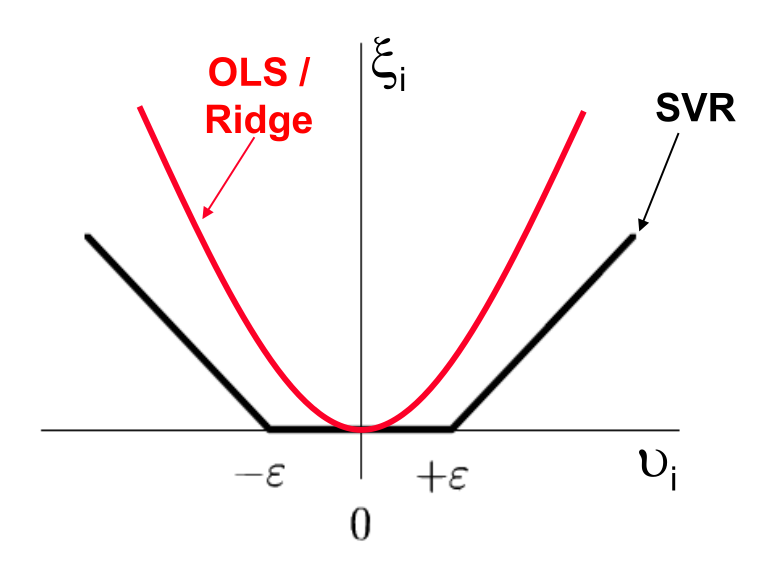
:::

::::

## Insensitive loss function (II)

Using the $\epsilon$-insensitive loss function, only those data objects are considered in the estimation, which have a distance greater than $\epsilon$ from the regression function:

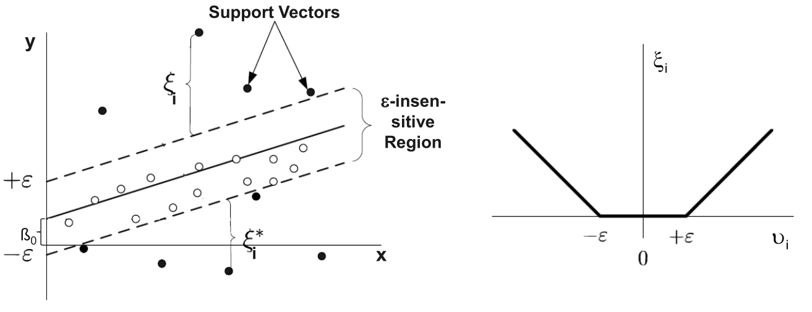

Every object inside the $\epsilon$-insensitive region is ignored.
It is regarded as noise.

<!--
TODO: include minimization (loss function) statement

TBD/careful: Nonlinearity (I) and Nonlinearity (II): slides present examples of classification (not regression!?)
-->

## Kernel functions

Kernel Functions are used to project n-dimensional input to m-dimensional input, where m is higher than n:

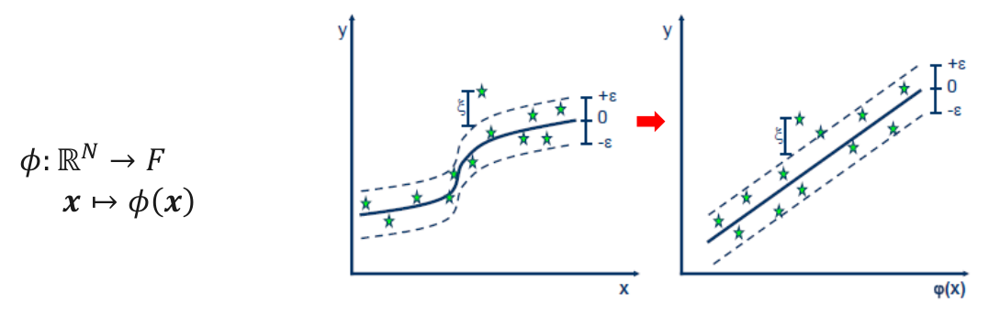

Any point x in the original space is mapped into the higher dimensional space.
For reason of efficiency, the mapping is not performed in real but instead embedded in the model building process via the kernel function:

Instead of $\beta_0 + \beta\cdot x = y$ the following is used: $\beta_0 + \beta \cdot \phi(x) = y$.

The main idea to use a kernel is:
A linear regression curve in higher dimensions becomes a non-linear regression curve in lower dimensions.

## SVR examples (I)

<br>

```{python}
#| fig-align: center
import numpy as np
import matplotlib.pyplot as plt
from sklearn.svm import SVR

np.random.seed(1)

X = np.linspace(1, 15, 60).reshape(-1, 1)
y = -(X.ravel() - 8)**2 + 50 + np.random.normal(0, 3, 60)

model = SVR(kernel='rbf', C=100, epsilon=2)
model.fit(X, y)

X_plot = np.linspace(1, 15, 200).reshape(-1, 1)
y_pred = model.predict(X_plot)

plt.scatter(X, y)
plt.plot(X_plot, y_pred)
plt.xlabel("Team size")
plt.ylabel("Productivity")
plt.title("SVR captures optimal mid-size teams")
plt.show()
```

## SVR examples (II)

<br>

```{python}
#| fig-align: center
import numpy as np
import matplotlib.pyplot as plt
from sklearn.svm import SVR

np.random.seed(0)

X = np.linspace(0, 10, 50).reshape(-1, 1)
y = 10 * np.log1p(X).ravel() + np.random.normal(0, 0.5, 50)

model = SVR(kernel='rbf', C=100, epsilon=0.5)
model.fit(X, y)

X_plot = np.linspace(0, 10, 200).reshape(-1, 1)
y_pred = model.predict(X_plot)

plt.scatter(X, y)
plt.plot(X_plot, y_pred)
plt.xlabel("Advertising spend")
plt.ylabel("Sales")
plt.title("SVR captures diminishing returns")
plt.show()
```

## SVR examples (III)

<br>

```{python}
#| fig-align: center
import numpy as np
import matplotlib.pyplot as plt
from sklearn.svm import SVR

np.random.seed(2)

X = np.linspace(1, 20, 60).reshape(-1, 1)
y = 100 / (X.ravel() + 2) + np.random.normal(0, 2, 60)

model = SVR(kernel='rbf', C=100, epsilon=1)
model.fit(X, y)

X_plot = np.linspace(1, 20, 200).reshape(-1, 1)
y_pred = model.predict(X_plot)

plt.scatter(X, y)
plt.plot(X_plot, y_pred)
plt.xlabel("Price")
plt.ylabel("Demand")
plt.title("SVR captures nonlinear demand curve")
plt.show()
```


## Summary {data-state="hide-menubar"}

- Supervised machine learning includes a variety of **model families** (linear, distance-based, tree-based, margin-based, neural networks) that can be applied to both **classification** and **regression** tasks. Model choice depends on data characteristics, problem complexity, and the trade-off between interpretability and predictive performance.

- Different models embody different assumptions and levels of flexibility:  
  **linear models** are simple and interpretable, while **more flexible models** (e.g., trees, SVMs, neural networks) can capture complex, non-linear relationships but are harder to interpret.

- Controlling **model complexity** is central to achieving good generalization. Techniques such as **regularization (Ridge, Lasso)**, parameter choices (e.g., k in k-NN, depth in trees), and margin control (SVM) balance fit and simplicity.

- Key supervised learning algorithms introduced include **k-Nearest Neighbors (k-NN)** (distance-based), **decision trees and Random Forests** (tree-based and ensemble methods), and **Support Vector Machines (SVMs)** (margin-based models), illustrating different approaches to learning from data with varying assumptions, flexibility, and interpretability.


## Survey: Session 7 {data-state="hide-menubar"}

<br><br>

::: {style="display:flex; justify-content:center;"}

" width=400 height=400 >}}

:::

<br><br>

[]()

::: aside
Note: Responses may be analyzed and published in anonymized form.

Please complete the survey before you leave today — thank you 🙏
:::


# References {data-state="hide-menubar"}