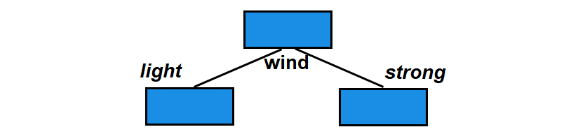
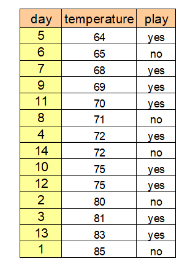

## {data-menu-title="Learning objectives" data-state="hide-menubar"}

     

::: {.learning-objectives}
- **Compare** selected supervised machine learning algorithms with respect to their assumptions, flexibility, interpretability, and typical application scenarios.
- **Explain** the mechanics of selected algorithms, including distance-based classification (k-NN), recursive partitioning (decision trees), and layered weighted transformations (neural networks).
- **Select and justify** an appropriate method for a given predictive task, taking into account data characteristics, performance metrics, and trade-offs between interpretability and predictive power.
:::

<!--
 (e.g., k-NN, logistic regression, decision trees, random forests, neural networks)
characteristics: (e.g., dimensionality, non-linearity, class imbalance)
-->

## Classification vs. Regression: Same models, different outputs

Classification → categorical output
Regression → numerical output

Many models can handle both

# Linear models {data-stack-name="Linear models"}

## Linear models

Linear Regression (regression)
Logistic Regression (classification)
Ridge / Lasso (regularization)

👉 Key idea:

Linear relationship + regularization

      ## Introductory Example

      > Credit-Scoring is a typical example for a classification problem. A bank wants to determine the creditworthiness of a customer.

      > Assume you have the age, income, and a creditworthiness category of "yes" or "no" for a bunch of people and you want to use the age and income to predict the creditworthiness for a new person.

      > You can plot people as points on the plane and label people with an empty circle if they have low credit ratings.

      > What if a new guy comes in who is 49 years old and who makes 53,000 Euro? What is his likely credit rating label?

      

      TODO: remove knn (covered in EDA)!?!

      # k-Nearest Neighbors {data-stack-name="k-Nearest Neighbors"}

      ## k-Nearest Neighbors

      - k-Nearest Neighbors (k-NN) is an algorithm that can be used when you have a bunch of objects that have been classified or labeled in some way, and other similar objects that have not gotten classified or labeled yet, and you want a way to automatically label them.
      - The intuition behind k-NN is to consider the most similar other items defined in terms of their attributes, look at their labels, and give the unassigned item the majority vote. If there’s a tie, you randomly select among the labels that have tied for first.
      - **Procedure of k-NN:**
        - 1. Determine parameter k (= number of nearest neighbors)
        - 2. Calculate the distances between the new object and all known labeled objects.
        - 3. Choose the k objects from all known labeled objects having the smallest distance to the new object as nearest neighbors.
        - 4. Count the frequencies of the classes of the nearest neighbors.
        - 5. Assign the new object to the most frequent class.

      ## Measuring Similarity

      

      ## Unnormalized vs. Normalized

      

      ## Example (I)

      

      ## Example (II)

      

      ## Example (III)

      3. Choose the k nearest neighbors

      | Customer | Age | Monthly Income | Monthly Costs | Creditworthy | Distance |
      | :-: | :-: | :-: | :-: | :-: | :-: |
      | A | 0.0000 | 0.0303 | 0.0400 | yes | 0.4347 |
      | C | 0.1714 | 0.3333 | 0.3600 | yes | 0.1726 |
      | E | 0.3143 | 0.1818 | 0.2000 | no | 0.2010 |
      | F | 0.4286 | 0.3939 | 0.6000 | no | 0.4482 |
      | G | 0.4857 | 0.2121 | 0.1200 | yes | 0.3090 |
      | X | 0.2286 | 0.3636 | 0.2000 | ? |  |

      4. Count the numbers of class members

      > 3 x yes; 2 x no

      5. Assign object to most frequent class

      > Customer is creditworthy!

      ## Creation and Use of Models

      

      ## Calculating Accuracies

      

      ## Determining Parameter k

      1. Split the original labeled dataset into training and test data.

      2. Pick an evaluation metric. Misclassification rate or accuracy are good ones.

      3. Run k-NN a few times, changing k and checking the evaluation measure.

      4. Optimize k by picking the one with the best evaluation measure.

      | k | Accuracy |
      | :-: | :-: |
      | 1 | 0.720 |
      | 2 | 0.685 |
      | 3 | 0.740 |
      | 4 | 0.745 |
      | 5 | 0.770 |
      | 6 | 0.740 |
      | 7 | 0.750 |
      | 8 | 0.750 |
      | 9 | 0.765 |
      | 10 | 0.760 |

# Decision trees {data-stack-name="Decision trees"}

- Decision Trees (classification + regression)
- Random Forests (ensemble)

## Which one is better?

## Introductory Example

::: aside
To choose the relevant features, you can apply several methods and after this you may train a selection model using for example logistic regression. The whole process would be very time-consuming and even costly. As an alternative, you can apply a decision tree algorithm which is a stepwise or recursive classification mechanism.

Proportions in the leafs can be interpreted as probabilities.
:::

## Decision Trees (I)

Decision trees belong to the hierarchical methods of classification. They analyze step-by-step (recursive partitioning).

A decision tree consists of nodes and borders. The topmost node (without any parent node) is called "root". A node without a child node is called "leaf". Nodes that have parent and child nodes are called "interior nodes". The interior nodes represent the splitting of the included object sets. An interior node has at least two child nodes (sons). If every interior node has exactly two child nodes, the tree is called a "binary tree".

A decision tree method starts at the root, which includes all objects. The different features are compared (with an adequate measure) regarding their suitability of classification. The most appropriate feature determines the branching of the current set of objects: regarding this feature, the current set of objects is divided into disjoint subsets (partitioning). This method is now used recursively to the created child nodes (subsets).

## Decision Trees (II)

Graphically, decision tree models divide the dataspace in a large number of subspaces and search for the variables which are able to split the dataspace with the greatest homogeneity. We can think of the decision tree as a map of different path. For a distinct combination of predictor variables and their observed values, we would enter a specific path, which gives the classification in the leaf of the decision tree.

The decision tree approach does not require any assumption about the functional form of variables or distributions. Furthermore in contrast to parametric models like linear regressions, the decision tree algorithm can model multiple structures as well as complex relationships within the data, which would be difficult to replicate in a linear model.

## Decision Trees (III)

::: aside
— Source: http://iopscience.iop.org/article/10.1088/1749-4699/5/1/015004
:::

## Overview of important Decision Tree Methods

| Name | CART | ID3 | C5.0 | CHAID | Random Forests |
| :-: | :-: | :-: | :-: | :-: | :-: |
| **Idea** | Choose the attribute with the highest information content | One of the first methods from Quinlan; uses the concept of information gain | Like ID3 based on the concept of information gain | Choose the attribute that is most dependent on the target variable | Construct many trees with different sets of features and samples (randomly). Result by voting. |
| **Measure used** | Gini-Index | Information gain (entropy) | Ratio of information gain | Chi-square split | Optional, mostly Gini-Index |
| **Type of Splitting** | Binary | Complete, pruning | Complete, pruning | Complete, pruning | Complete |

## Introductory Example

## Splitting with Entropy in ID3

## Calculating the Information Gain

> The information gain is a measure, that shows (by combination of the entropies) the appropriateness of an attribute for splitting:

> where m = number of values (here two: light, strong), ti = number of data sets with strong or light wind (8 resp. 6), t = total number of data sets (14) and entropy(t) = entropy before splitting.

## Decision using ID3

> Information gain (outlook) = 0.246

> Information gain (humidity) = 0.151

> Information gain (wind) = 0.048

> Information gain (temperature) = 0.029

> We choose the attribute with the largest information gain (here: outlook) for the first splitting.

> As solution we obtain the following tree:

## Decision using C5.0

> ID3 tends to favor attributes that have a large number of values, resulting in larger trees. For example, if we have an attribute that has a distinct value for each record, then the entropy is 0, thus the information gain is maximal.

> To compensate for this, C5.0 is a further development that uses the information gain ratio as a splitting criterion:

> In the case of our example the GainRatio of Windy is

> and the GainRatio of Outlook is

## Handling Numerical Attributes

> Numerical attributes are usually splitted binary. In contrast to categorical attributes many possible splitting points exist.

> The splitting point with the highest information gain is looked for. For this, the potential attribute is sorted according to its values first and then all possible splitting point and the corresponding information gains are calculated. In extreme cases there exists n-1 possibilities.

## The CART Algorithm

> The CART algorithm (Classification And Regression Trees) constructs trees that have only binary splits. Like C5.0, it is able to handle categorical and numerical attributes.

> As a measure for the impurity of a node t, CART uses the Gini Index. In the case of two classes the Gini Index is defined as:

## Splitting in CART

## Coherence between Entropy and Gini Index

> **Remark:** Entropy has been scaled from (0, 1) to (0, 0.5)!

## Overfitting (I)

> Most decision tree algorithms partition training data until every node contains objects of a single class, or until further partitioning is impossible because two objects have the same value for each attribute but belong to different classes. If there are no such conflicting objects, the decision tree will correctly classify all training objects.

> If tree performance is measured from the number of correctly classified cases it is common to find that the training data gives an over-optimistic guide to future performance, i.e. with new data. A tree should exhibit generalization, i.e. work well with data other than those used to generate it. When the tree grows during training it often shows a decrease in generalization. This is because the deeper nodes are fitting noise in the training data not representative over the entire universe from which the training set was sampled. This is called 'overfitting'.

## Overfitting (II)

> The learner overfits to correctly classify the noisy data objects.

## Random Forest (I)

> Random forest is an ensemble classifier that consists of many decision trees.

> For every tree a subset of the data objects and a subset of features is randomly chosen. Then the tree is constructed usually using the Gini Index.

> In the end, a simple majority vote is taken for prediction.

> **Algorithm:**

> 1. Create n samples from the original data. Frequent sample size is 2/3.
> 2. For each of the samples, grow a tree, with the following modification: at each node, rather than choosing the best split among all predictors, randomly sample m* of the m predictors and choose the best split from among those variables.
> 3. Predict by aggregating the predictions of the n trees (majority votes).

## Random Forest (II)

> Voting-Principle of Random Forest:

> To avoid overfitting effects, the size and the depth of the trees can be restricted.

          ## Introductory Example

          

          

          > **websites (features)**

          > 1=visited

          > 0=not visited

          > **ad (target)**

          > 1=clicked

          > 0=not clicked

          > **Giant sparse matrix!**

          > **One matrix for every ad!**

          ::: aside
          — Source: Giant sparse matrix! A sparse matrix is a matrix in which most of the elements are zero. One matrix for every ad! Can be solved by Naïve Bayes! Looking for an alternative
          :::

          ## Why not classical linear regression?

          > It is possible to implement a linear regression on such a dataset where Y={0,1}.

          > Problems:

          > - The predicted values of the linear model can be greater than 1 or less than 0.
          > - e is not normally distributed because Y takes on only two values.
          > - The error terms are heteroscedastic (the error variance is not constant for all values of X).

          ::: aside
          — Source: Bichler (2015): Course Business Analytics, TU München
          :::

# SVM {data-stack-name="SVM"}

## TODO (add contents)

# Neural Networks {data-stack-name="Neural Networks"}

## Functionality of Human Neurons

> **A Look into the Nervous System**

> **Design of a Neuron**

## An Easy Example (I)

> **f(x) = Activation function**

> e.g.

> where t = Stimulus threshold

## An Easy Example (II)

> **f(x) = Activation function**

> e.g.

> where t = Stimulus threshold

## Functionality of a Neuron

> For the case of n inputs, we can rewrite the neuron's function to

> with b = -t. b is known as the perceptron's bias. The result of this function would then be fed into an activation function to produce a labeling.

> This results in a linear classifier. Finally, we have to pick a line that best separates the labeled data. The training of the perceptron consists of feeding it multiple training samples and calculating the output for each of them. After each sample, the weights w are adjusted in such a way so as to minimize the output error, defined for example as accuracy or MSE.

::: aside
— Source: http://www.toptal.com/machine-learning/an-introduction-to-deep-learning-from-perceptrons-to-deep-networks
:::

## The Multilayer Perceptron

> The single perceptron approach has a major drawback: it can only learn linear functions. To address this problem, we’ll need to use a multilayer perceptron, also known as feedforward neural network. Here, we add layers between the input and the output layer, so-called hidden layers. The hidden layer is where the network stores its internal abstract representation of the training data.

> **Input Neurons**: receive signals from the outer world.

> **Hidden Neurons**: have an internal representation of the outer world.

> **Output Neurons**: pass signals to the outer world.

## Types of Activation Functions

> A linear composition of linear functions is still just a linear function, so most neural networks use non-linear activation functions:

- tangens
- hyperbolicus
- logistic function (sigmoid)

## Design of a Multilayer Perceptron

::: aside
— Source: http://www.sclgsummit.org/uploads/presentation/8934b2d0be055a2261f5d0320f5b59bb.pdf
:::

::: aside
— Source: http://www.sclgsummit.org/uploads/presentation/8934b2d0be055a2261f5d0320f5b59bb.pdf
:::

              ## Introductory Example

              > Decision Tree for Predicting Fuel Consumption of Cars (in Miles-per-Gallon)

              ## Regression Trees

              > Some of the tree approaches can be used for regression too. They can be used for nonlinear multiple regression. The output must be numerical.

              > The figure shows a regression tree for predicting the salary of a baseball player, based on the number of years that he has played in the major leagues and the number of hits that he made in the previous year.

              > The predicted salary is given by the mean value of the salaries in the corresponding leaf, e.g. for the players in the data set with Years<4.5, the mean (log-scaled) salary is 5.11, and so we make a prediction of e^5.11 thousands of dollars, i.e. $165,670, for these players.

              > Players with Years>=4.5 are assigned to the right branch, and then that group is further subdivided by Hits. The predicted salaries for the resulting two groups are 1,000*e^6.00 =$403,428 and 1,000*e^6.74 =$845,346.

              

              ::: aside
              — Source: James et al. (2013): An Introduction to Statistical Learning with R Applications, p. 304f.
              :::

              ## Constructing a Regression Tree (I)

              

              ::: aside
              — Source: James et al. (2013): An Introduction to Statistical Learning with R Applications, p. 305f.
              :::

              ## Constructing a Regression Tree (II)

              ::: aside
              — Source: James et al. (2013): An Introduction to Statistical Learning with R Applications, p. 305f.
              :::

              ## Random Forests for Regression

              > Due to the usage of means as predictors a regression tree usually simplifies the true relationship between the inputs and the output. The advantage over traditional statistical methods is, that it can give valuable insights about which variables are important and where. But the prediction ability is poor compared to other regression approaches.

              > A much better prediction quality can be achieved with the creation of an ensemble of trees, use them for prediction and averaging their results. This is done, when applying the Random Forests approach to a regression task.

              > Regression Forests are an ensemble of different regression trees and are used for nonlinear multiple regression. The principle is the same as in classification, except that the output is not the result of a voting but instead of an averaging process.

              > The disadvantage of Random Forests is that the analysis, which aggregates over the results of many bootstrap trees, does not produce a single, easily interpretable tree diagram.

              ## Comparing the Fitting Ability of one vs. many Regression Trees

              **Single Regression Tree**

              **Average of 100 Regression Trees**

              

              

              ## Limitations of Tree Methods in Regression

              > When applied to regression problems, tree methods have the limitation that they cannot exceed the range of values of the target variable used in training. The reason for this lies in their design principle, how the leaves of the trees are created.

              > Thus, Random Forests may perform poorly when the target data is out of the range of the original training data, e.g. in the case of data with persistent trends. A solution may be a frequent re-training in this case.

              > An important strength of Random Forests is that they are able to perform still well in the case of missing data. According to their construction principle, not every tree is using the same features.

              > If there is any missing value for a feature during the application there usually are enough trees remaining that do not use this feature to produce accurate predictions.

              ## k-Nearest Neighbors for Regression

              > k-Nearest Neighbors cannot only be used for classification but also for regression. The only difference in regression is that the prediction is not the result of a majority vote but of an averaging process.

              > A simple implementation of KNN regression is to calculate the average of the numerical target of the k-nearest neighbors. Another approach uses an inverse distance weighted average of the K-nearest neighbors. KNN regression uses the same distance functions as KNN classification.

# Ensembles {data-stack-name="Ensbembles"}

## TODO / see ABD slides

## Survey: Session 7 {data-state="hide-menubar"}

  

::: {style="display:flex; justify-content:center;"}

" width=400 height=400 >}}

:::

  

[]()

::: aside
Note: Responses may be analyzed and published in anonymized form.

Please complete the survey before you leave today — thank you 🙏
:::

# References {data-state="hide-menubar"}