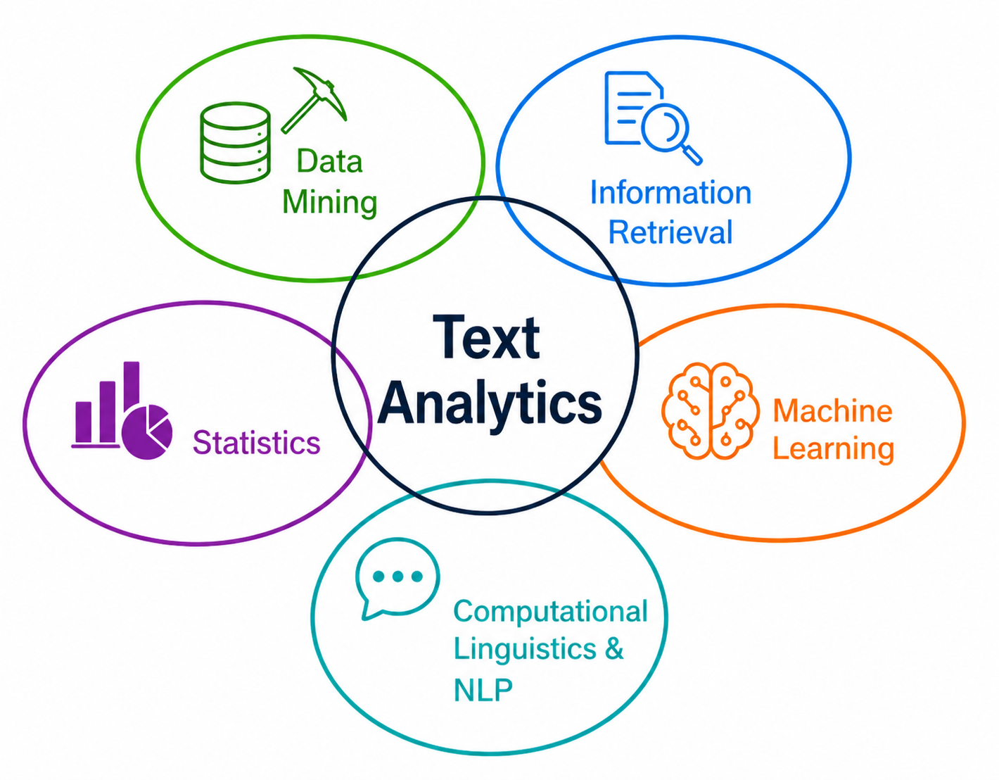

## {data-menu-title="Learning objectives" data-state="hide-menubar"}

     

::: {.learning-objectives}
- **Explain** the characteristics of big data and their implications for analytics workflows.
- **Assess** key challenges of big data, including scalability, heterogeneity, and data quality.
- **Outline** distributed data architectures and their role in large-scale analytics.
:::

TODO: Explain how big data environments reshape model development, validation, and deployment. This creates continuity with: Generalization problem, Overfitting, Model evaluation

# Big data {data-stack-name="Big data"}

<!--
TODO: refer to the introduction (growth of data, ...)
TODO: highlight the Big-Data Vs with specific examples. illustrate the data vividly, but also highlight the analytical models and business outcomes (starting to move towards the systems and organizational deployment of analytics)

    ## What is Big Data?

    > The basic idea behind the phrase 'Big Data' is that everything we do is increasingly leaving a digital trace (or data), which we (and others) can use and analyze.  
    > -- Bernard Marr

    > Big Data is the frontier of a firm’s ability to store, process, and access (SPA) all the data it needs to operate effectively, make decisions, reduce risks, and serve customers.  
    > -- Forrester

    > Big Data is not about the size of the data, it's about the value within the data.  
    > -- David Wellman
-->

## 4V’s of Big Data

::: {.highlight_must_learn}

{fig-align="center" width="50%"}

:::

::: aside
— Source: www.cs.kent.edu/~jin/BigData/Lecture1.pptx
:::

## Big data changes the managerial problem

> Big data matters when the **properties of the data** change what managers can decide, automate, or compete on.

| V | Business dilemma |
|---|---|
| **Volume** | Too many operational combinations to optimize manually |
| **Velocity** | Decisions must be made before the moment passes |
| **Variety** | Many data worlds must be integrated |
| **Veracity** | Data may look precise but still be false |

::: notes
Rationale and key points to cover:

This opening slide should shift the students away from the generic definition of big data as "lots of data." The key teaching message is that each V corresponds to a different managerial dilemma.

Volume is not just about storage; it is about decision complexity. Velocity is not just about speed; it is about making a decision while the event is still unfolding. Variety is not just about having structured and unstructured data; it is about integrating data worlds that were previously separate. Veracity is not just about data quality; it is about whether managers can trust what the data appears to say.

Use this as the conceptual frame for the four business examples that follow.
:::

## Volume: UPS route optimization

::: columns
::: {.column width="55%"}

**Managerial dilemma**

How do you optimize millions of delivery decisions when every route has thousands of possible variants?

**Key data facts**

- 250M+ address data points
- 200,000+ route options per typical route
- Parcels, drivers, fleet, road network, customer constraints
- Real-time updates from operations and telematics

**Models:** vehicle routing · scheduling · ETA prediction · dynamic re-optimization  
**Outcomes:** fewer miles · lower fuel costs · better on-time delivery · operational data advantage

:::

::: {.column width="45%"}

{fig-alt="UPS delivery truck or route optimization image" width=450px}

:::
:::

::: notes
Rationale and key points to cover:

This slide illustrates volume as operational complexity. The point is not merely that UPS has "a lot of data." The deeper point is that parcel logistics creates an enormous number of possible decisions: which parcels go into which vehicle, in which order, driven by which driver, through which road network, under which delivery and pickup constraints.

Emphasize that a route is not simply a map from A to B. It includes today’s parcels, promised delivery windows, pickup commitments, driver constraints, fleet capacity, customer requirements, historical travel times, current network conditions, road restrictions, and operational updates during the day.

The analytical problem is therefore combinatorial. A human dispatcher cannot compare hundreds of thousands of possible stop sequences. The firm needs optimization models, routing heuristics, scheduling systems, and ETA prediction. More advanced versions also support dynamic re-optimization when traffic, delays, or operational disruptions occur.

The competitive implication is that small improvements per route become enormous at system scale. Saving a few minutes or a few kilometers per driver per day can translate into major annual savings in fuel, labor, emissions, and service reliability. This creates an operational data advantage: firms with richer route histories, denser delivery networks, and better optimization infrastructure can operate at lower cost and higher reliability.

References for data and claims:

- UPS ORION materials describe large-scale route optimization using more than 250 million address data points and evaluating more than 200,000 route options for a typical route.
- UPS has reported ORION-related savings on the order of 100 million miles and around 10 million gallons of fuel per year.
- Useful source search terms: "UPS ORION 250 million address data points", "UPS ORION 200,000 route options", "UPS ORION 100 million miles 10 million gallons".
:::

## Velocity: Visa fraud detection

::: columns
::: {.column width="55%"}

**Managerial dilemma**

Can fraud be detected **before** the transaction is approved?

**Key data facts**

- Up to **83,000 transactions / second**
- ≈ **7.17B decisions / day** at peak capacity
- 500+ data points per transaction
- Fraud is rare, but losses are massive
- Visa reported **$40B+ fraud blocked in 2023**

**Models:** real-time risk scoring · anomaly detection · streaming ML · network analysis  
**Outcomes:** approve · decline · challenge · escalate — all within milliseconds
:::

::: {.column width="45%"}

{fig-alt="Digital payment or fraud detection image" width=450px}

:::
:::

::: notes
Rationale and key points to cover:

This slide illustrates velocity as the need to decide while the business event is still happening. In payment fraud detection, the decision must be made before the customer leaves the checkout page or terminal. The system cannot wait for an overnight batch report.

The key teaching point is the millisecond decision window. The model must ingest transaction data, compare it against historical patterns, evaluate location, merchant, amount, device, account history, and behavioral signals, and then decide whether the transaction should be approved, declined, challenged, or escalated.

This is also a useful example of rare-event analytics. Fraudulent transactions may be a tiny share of all transactions, but at Visa scale even a very small percentage can imply very large losses. False positives also matter: blocking genuine customers damages trust, merchant revenue, and user experience. The analytical challenge is therefore not simply "detect fraud"; it is "detect fraud while minimizing false declines, in milliseconds, at massive scale."

The models typically include supervised machine learning, anomaly detection, streaming analytics, graph and network analysis, and real-time decision rules. The models are embedded directly in the transaction infrastructure.

The competitive implication is trust. Payment networks compete partly on reliability, fraud protection, authorization quality, and customer experience. Better fraud analytics can reduce losses, increase legitimate approval rates, and make merchants and banks more willing to rely on the network.

References for data and claims:

- Visa reports infrastructure capacity of up to 83,000 transactions per second.
- 83,000 × 86,400 seconds per day = 7,171,200,000 theoretical peak transaction decisions per day.
- Visa describes using 500+ data points in fraud detection and reported blocking over $40 billion in fraud in 2023.
- ECB/EBA payment fraud reports can be used to illustrate that fraud rates are small as a percentage of transaction value but still correspond to billions in absolute losses.
- Useful source search terms: "Visa 83,000 transactions per second", "Visa 500 data points fraud", "Visa blocked 40 billion fraud 2023", "ECB EBA payment fraud 2024 0.002 percent".
:::

## Variety: Walmart ambient IoT supply chain

::: columns
::: {.column width="55%"}

**Managerial dilemma**

How do you coordinate inventory when the relevant data comes from many different worlds?

**Key data facts**

- Target: **90M pallets** by end of 2026
- Active in **500 Walmart locations**
- Potential scale: 4,600 stores + 40+ distribution centers
- Sensor data: location, movement, temperature, humidity, dwell time
- Combined with inventory, supplier, store, and replenishment data

**Models:** sensor fusion · demand forecasting · replenishment optimization · exception detection  
**Outcomes:** fewer stockouts · fresher products · less waste · tighter supplier coordination
:::

::: {.column width="45%"}

{fig-alt="Retail supply chain or IoT pallet tracking image" width=450px}

:::
:::

::: notes
Rationale and key points to cover:

This slide illustrates variety as the integration of heterogeneous data worlds. Walmart’s supply-chain example is useful because the relevant data are not all in one system. They come from physical pallets, ambient IoT sensors, store inventory systems, supplier systems, distribution centers, transport flows, and AI-based replenishment systems.

The important teaching point is that the same business object—the pallet—becomes a digital object. It can produce information about where it is, how long it has been there, whether it was exposed to temperature or humidity deviations, and whether it is moving through the supply chain as expected.

This is especially important for food and grocery supply chains, where freshness, waste, stockouts, and timing matter. Data variety allows Walmart to connect physical product flow with digital planning and replenishment decisions.

Typical analytical models include sensor fusion, demand forecasting, replenishment optimization, dwell-time analytics, exception detection, and cold-chain monitoring. More advanced versions can be described as supply-chain control towers or digital twins.

The competitive implication is coordination. Walmart can use these data not only internally but also to structure supplier behavior. The firm gains better visibility over inbound flows, supplier performance, inventory accuracy, and store-level availability. This can reduce waste, improve freshness, reduce stockouts, and strengthen Walmart’s cost and availability advantage.

References for data and claims:

- Wiliot announced collaboration with Walmart to scale ambient IoT tracking toward 90 million pallets by the end of 2026.
- Wiliot/Walmart materials mention deployment across hundreds of Walmart locations and potential expansion across Walmart’s store and distribution-center network.
- Wiliot describes ambient IoT sensors collecting location and condition data such as temperature and humidity.
- Useful source search terms: "Wiliot Walmart 90 million pallets 2026", "Walmart ambient IoT pallets 500 locations", "Wiliot Walmart temperature humidity pallets".
:::

## Veracity: Digital advertising fraud

::: columns
::: {.column width="55%"}

**Managerial dilemma**

The dashboard says there were clicks and impressions — but were they real?

**Key data facts**

- Fraudulent impressions, clicks, conversions, or data events
- DoubleVerify measures **8.3T+ media transactions / year**
- Ad fraud losses projected at **$172B by 2028**
- One fraud operation fell from **2.5B** to **100M** daily bid requests after mitigation

**Models:** bot detection · invalid traffic scoring · anomaly detection · graph analysis  
**Outcomes:** block fake traffic · clean attribution · reallocate spend · protect ROI
:::

::: {.column width="45%"}

{fig-alt="Digital advertising fraud or bot traffic image" width=450px}

:::
:::

::: notes
Rationale and key points to cover:

This slide illustrates veracity: whether the data can be trusted. Digital advertising is a strong example because the data may look extremely precise. A dashboard can report impressions, clicks, conversions, engagement rates, and cost per acquisition. But the central managerial question is whether these events reflect real human attention and real customer intent.

This is a better teaching example than a simple sensor failure because the ambiguity is managerial and economic. A click may exist in the data but still be generated by a bot. An impression may be counted but never actually seen by a human. A conversion may be attributed to a campaign but be manipulated by fraud or poor measurement.

The analytical models include bot detection, invalid-traffic classification, anomaly detection, device and behavioral fingerprinting, graph analysis, publisher-quality scoring, and campaign-level traffic-quality models.

The decision consequences are significant. Advertisers may block traffic, exclude publishers, shift budgets, reprice impressions, revise attribution models, or stop campaigns. Without veracity, the organization may optimize toward fake engagement. This is a powerful teaching point: bad data can make analytics actively harmful because the model learns from signals that do not correspond to real business value.

The competitive implication is marketing efficiency and trust. Firms with better traffic-quality analytics can spend advertising budgets more effectively, avoid waste, protect brands, and build more reliable attribution systems.

References for data and claims:

- IAB defines ad fraud and invalid traffic as fraudulent representation of impressions, clicks, conversions, or other data events.
- DoubleVerify reports measuring over 8.3 trillion media transactions annually.
- DoubleVerify cites Juniper estimates that global ad fraud losses could reach $172 billion by 2028.
- HUMAN Security reported mitigation of a fraud operation that reduced activity from 2.5 billion daily bid requests to 100 million daily bid requests.
- Useful source search terms: "IAB ad fraud invalid traffic impressions clicks conversions", "DoubleVerify 8.3 trillion media transactions", "Juniper ad fraud 172 billion 2028", "HUMAN 2.5 billion daily bid requests 100 million".
:::

## TODO: too simple, but maybe integrate in the "end of the first section" (Key takeaway)

Big data is not one problem.

It creates **four different managerial dilemmas**:

| V | Core challenge | Business response |
|---|---|---|
| Volume | Too many combinations | Optimize |
| Velocity | Too little time | Decide instantly |
| Variety | Too many data worlds | Integrate |
| Veracity | Too little trust | Validate |

::: notes
Rationale and key points to cover:

Use this closing slide to consolidate the examples.

The most important message is that each V changes the managerial problem in a different way. Volume creates optimization challenges. Velocity creates real-time decision challenges. Variety creates integration and coordination challenges. Veracity creates trust and validation challenges.

A useful closing question for students:

"Which of these four dilemmas is most difficult to solve technologically, and which is most difficult to solve organizationally?"

This helps transition from technical analytics to organizational capability. Firms do not compete simply by owning data. They compete by building decision systems, routines, governance structures, and analytical capabilities that turn data properties into better business outcomes.
:::

<!--

    ## Volume (Scale)

    :::: {.columns}

    ::: {.column width="50%"}
    {width="80%"}
    :::

    ::: {.column width="50%"}
    {width="80%"}
    :::

    ::::

    ## The Model of Generating and Consuming Data has Changed

    {fig-align="center" width="50%"}

    ## Collecting Data

    {fig-align="center" width="50%"}

    ::: aside
    — Source: www.cs.kent.edu/~jin/BigData/Lecture1.pptx
    :::

    ## Types of Data People are Creating \(I\)

    Activity Data

    Simple activities like listening to music or reading a book are now generating data.
    Digital music players and eBooks collect data on our activities. Your smartphone collects
    data on how you use it and your web browser collects information on what you are searching for.
    Your credit card company collects data on where you shop and the shops collect data on what you buy.
    It is hard to imagine any activity that does not generate data.

    Conversation Data

    Our conversations are now digitally recorded. It all started with emails, but nowadays most
    of our conversations leave a digital trail. Consider all the conversations we have on social media
    sites like Facebook or Twitter. Even many of our phone conversations are now digitally recorded.

    Photo and Video Image Data

    Think about all the pictures we take on our smartphones or digital cameras. We upload and share
    hundreds of thousands of them on social media sites every second. An increasing number of cameras
    record video images, and we upload hundreds of hours of video to YouTube and other platforms every minute.

    ::: aside
    — Source: http://de.slideshare.net/BernardMarr/140228-big-data-slide-share/3-The_basic_idea_behind_the
    :::

    ## Types of Data People are Creating \(II\)

    Sensor Data

    We are increasingly surrounded by sensors that collect and share data. Take your smart phone, it contains a global positioning sensor to track exactly where you are every second of the day, it includes an accelerometer to track the speed and direction at which you are travelling. We now have sensors in many devices and products.

    The Internet of Things Data

    We now have smart TVs that are able to collect and process data, we have smart watches, smart fridges, and smart alarms. The Internet of Things, or Internet of Everything connects these devices so that e.g. the traffic sensors on the road send data to your alarm clock which will wake you up earlier than planned because the blocked road means you have to leave earlier to make your 9am meeting.

    ::: aside
    — Source: http://de.slideshare.net/BernardMarr/140228-big-data-slide-share/3-The_basic_idea_behind_the
    :::

    ## Variety \(Complexity\)

    {fig-align="center" width="50%"}

    ::: aside
    — Source: www.cs.kent.edu/~jin/BigData/Lecture1.pptx
    :::

    ## A Single View to the Customer

    {fig-align="center" width="50%"}

    ::: aside
    — Source: www.cs.kent.edu/~jin/BigData/Lecture1.pptx
    :::

    ## Velocity \(Speed\)

    {width="30%"}

    Data is being generated fast and needs to be processed fast.

    - Late decisions result in missing opportunities

    Examples

    - E-Promotions: Based on your current location, your purchase history, and your interests → send promotions immediately for the store next to you.
    - Healthcare monitoring: Sensors track your activities and health → any abnormal measurements require immediate reaction.
    - Production and Logistics: With real-time POS data, Langnese can adjust production and delivery instantly → saving millions of euros monthly.

    ::: aside
    — Source: www.cs.kent.edu/~jin/BigData/Lecture1.pptx
    :::

    ## Real\-Time Analytics

    {fig-align="center" width="50%"}

    ::: aside
    — Source: www.cs.kent.edu/~jin/BigData/Lecture1.pptx
    :::

    ## Veracity \(Uncertainty\)

    {width="50%"}

    Organizations must now analyze both structured and unstructured data that is uncertain and imprecise.

    In many cases, it is not known whether the data is correct (e.g. fake news) or representative (e.g. biased expressions of opinion in forums).

    It may be prudent to assign a Data Veracity score and ranking for specific data sets to avoid making decisions based on analysis of uncertain and imprecise data.

    ## How is Big Data actually used?

    - Better understand and target customers
    Companies expand their traditional data with social media data, browser, text analytics or sensor data to get a more complete picture of their customers.

    - Understand and Optimize Business Processes
    Retailers are able to optimize their stock based on predictive models generated from social media data, web search trends, weather forecasts...

    - Improving Health
    Use the data from smart watches, wearable devices, Google Trends, health research, electronic medical record to diagnose disease, predict epidemics, …

    - Improving Security and Law Enforcement
    Use big data analytics to predict criminal activity, foil terrorist plots, detect cyber attacks, and detect fraudulent credit card transactions.

    - Improving and Optimizing Cities and Countries (Smart Cities)
    Optimize traffic flows based on real time traffic information, social media and weather data. A bus would wait for a delayed train and traffic signals predict traffic volumes.

    ::: aside
    — Source: http://de.slideshare.net/BernardMarr/140228-big-data-slide-share/3-The_basic_idea_behind_the
    :::

-->

## Turning Big Data into Value

{fig-align="center" width="50%"}

::: aside
— Source: http://de.slideshare.net/BernardMarr/140228-big-data-slide-share/3-The_basic_idea_behind_the
:::

# Architecture {data-stack-name="Architecture"}

## TODO: data lake vs data warehouse as alternative architectures? clarify the difference!

TODO

## Limitations of the Data Warehouse Approach

Traditional DWH solutions are designed to provide a single point of truth. Important aspects are:

- Merge and unify data from multiple data sources
- High data quality
- Proper historization of the data
- Data Governance and Compliance

This results in the following problem areas in today's world:

- **Lack of flexibility** due to high effort for changes
- **Time expenditure** due to transfer from the operational sources and the aggregations
- **Past orientation** of data (snapshot of the past); there is an increasing need for ad hoc and real-time analyses
- **Partial knowledge**, as only structured data is stored, with increasing need for social media data, etc.
- **Patchwork**: due to gradual introduction of data warehouses, many isolated solutions exist and are operated separately both technically and methodologically

## The Four Layers of Big Data \(I\)

Data Source Layer

This is where the data arrives at the organization.
It includes everything from sales records, customer database, feedback, social media channels, marketing list, email archives etc.

{fig-align="center" width="300px"}

::: aside
— Source: http://de.slideshare.net/BernardMarr/140228-big-data-slide-share/3-The_basic_idea_behind_the
:::

## Identify and Prioritize Data Sources

{fig-align="center" width="50%"}

::: aside
— Source: @Schmarzo2016, p. 49
:::

## The Four Layers of Big Data (II)

{fig-align="center" width="50%"}

::: aside
— Source: http://de.slideshare.net/BernardMarr/140228-big-data-slide-share/3-The_basic_idea_behind_the
:::

## The Four Layers of Big Data (III)

{fig-align="center" width="50%"}

::: aside
— Source: http://de.slideshare.net/BernardMarr/140228-big-data-slide-share/3-The_basic_idea_behind_the
:::

## The Four Layers of Big Data (IV)

{fig-align="center" width="50%"}

::: aside
— Source: http://de.slideshare.net/BernardMarr/140228-big-data-slide-share/3-The_basic_idea_behind_the
:::

## From Data Warehouse to Data Lake

Instead of recording millions of transactions, today's organizations are recording billions of interactions. Companies are capturing more and more data that can open business opportunities and unlock new sources of value for organizations.

Companies are not able to store this data in data warehouses because it is of high volume, mostly raw and often not structured. As consequence, data lakes have emerged as an alternative approach. The intent is to capture enterprise data and load it in its raw form into a centralized, large, and inexpensive storage system.

In shifting from data warehouses to data lakes, it became important to decouple data movement from data transformation. Data movement (the "E" and "L" of ETL) is an operational task. Data transformation (the "T" of ETL) is a content-based, analytic-facing task that requires an understanding both of the data and how it's to be used.

A clean separation between data movement and data transformation has the benefits of less friction because the instance loading the data isn't responsible for transforming it.

::: aside
— Source: Trifacta: EOL for
:::

## The Data Lake

A data lake is a method of storing data within a system in its natural format, that facilitates the collocation of data in various schemata and structural forms. The idea of data lake is to have a single store of all data in the enterprise ranging from raw data to transformed data which is used for various tasks including reporting, visualization, analytics and machine learning.

{fig-align="center" width="50%"}

::: aside
— Source: https://www.pmone.com/fileadmin/user_upload/pics/other/Data_lake.jpg
:::

## Modern Data Analytics Architecture

{fig-align="center" width="50%"}

## Logical Data Warehouse

A "logical data warehouse" provides analytical company data without first physically moving it to a physical data warehouse.

As in a classic data warehouse, uniform views are provided for analysis purposes.

While the data in the classic data warehouse comes from a "well-defined" physically uniform database, the "logical data warehouse" pulls data together from the data lake at the time of the query.

Aggregation is done just in time. Thus, the schema of the data warehouse is just virtual.

{fig-align="center" width="40%"}

::: aside
— Source: http://www.datavirtualizationblog.com/emergence-logical-data-warehouse/
:::

# Text analytics {data-stack-name="Text analytics"}

## Text analytics

:::: {.columns}

::: {.column width="50%"}

The vast majority of global data is stored in unstructured formats.
For example:

- emails and internal communication
- customer support tickets
- meeting notes and reports
- product reviews and social media posts
- annual reports and corporate filings
- contracts and legal documents
- job descriptions and résumés
- scientific and market research reports
- CRM notes and sales reports
- helpdesk and incident reports

:::

::: {.column width="50%"}
**Text analytics** combines methods from natural language processing, machine learning, information retrieval, and statistics to systematically analyze large volumes of textual data and derive actionable insights.

{width=70%}

:::

::::

::: aside
*Text mining* is often viewed as a subset of the broader field of text analytics, emphasizing the discovery of previously unknown patterns in textual data.
Here, we use the broader term *text analytics*.
:::

## Application areas

{fig-align=center width=75%}

## Text preprocessing

:::: {.columns}

::: {.column width="80%"}
TODO: structure: see "Text representation pipeline" note (obsidian)

show an example of python (regex)?

TBD: concept of "noise"?

:::

::: {.column width="20%"}

<!-- subtle highlight -->

<!-- arrow -->

➜

:::

::::

<!--

-->

## Feature Generation Paradigm 1: Sparse Representations (Classical NLP)

:::: {.columns}

::: {.column width="80%"}
* Core challenge: *How do we turn text into analyzable data?*

* Basic pipeline:

  * preprocessing (tokenization, cleaning)
  * feature engineering (Bag-of-Words, TF-IDF)
* Output: **sparse feature vectors → ML models**
* Use case: classification (e.g., sentiment analysis)
* Key idea: *text → structured matrix → prediction*

:::

::: {.column width="20%"}

<!-- subtle highlight -->

<!-- arrow -->

➜

:::

::::

## Feature Generation Paradigm 2: Dense Representations (Embeddings)

* Motivation: capture **semantic meaning**

* Introduce embeddings (e.g., BERT)

* Output: **dense vectors → ML / clustering / similarity**

* Use cases:

  * semantic search
  * clustering documents
  * regression/classification

* Key shift: *better features, same analytics logic*

## Feature Generation Paradigm 3: AI-Assisted Analytics (LLMs & Systems)

* Embeddings as foundation for systems:

  * retrieval (finding relevant documents)
  * similarity-based analytics

* Extend to LLM-based workflows (e.g., GPT-4):

  * direct classification via prompting
  * information extraction
  * summarization

* Concept: **Retrieval-Augmented Generation (RAG)**

  * embeddings → retrieve relevant data
  * LLM → analyze / generate output

* Key shift: *model integrates feature extraction + prediction*

## Feature Generation Paradigms: Comparison & Analytical Perspective

* Three ways to turn text into insights:

| Approach  | Representation | Role in Analytics                |
| --------- | -------------- | -------------------------------- |
| Sparse    | TF-IDF         | baseline, interpretable          |
| Dense     | embeddings     | semantic features                |
| LLM-based | implicit       | flexible, system-level analytics |

* Emphasize: **choice depends on task, cost, and requirements**

Takeaway: The Future of Text Analytics

* Text is no longer “unstructured” → it’s **transformable data**
* Evolution:

  * manual features → learned representations → AI-assisted analysis
* Role of analytics:

  * selecting representations
  * designing pipelines/systems
  * evaluating outcomes

## Feature selection

:::: {.columns}

::: {.column width="80%"}
Pruning (p.28): approaches

-> particularly relevant for sparse vectors (dense vectors already offer a compressed representation)

:::

::: {.column width="20%"}

<!-- subtle highlight -->

<!-- arrow -->

➜

:::

::::

## Pattern discovery

Similar documents (stories, products, e-mails)

Jaccard (p.31, ...) for sparse vectors (distance-based clustering)
Dense (semantic) vectors: k-means

## Classification

TODO (sentiment??)

## Regression

TODO (?)^

<!--
## **One-line narrative**

> “We move from manually structuring text for models → to learning representations → to using AI systems that directly turn language into insights.”

## TODO Deployment

Cover ML Ops pipelines, scaling (parallel architectures)
-->

## Survey: Session 8 {data-state="hide-menubar"}

  

::: {style="display:flex; justify-content:center;"}

" width=400 height=400 >}}

:::

  

[]()

::: aside
Note: Responses may be analyzed and published in anonymized form.

Please complete the survey before you leave today — thank you 🙏
:::

# References {data-state="hide-menubar"}