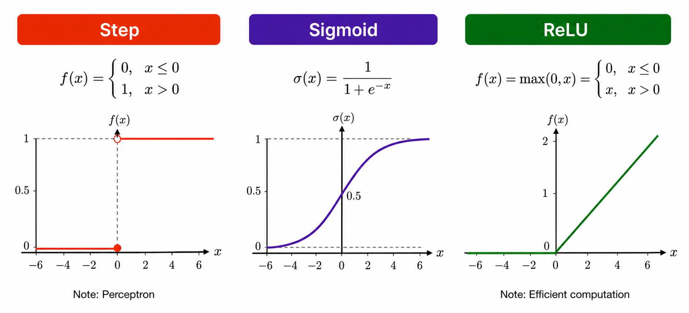
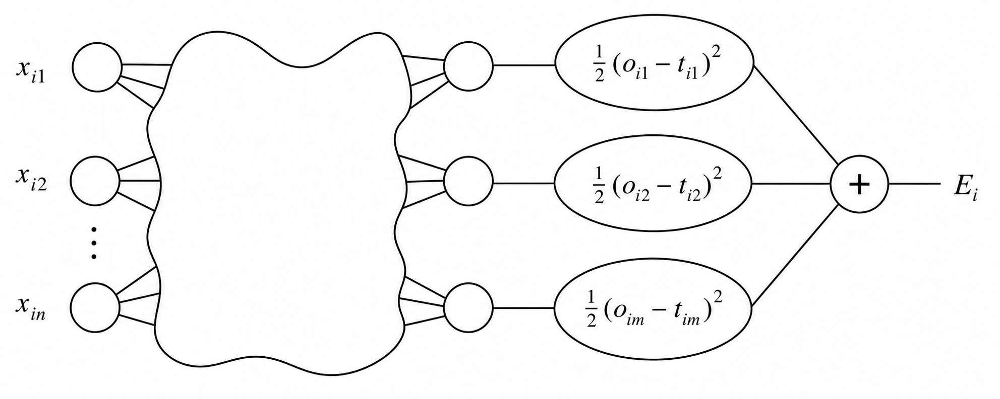

## {data-menu-title="Learning objectives" data-state="hide-menubar"}

<br><br><br>

::: {.learning-objectives}

* **Explain and interpret** the core ideas and mathematical operations underlying artificial neural networks
* **Distinguish** between major neural network architectures (MLP, CNN, RNN, TM) and identify the types of data for which they are most appropriate.
* **Understand** the design and training process of neural networks, including architecture selection and optimization.
:::

# Foundations {data-stack-name="Foundations"}

## From biological neurons to artificial neural networks

<br>

{fig-align=center width=40%}

<!--
https://pressbooks.cuny.edu/sensationandperception/chapter/how-neurons-work/
-->

**Key milestones**

- **1943** (Warren McCulloch & Walter Pitts) — Mathematical model of artificial neurons
- **1958** (Frank Rosenblatt) — Development of the *Perceptron*
- **2010s** (Geoffrey Hinton, Yann LeCun & Yoshua Bengio) — Revival of modern deep learning
- **2020s** (GPT models, OpenAI) — Emergence and widespread adoption of large language models (LLMs) and multimodal AI systems

::: notes
Highlight: multimodal AI (big-data) is closely connected to neural networks

Inputs correspond to dendrites, outputs to axons

The foundations of neural networks were developed 80 years ago.
Why did we have to wait for the AI breakthroughs for so long?

-> AI-Winters: 1974-1980, 1987-1993

-> availability of computing power and data (next slide) 
:::


## Performance of machine learning and neural networks

::: columns

:::: {.column width="50%"}
<br><br>
{fig-align=center width=90%}

::::

:::: {.column width="50%"}

**Key drivers of recent progress in neural networks**

- Availability of large-scale datasets
- Increasing computational power (especially GPUs/TPUs)
- Advances in algorithms and neural network architectures
- Specialization of neural networks:

    - Convolutional Neural Networks (CNNs) for image and video recognition
    - Recurrent Neural Networks (RNNs) for sequential and time-series data
    - Transformers for language processing and generative AI
    - Graph Neural Networks (GNNs) for network and relational data
    - Diffusion Models for image and media generation

::::

:::

::: aside
In small-data regimes, experiments are needed to identify algorithms that perform best for a given dataset.
:::

::: notes
TPU: Tensor processing unit (for matrix and tensor operations in AI)
:::


## The perceptron

:::: {.columns}

::: {.column width="50%"}
A perceptron is one of the earliest forms of neural networks.
A **classical perceptron** is characterized by:

$$z = w^T x + b$$

followed by a **threshold activation**:

$$\hat{y} =
\begin{cases}
1 & \text{if } w^T x + b > 0 \\
0 & \text{otherwise}
\end{cases}$$

- This corresponds to a linear classifier
- The training of the perceptron consists of feeding it multiple training samples and calculating the output for each of them
- After each sample, the weights $w$ are adjusted to minimize a loss function, which quantifies the difference between the predicted and target outputs
:::

::: {.column width="50%"}
<br><br>
{width=70% fig-align=center}
:::

::::


## From perceptron to deep neural networks

::: {.highlight_must_learn}

:::: {.columns}

::: {.column width="47%"}

Limitation of a single perceptron:
It cannot build abstract intermediate representations and can only learn linear decision boundaries.

Solution:
Multilayer neural networks combine:

- **Multiple hidden layers**, which enable increasingly abstract representations
- **Nonlinear activation functions**, which make nonlinear learning possible

Layers:

- Input neurons: raw data (e.g., images, audio, video)
- Hidden neurons: the weights and biases store abstract representations learned from the data (e.g., edges, parts of an image)
- Output neuron: prediction (e.g., one neuron for binary, multiple for multi-class)

Note: the number of layers and neurons is specified ex-ante and does not change in the training process.

:::

::: {.column width="53%"}
<br><br>

:::

::::

:::

::: {.learning_note .fragment}
🎥 Grant Anderson (3Blue1Brown) provides a series of instructive  
animated explanations, including one on [Neural Networks](https://www.youtube.com/watch?v=aircAruvnKk).
:::

## Functionality of a neuron

::: {.highlight_must_learn}

<br>
{fig-align=center width=65%}
<br>
:::

::: aside
In a classical perceptron, the activation is typically binary (0 or 1), representing whether the neuron “fires.”  
In modern neural networks, activations are usually continuous-valued scalars determined by the activation function.
:::


## Types of activation functions

<br>

{fig-align=center width=70%}

## Training of a multilayer perceptron

<br>

{fig-align=center width=70%}


## Forward pass

TODO: illustrate forward pass (aside: random? initial weights, training sample i)

## Loss function

:::: {.columns}

::: {.column width="50%"}
<br><br>

:::

::: {.column width="50%"}
The network’s prediction error is measured with a **loss function**.

For one training example $i$:

$$E_i = \frac{1}{2} \sum_{j=1}^{m} (o_{ij} - t_{ij})^2$$

This is the squared error loss across all **output neurons**.

Across all $h$ training examples, the total loss is:

$$E = \sum_{i=1}^{h} E_i$$

Backpropagation adjusts the weights to reduce this total loss.
:::

::::

## Backpropagation

<!--
**TODO: Cost function, Learning: gradient descent + back propagation (see slides PR)**
-->

The Backpropagation algorithm is used for calculating the weights.
In a training phase, the weights are iteratively calculated using training data sets in such a way that the difference between the calculated and the expected (true) results is minimized.
Because the simultaneous calculation of all weights is not possible, they must be found via a learning process.
The backpropagation algorithm looks for the minimum of the cost function in weight space using the method of gradient descent.

```Markdown
initialize weights and biases

repeat until stopping criterion is met:

    total_error = 0

    for each training example:

        pass input forward through all layers
        compare predicted output with target value
        add error to total_error
        propagate error backward through all layers
        update weights and biases

    check whether total_error is small enough
```

<!--

The procedure in principle:

1. Define the initial weights
2. Put the training set into the input layer
3. Calculate the result (value of the output layer) via successive processing one layer after the other
4. Compare the output values and target values and calculate the difference
5. Iterate steps (2) to (4) for every training set
6. Calculate the total error. Adjust the weights beginning with the output layer towards the input layer (backpropagation)
7. Iterate steps (2) to (6) until the total error reaches the defined error-level or the number of maximum iterations is reached.
-->


## Using the loss function to adjust weights

The loss function $E$ has to be minimized.
Because it depends on the output neurons $o_j$, it automatically depends on their weights to the precedent layer(s):

$$o_j=f(s(x)_j) \text{    with    } s(x)_j =\sum_k^n w_{jk}\cdot x_k$$

Thus, the weights have to be found where $E$ is minimal.

<br>

Examples of the loss function with **two weights** (simplified):

<br>

{width=50% fig-align=center}

## Gradient descent

To minimize the loss function $E$ the backpropagation algorithm uses the method of gradient descent.
This method searches those weights, where the vector containing the partial first derivatives of the loss function $\nabla E$ (gradient) is equal to the zero vector (minimum):

$$
\nabla E =
\left(
\frac{\partial E}{\partial w_1},
\frac{\partial E}{\partial w_2},
\ldots,
\frac{\partial E}{\partial w_m}
\right)
$$

To adjust the weight $w_{ij}$, which connects neuron $i$ to neuron $j$, gradient descent updates the weight in the negative gradient direction:

$$
\Delta w_{ij}
= -a \cdot \frac{\partial E}{\partial w_{ij}}
$$

$$
\Delta w_{ij}
= -a \cdot \sum_{j=1}^{m}
(o_{ij} - t_{ij}) \cdot (-x_i)
= a \cdot \sum_{j=1}^{m}
(o_{ij} - t_{ij}) \cdot x_i
$$

where $a$ represents the predefined learning rate.
The adjusted weight is then computed as:

$$
w_{ij}^{\text{new}}
=
w_{ij}^{\text{old}}
+
\Delta w_{ij}
$$

. . . 

> Because neural networks have many parameters, each update changes the model in many dimensions at once.
> The learning rate therefore has to be chosen carefully: large steps can destabilize training, while very small steps can make learning inefficient.

<!--
TODO: cover example of backpropagation? http://hmkcode.github.io/ai/backpropagation-step-by-step
-->

# Specialized NNs {data-stack-name="Specialized NNs"}

<!--
> GPT is based on a huge neural network that essentially represents the language model. While the first GPT-3 has 175 billion parameters, the newer GPT-4 already has 1 trillion parameters. Compared to GPT-3, GPT-4 is therefore more intelligent, can deal with more extensive questions and conversations and makes fewer factual errors.
-->

TODO: overview (feedforward, perceptron, ...)

## CNN

.. How images are processsed

## RNN

..How text of different lengths is processed

## Transformers


# Design and training of neural networks {data-stack-name="Design and training"}

TODO: understand where clear default choices exist and where tuning and experimentation is necessary

## Decisions / Process

TODO: must address this questison: To what extent do neural networks reduce the need for manual feature engineering?
TBD: here and/or in the previous founcations section

## Choice of architecture

## Tuning/Experimentation

## Python code example


## Survey: Session 9 {data-state="hide-menubar"}

<br><br>

::: {style="display:flex; justify-content:center;"}

" width=400 height=400 >}}

:::

<br><br>

[]()

::: aside
Note: Responses may be analyzed and published in anonymized form.

Please complete the survey before you leave today — thank you 🙏
:::


# References {data-state="hide-menubar"}